# HieraChain Architecture

## 📋 Overview

HieraChain is a **multi-language blockchain infrastructure** designed for high-performance enterprise applications. The architecture follows a **layered approach** combining the strengths of Python and Rust:

| Component | Language | Purpose |
|:----------|:---------|:--------|
| **hierachain** | Python | Business logic, REST API, high-level abstractions |
| **hierachain-consensus** | Rust | High-performance consensus, cryptography |

---

## 📑 Table of Contents

- [🏗️ High-Level Architecture](#️-high-level-architecture)
- [📦 Project Structure](#-project-structure)
- [🏛️ Hierarchical Chain Architecture](#️-hierarchical-chain-architecture)
- [🔄 Data Flow Architecture](#-data-flow-architecture)
- [🔗 Inter-Language Communication](#-inter-language-communication)
- [⚙️ Consensus Mechanisms](#️-consensus-mechanisms)
- [🛡️ Zero Knowledge Proof (ZKP) Verification Layer](#️-zero-knowledge-proof-zkp-verification-layer)
- [🔐 Security Architecture](#-security-architecture)
- [📊 Performance Architecture](#-performance-architecture)
- [🌐 Network Architecture](#-network-architecture)
- [📈 Monitoring & Observability](#-monitoring--observability)
- [📄 License](#-license)

---

## 🏗️ High-Level Architecture

### System Overview

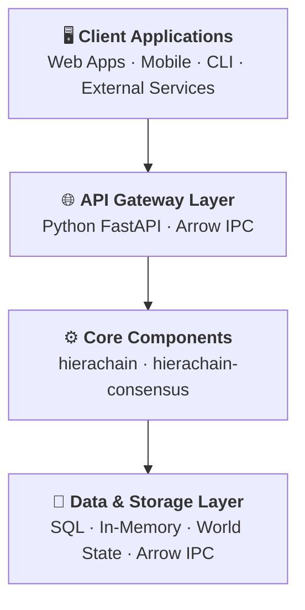

### API Gateway Detail

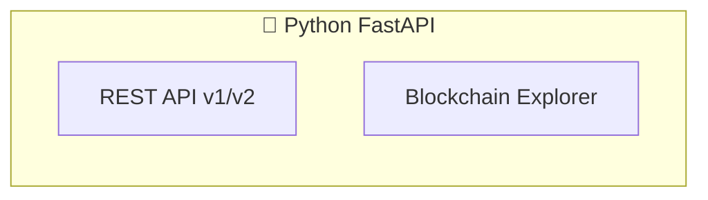

### Core Components Detail

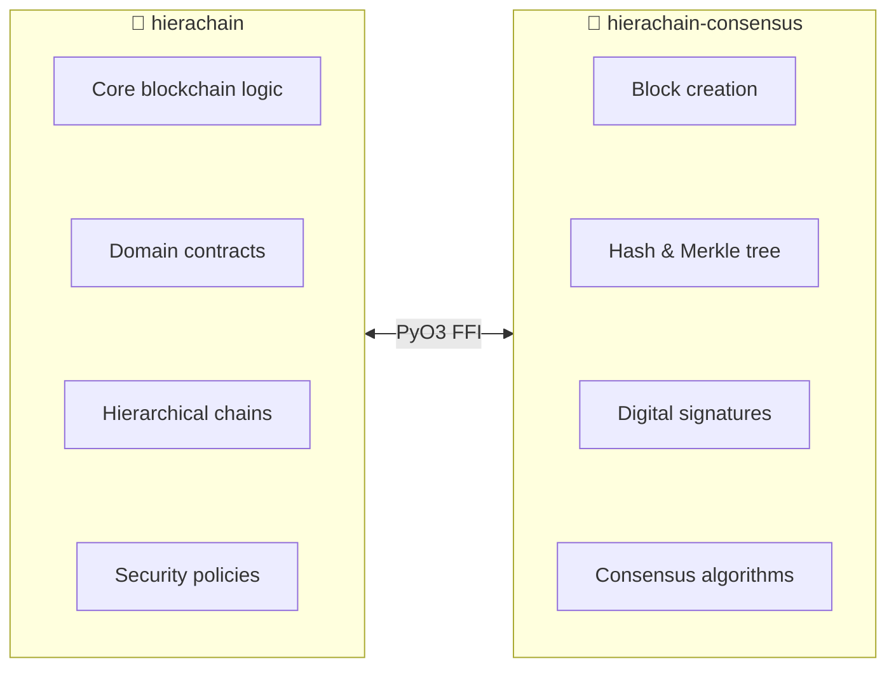

### Storage Layer Detail

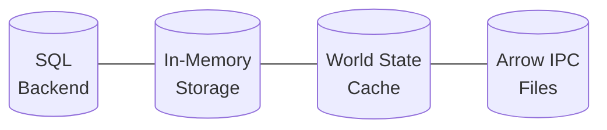

---

## 📦 Project Structure

```
HieraChain Ecosystem/
├── hierachain/                    # 🐍 Python - Main Ledger
│   ├── adapters/                  # External adapters
│   ├── api/                       # REST API (FastAPI)
│   │   ├── v1/                    # API version 1
│   │   ├── v2/                    # API version 2
│   │   ├── server.py              # FastAPI server
│   │   └── blockchain_explorer.py # Explorer endpoints
│   ├── cli/                       # Command-line interface
│   ├── config/                    # Configuration management
│   ├── consensus/                 # Python consensus wrappers
│   │   └── ordering_service.py    # Transaction ordering
│   ├── core/                      # Core blockchain components
│   │   ├── block.py               # Block definitions
│   │   ├── blockchain.py          # Blockchain management
│   │   ├── caching.py             # Performance caching
│   │   ├── domain_contract.py     # Smart contracts
│   │   ├── parallel_engine.py     # Parallel execution
│   │   └── consensus/             # Consensus implementations
│   ├── domains/                   # Business domain logic
│   ├── error_mitigation/          # Error handling & recovery
│   ├── hierarchical/              # Hierarchical chain system
│   │   ├── channel.py             # Channel management
│   │   ├── main_chain.py          # Main chain logic
│   │   ├── sub_chain.py           # Sub-chain management
│   │   ├── hierarchy_manager.py   # Hierarchy coordination
│   │   └── consensus/             # BFT consensus
│   ├── integration/               # System integrations
│   ├── monitoring/                # Observability & metrics
│   ├── network/                   # Network layer
│   │   ├── zmq_transport.py       # ZeroMQ transport
│   │   └── secure_connection.py   # TLS connections
│   ├── risk_management/           # Risk assessment
│   ├── security/                  # Security & cryptography
│   ├── storage/                   # Data persistence
│   │   ├── memory_storage.py      # In-memory backend
│   │   ├── sql_backend.py         # SQL database
│   │   └── world_state.py         # State management
│   └── units/                     # Utility modules
│
├── hierachain-consensus/          # 🦀 Rust - High-Performance Core
│   ├── lib.rs                     # Library entry point + PyO3 module
│   ├── ffi.rs                     # Foreign Function Interface
│   ├── core/                      # Core components
│   │   ├── block.rs               # Block struct & operations
│   │   ├── blockchain.rs          # Blockchain management
│   │   ├── schemas.rs             # Data schemas
│   │   ├── utils.rs               # Utilities (hashing, Merkle)
│   │   ├── py_wrapper.rs          # Python bindings
│   │   └── consensus/             # Consensus algorithms
│   │       ├── poa.rs             # Proof of Authority
│   │       └── pof.rs             # Proof of Federation
│   ├── consensus/                 # Ordering services
│   │   └── ordering_service.rs    # Transaction ordering
│   ├── hierarchical/              # Hierarchical chains
│   │   ├── main_chain.rs          # Main chain
│   │   ├── sub_chain.rs           # Sub-chains
│   │   ├── bft.rs                 # BFT consensus
│   │   └── hierarchy_manager.rs   # Hierarchy management
│   ├── security/                  # Cryptography
│   │   └── signatures.rs          # Ed25519 signatures
│   ├── error_mitigation/          # Error handling
│   └── utils/                     # Helper functions
│
├── Cargo.toml                     # Rust dependencies
├── pyproject.toml                 # Python dependencies
└── Makefile                       # Build automation
```

---

## 🏛️ Hierarchical Chain Architecture

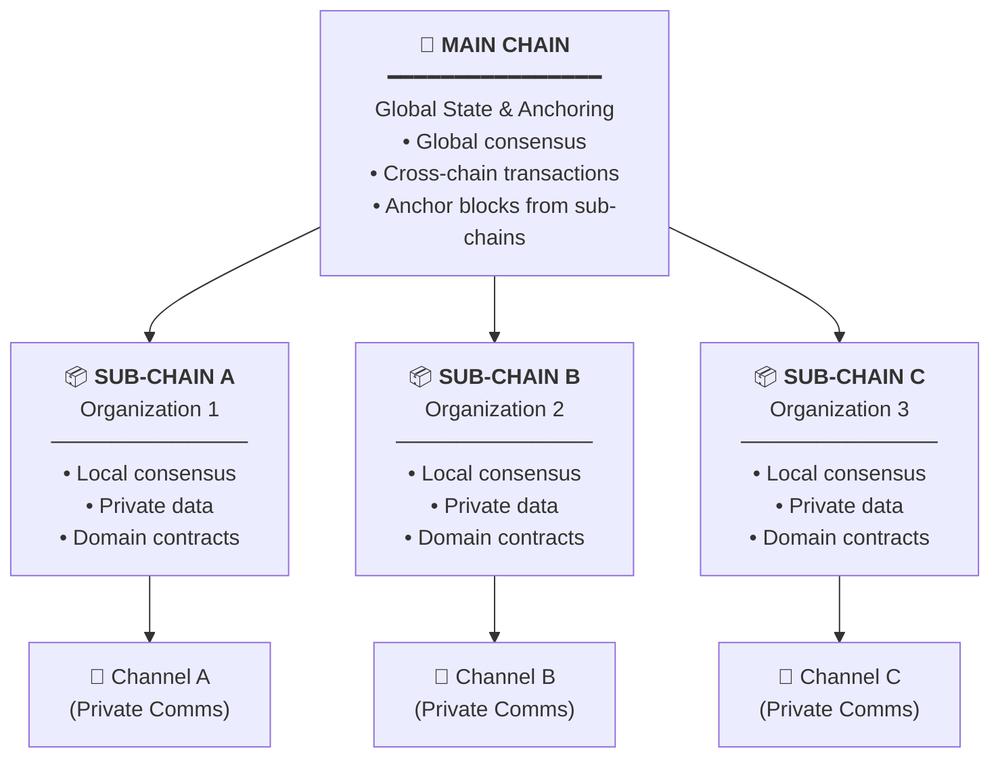

---

## 🔄 Data Flow Architecture

### Transaction Processing Flow

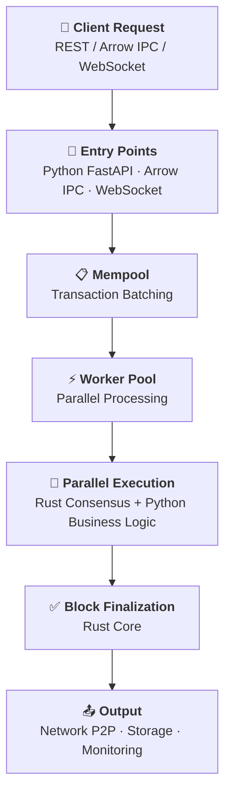

---

## 🔗 Inter-Language Communication

### Unified Data Format: Apache Arrow

Python and Rust communicate using **Apache Arrow** as the common data format, enabling zero-copy data sharing:

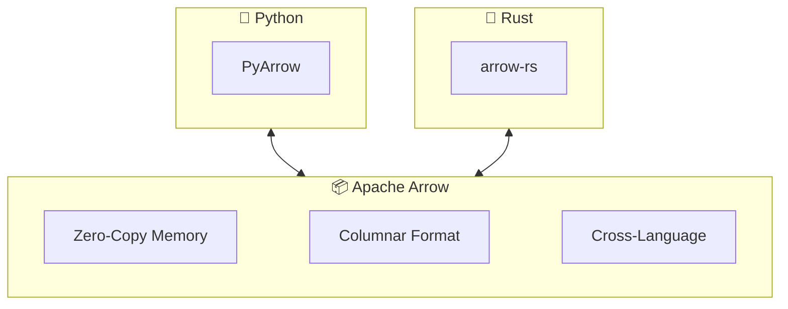

| Language | Arrow Library | Integration Method |
|:---------|:--------------|:-------------------|
| **Python** | `pyarrow` | Native Python bindings |
| **Rust** | `arrow-rs` | PyO3 FFI + Arrow IPC |

### Python ↔ Rust (PyO3 FFI + Arrow)

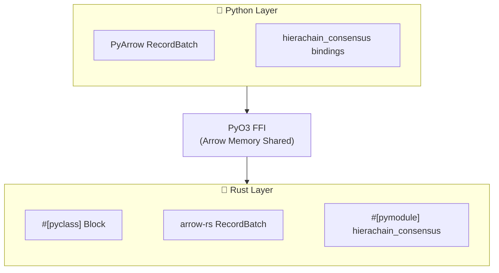

---

## ⚙️ Consensus Mechanisms

### Supported Algorithms

| Algorithm | Language | Use Case |
|:----------|:---------|:---------|
| **Proof of Authority (PoA)** | Rust | Private networks with trusted validators |
| **Proof of Federation (PoF)** | Rust | Multi-organization permissioned networks |
| **BFT Consensus** | Rust/Python | Byzantine fault-tolerant ordering |
| **Ordering Service** | Rust | Transaction ordering & batching |

### Algorithm Summary

| Algorithm | Key Concept | Fault Tolerance |
|:----------|:------------|:----------------|
| **PoA** | Identity-based validation by trusted authorities | Relies on validator reputation |
| **PoF** | Quorum-based consensus across organizations | Distributed trust, no single control |
| **BFT** | Tolerates Byzantine faults (malicious nodes) | Up to `f` faulty nodes in `3f + 1` network |

---

## 🛡️ Zero Knowledge Proof (ZKP) Verification Layer

### Overview

The ZKP layer enhances HieraChain's consensus mechanisms (PoA/PoF) from **Trust-Based** to a **Trustless** verification model:

| Model | Consensus | Trust Basis | Verification | Security Level |
|:------|:----------|:------------|:-------------|:---------------|
| **PoA/PoF (Base)** | Authority/Federation | Identity & Reputation | Signature only | Medium |
| **PoA/PoF + ZKP** | Authority/Federation | Cryptographic Proof | Mathematical verification | High |

> **Note**: Both **Proof of Authority (PoA)** and **Proof of Federation (PoF)** inherit from `BaseConsensus`, which provides the shared ZKP verification logic via `_verify_block_zk_proof()`.

### Architecture

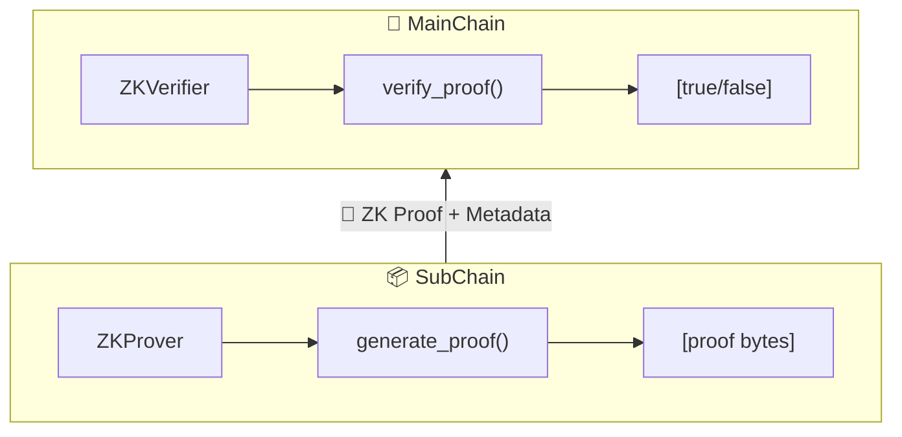

### ZK Components

| Component | Location | Responsibility |
|:----------|:---------|:---------------|
| `ZKProver` | `hierachain/security/zk_prover.py` | Generate proofs for block state transitions |
| `ZKVerifier` | `hierachain/security/zk_verifier.py` | Verify ZK proofs from SubChains |
| `BaseConsensus._verify_block_zk_proof()` | `hierachain/consensus/base_consensus.py` | Shared ZK verification logic |

### ZK State Transition Model

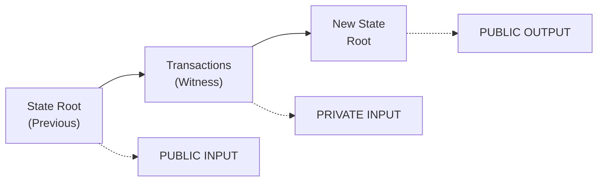

### Public Inputs (Verifiable)

| Field | Type | Purpose |
|:------|:-----|:--------|
| `old_state_root` | `bytes` | Merkle root of previous block |
| `new_state_root` | `bytes` | Merkle root of new block |
| `block_index` | `int` | Sequential block number (prevents replay) |

### Consensus Integration

ZK verification is integrated into all consensus mechanisms:

- **ProofOfAuthority (PoA)**: Uses `_verify_block_zk_proof()` from `BaseConsensus`
- **ProofOfFederation (PoF)**: Uses `_verify_block_zk_proof()` from `BaseConsensus`
- **BFTConsensus**: Includes `_verify_operation_zk_proof()` in `_handle_pre_prepare`
- **OrderingService**: `EventCertifier.validate()` includes `_verify_zk_proof()` method

### Configuration

| Setting | Default | Description |
|:--------|:--------|:------------|
| `ENABLE_ZK_PROOFS` | `False` | Enable/disable ZK verification |
| `ZK_MODE` | `"mock"` | `"mock"` for development, `"production"` for real ZK |
| `ZK_VERIFICATION_KEY_PATH` | `""` | Path to ZoKrates verification key |
| `ZK_PROVING_KEY_PATH` | `""` | Path to ZoKrates proving key |

### Modes

- **Mock Mode**: Uses SHA-256 hashes to simulate ZK proofs (development)
- **Production Mode**: Uses **ZoKrates** for real ZK-SNARKs circuits

### Security Guarantees

- ✅ **Soundness**: Cannot forge a valid proof for an invalid state transition
- ✅ **Completeness**: Valid state transitions always produce valid proofs
- ✅ **Zero-Knowledge**: Proof reveals nothing about private transaction data
- ✅ **Non-Interactive**: No communication needed between prover and verifier
- ✅ **Succinct**: Proof size is constant regardless of transaction count

---

## 🔐 Security Architecture

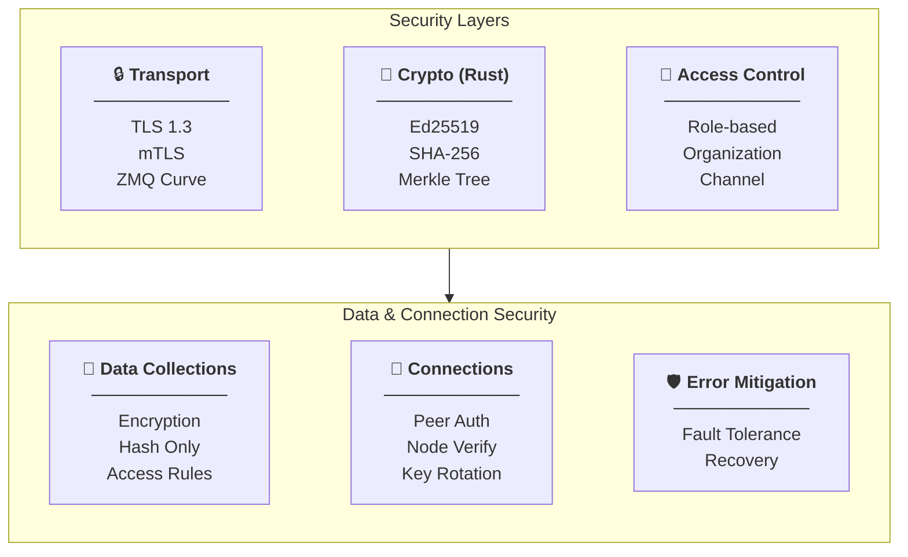

---

## 📊 Performance Architecture

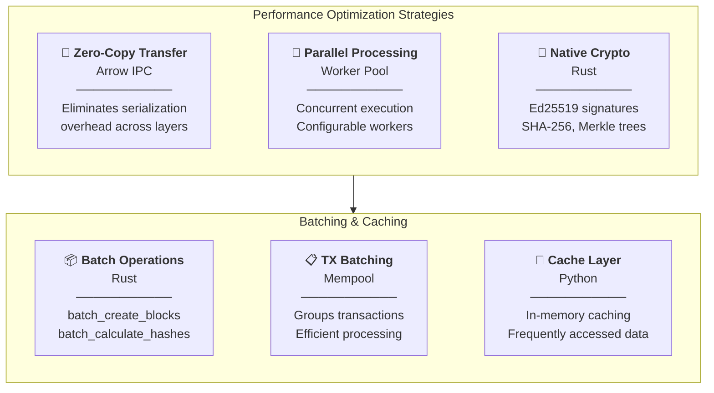

---

## 🌐 Network Architecture

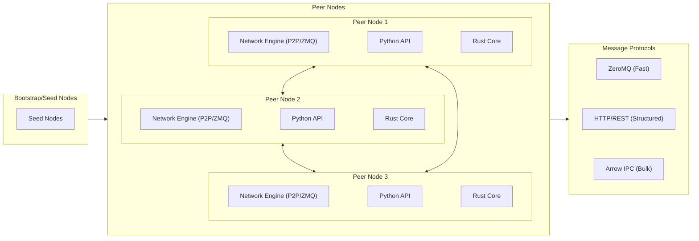

---

## 📈 Monitoring & Observability

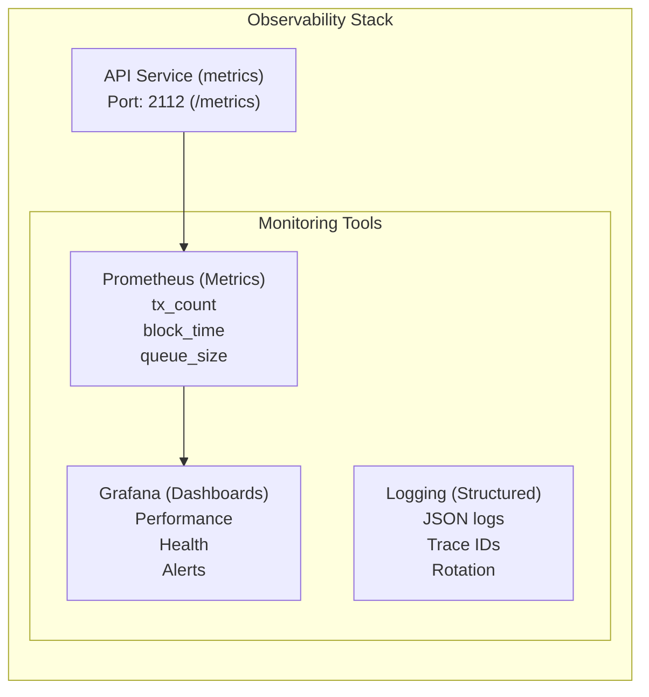

---

---

## 📄 License

Dual licensed under [Apache-2.0](LICENSE-APACHE) or [MIT](LICENSE-MIT).

---

*Last updated: 2026-01-12*
