# HieraChain Architecture

*Last updated: 2026-01-12*

## 📋 Overview

HieraChain is a **pure Python, high-performance enterprise blockchain ledger**. The architecture follows a **layered approach**, heavily utilizing **Apache Arrow** for fast columnar data processings and focusing on true enterprise integration rather than cryptocurrency mining natively.

---

## 📑 Table of Contents

* [🏗️ High-Level Architecture](#️-high-level-architecture)
* [📦 Project Structure](#-project-structure)
* [🏛️ Hierarchical Chain Architecture](#️-hierarchical-chain-architecture)
* [🔄 Data Flow Architecture](#-data-flow-architecture)
* [⚙️ Consensus Mechanism & Ordering](#️-consensus-mechanism--ordering)
* [🛡️ Zero Knowledge Proof (ZKP) Verification Layer](#️-zero-knowledge-proof-zkp-verification-layer)
* [⚖️ Cluster & Risk Management](#-cluster--risk-management)
* [🔐 Security Architecture](#-security-architecture)
* [📊 Performance Architecture](#-performance-architecture)
* [🌐 Network Architecture](#-network-architecture)
* [📈 Monitoring & Observability](#-monitoring--observability)
* [📄 License](#-license)

---

## 🏗️ High-Level Architecture

### System Overview

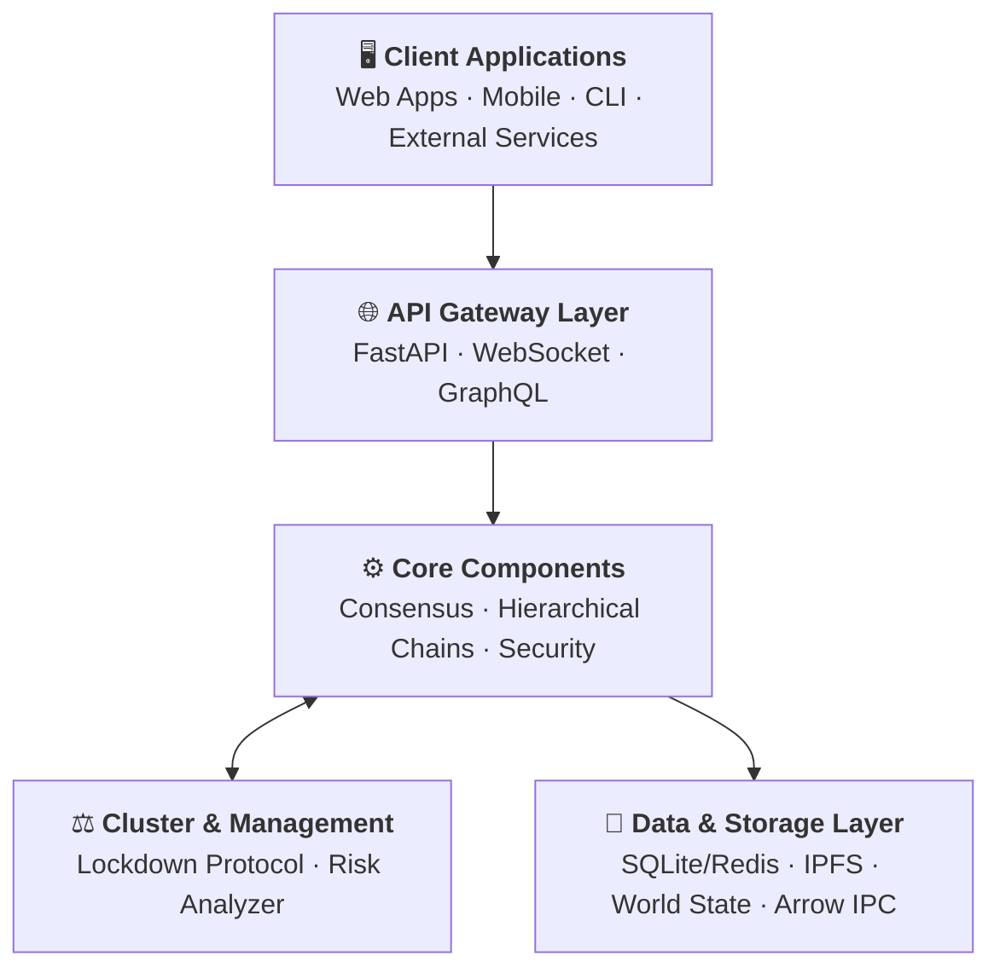

### Core Components Detail

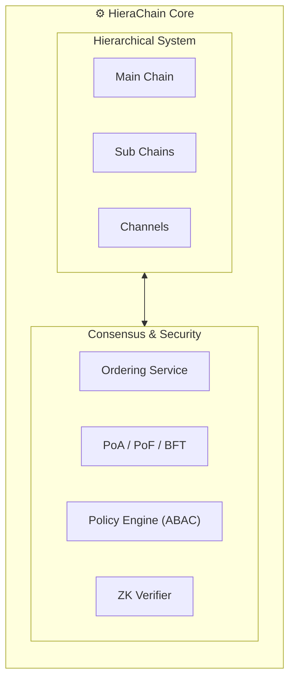

### Storage Layer Detail

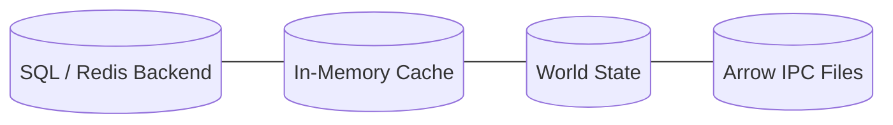

---

## 📦 Project Structure

```
HieraChain Ecosystem/
├── hierachain/                    # 🐍 Python - Main Ledger
│   ├── adapters/                  # Storage/DB adapters (SQLite, Redis)
│   ├── api/                       # REST, GraphQL, WebSocket, Explorer
│   ├── cli/                       # Command-line interface
│   ├── cluster/                   # ⚖️ Cluster Quorum & Sync
│   ├── config/                    # Configuration management
│   ├── consensus/                 # ⚙️ Ordering Service, BFT, PoA, PoF
│   ├── core/                      # Core blockchain components
│   ├── domains/                   # 🏢 Business domain logic & Event Types
│   ├── error_mitigation/          # Error handling & recovery
│   ├── hierarchical/              # Hierarchical chain system
│   ├── integration/               # Enterprise logic (ERP connectors)
│   ├── monitoring/                # 📈 Observability & Alerts
│   ├── network/                   # P2P Network (ZMQ)
│   ├── risk_management/           # 🛡️ Risk assessment & Mitigation
│   ├── security/                  # Cryptography, PoA, ACL
│   ├── storage/                   # Data persistence abstractions
│   └── units/                     # Semantic versioning & Utils
│
├── tests/                         # Unit, Integration, Stress tests
├── docs/                          # Developer documentation
├── pyproject.toml                 # Python dependencies
└── requirements.txt               # Main dependencies
```

---

## 🏛️ Hierarchical Chain Architecture

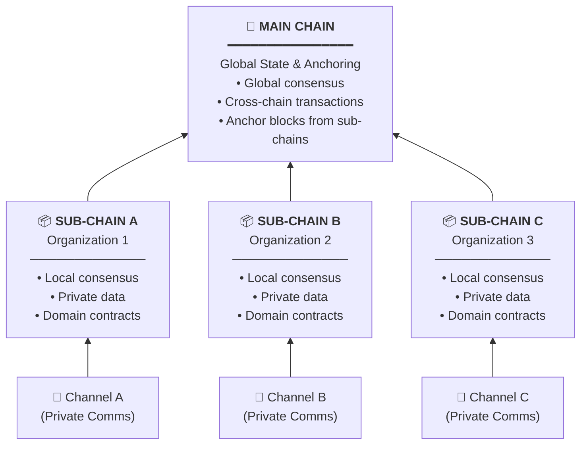

---

## 🔄 Data Flow Architecture

### Transaction Processing Flow

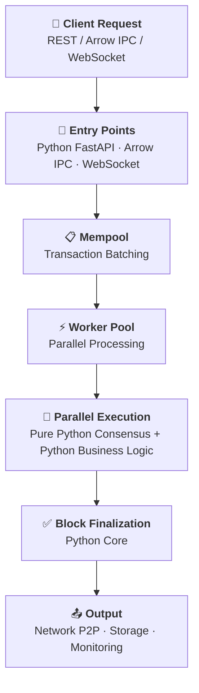

---

## ⚖️ Cluster & Risk Management

### Cluster Quorum Protocol

HieraChain implements a robust, Quorum-based cluster protocol (instead of single-leader election) to manage distributed states safely:

* **Heartbeat & Health Sync**: Continuous peer validation across the cluster.
* **Lockdown Protocol**: If severe anomalies occur, nodes cast votes. A quorum triggers a system-wide lockdown to freeze state changes.
* **Recovery Voting**: Upon resolution, the cluster votes to lift the lockdown.

### Risk Analyzer

Runs concurrently alongside operations to detect anomalies such as:

* Abnormal transaction volume (Z-score analysis).
* Suspicious cross-chain activity.
* Entity misbehaviors.

---

## ⚙️ Consensus Mechanism & Ordering

### Supported Algorithms

| Algorithm | Language | Use Case |
|:----------|:---------|:---------|
| **Proof of Authority (PoA)** | Python | Private networks with trusted validators |
| **Proof of Federation (PoF)** | Python | Multi-organization permissioned networks |
| **BFT Consensus** | Python | Byzantine fault-tolerant ordering |
| **Ordering Service** | Python | Transaction ordering & batching |

### Algorithm Summary

| Algorithm | Key Concept | Fault Tolerance |
|:----------|:------------|:----------------|
| **PoA** | Identity-based validation by trusted authorities | Relies on validator reputation |
| **PoF** | Quorum-based consensus across organizations | Distributed trust, no single control |
| **BFT** | Tolerates Byzantine faults (malicious nodes) | Up to `f` faulty nodes in `3f + 1` network |

---

## 🛡️ Zero Knowledge Proof (ZKP) Verification Layer

### Overview

The ZKP layer enhances HieraChain's consensus mechanisms (PoA/PoF) from **Trust-Based** to a **Trustless** verification model:

| Model | Consensus | Trust Basis | Verification | Security Level |
|:------|:----------|:------------|:-------------|:---------------|
| **PoA/PoF (Base)** | Authority/Federation | Identity & Reputation | Signature only | Medium |
| **PoA/PoF + ZKP** | Authority/Federation | Cryptographic Proof | Mathematical verification | High |

> **Note**: Both **Proof of Authority (PoA)** and **Proof of Federation (PoF)** inherit from `BaseConsensus`, which provides the shared ZKP verification logic via `_verify_block_zk_proof()`.

### Architecture

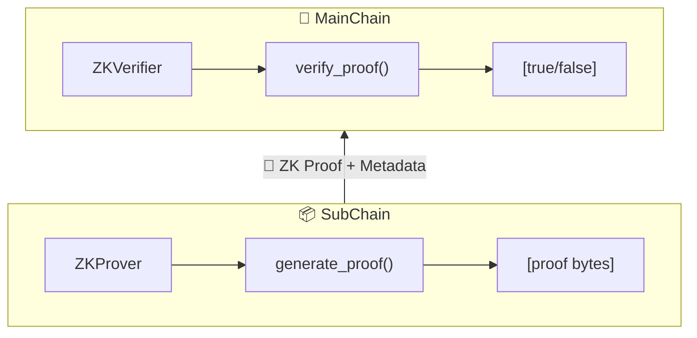

### ZK Components

| Component | Location | Responsibility |
|:----------|:---------|:---------------|
| `ZKProver` | `hierachain/security/zk_prover.py` | Generate proofs for block state transitions |
| `ZKVerifier` | `hierachain/security/zk_verifier.py` | Verify ZK proofs from SubChains |
| `BaseConsensus._verify_block_zk_proof()` | `hierachain/consensus/base_consensus.py` | Shared ZK verification logic |

### ZK State Transition Model

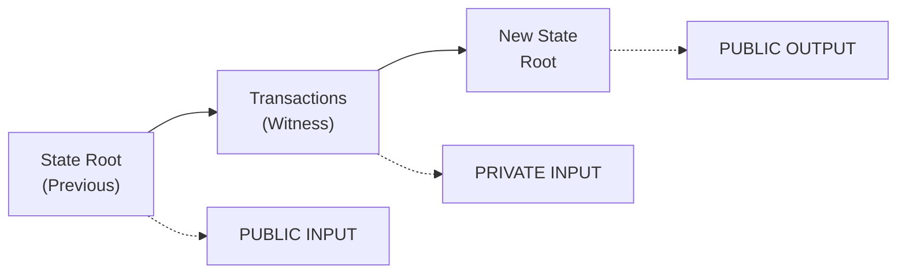

### Public Inputs (Verifiable)

| Field | Type | Purpose |
|:------|:-----|:--------|
| `old_state_root` | `bytes` | Merkle root of previous block |
| `new_state_root` | `bytes` | Merkle root of new block |
| `block_index` | `int` | Sequential block number (prevents replay) |

### Consensus Integration

ZK verification is integrated into all consensus mechanisms:

* **ProofOfAuthority (PoA)**: Uses `_verify_block_zk_proof()` from `BaseConsensus`
* **ProofOfFederation (PoF)**: Uses `_verify_block_zk_proof()` from `BaseConsensus`
* **BFTConsensus**: Includes `_verify_operation_zk_proof()` in `_handle_pre_prepare`
* **OrderingService**: `EventCertifier.validate()` includes `_verify_zk_proof()` method

### Configuration

| Setting | Default | Description |
|:--------|:--------|:------------|
| `ENABLE_ZK_PROOFS` | `False` | Enable/disable ZK verification |
| `ZK_MODE` | `"mock"` | `"mock"` for development, `"production"` for real ZK |
| `ZK_VERIFICATION_KEY_PATH` | `""` | Path to ZoKrates verification key |
| `ZK_PROVING_KEY_PATH` | `""` | Path to ZoKrates proving key |

### Modes

* **Mock Mode**: Uses SHA-256 hashes to simulate ZK proofs (development)
* **Production Mode**: Uses **ZoKrates** for real ZK-SNARKs circuits

### Security Guarantees

* ✅ **Soundness**: Cannot forge a valid proof for an invalid state transition
* ✅ **Completeness**: Valid state transitions always produce valid proofs
* ✅ **Zero-Knowledge**: Proof reveals nothing about private transaction data
* ✅ **Non-Interactive**: No communication needed between prover and verifier
* ✅ **Succinct**: Proof size is constant regardless of transaction count

---

## 🛡️ Enterprise Security Architecture

HieraChain adopts an omnipresent security philosophy relying on **6 core pillars**. Rather than being a single module, these pillars bind components across `hierachain.security`, `hierachain.cluster`, and `hierachain.risk_management` into a holistic enterprise-grade defense mechanism:

* 👤 **Authorization**: `PolicyEngine` (ABAC) and MSP Identity enforcing zero-trust access control.
* 🔒 **Lockdown & Logging**: `ClusterLockdownManager` via Quorum voting, paired with tamper-evident `SecureLogger`.
* 🛡️ **Fault-tolerance**: BFT and PoF consortium models resisting Byzantine behaviors and network splits.
* 📈 **Risk Analyzer**: Real-time Z-score anomaly detection to identify and flag suspicious transaction patterns.
* 🔑 **Encryption**: AES-256-GCM for all IPFS Swarm data, Ed25519 signatures, and mTLS/ZMQ Curve for the transport layer.
* 🔐 **Decentralized Zero-Knowledge Proofs**: ZK circuits (`ZKProver`/`ZKVerifier`) allowing systemic truth verification without revealing raw private data on the Main Chain.

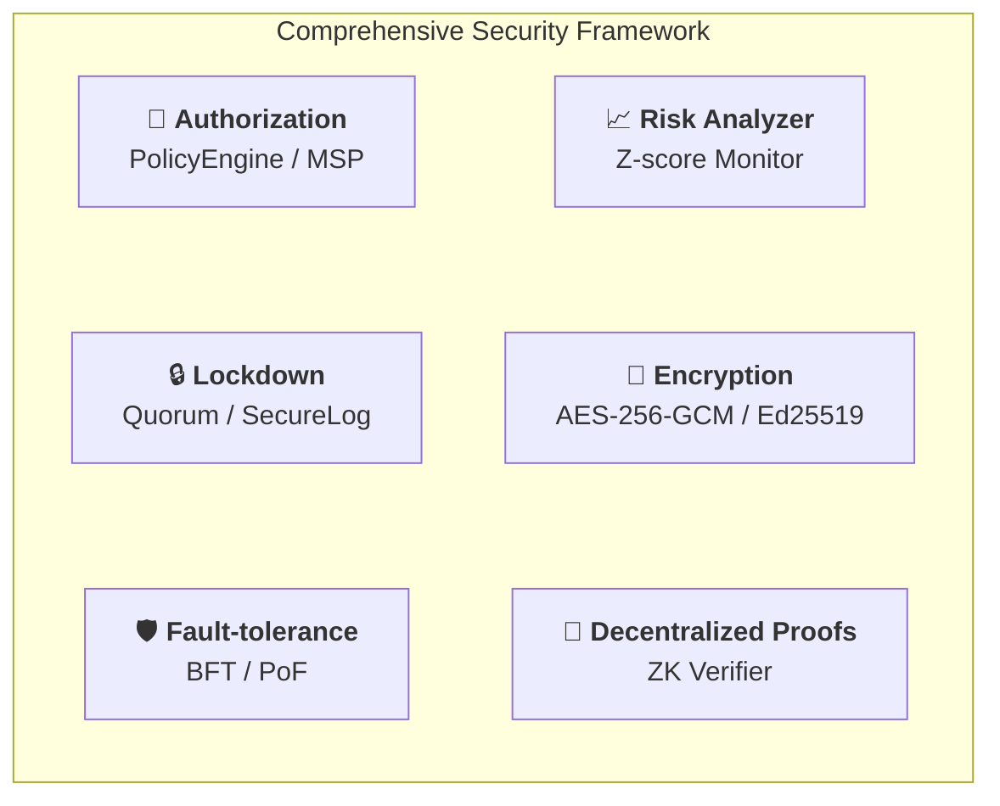

---

## 📊 Performance Architecture

Despite being written natively in Python, HieraChain achieves high throughput via advanced data processing paradigms:

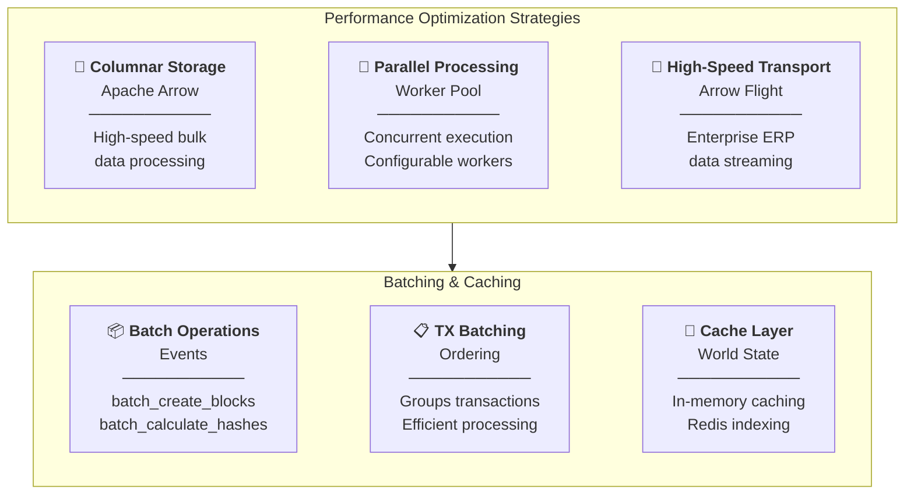

---

## 🌐 Network Architecture

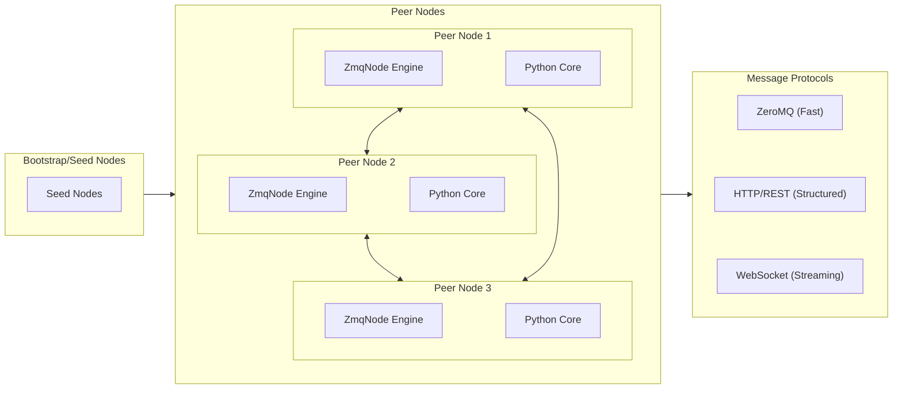

---

## 📈 Monitoring & Observability

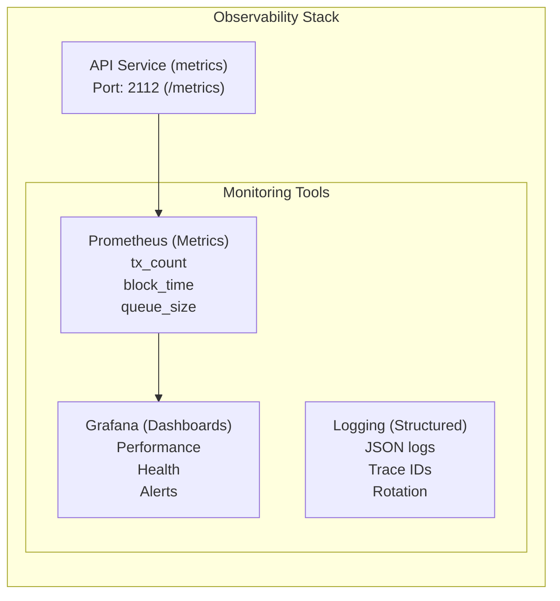

---

## 📄 License

Dual licensed under [Apache-2.0](LICENSE-APACHE) or [MIT](LICENSE-MIT).

---
