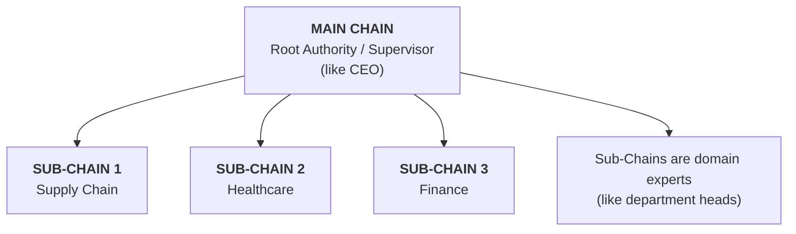
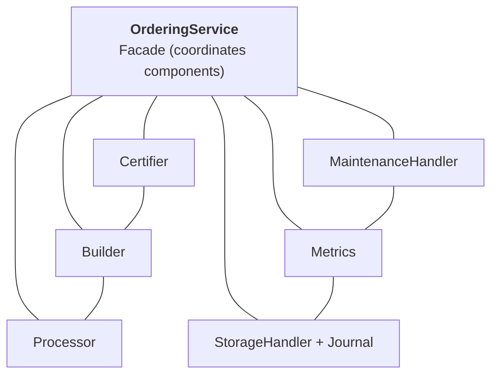
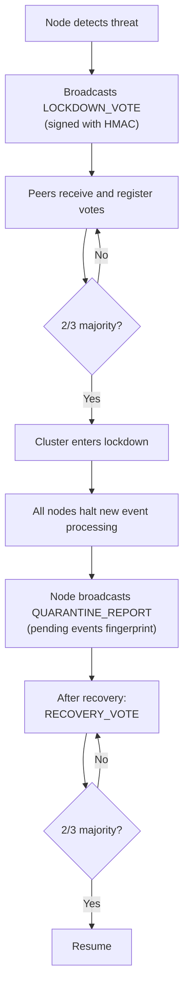
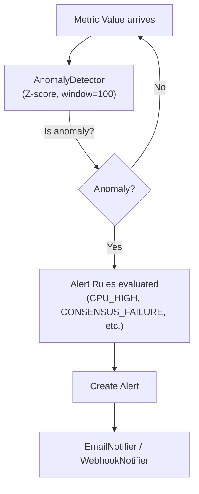
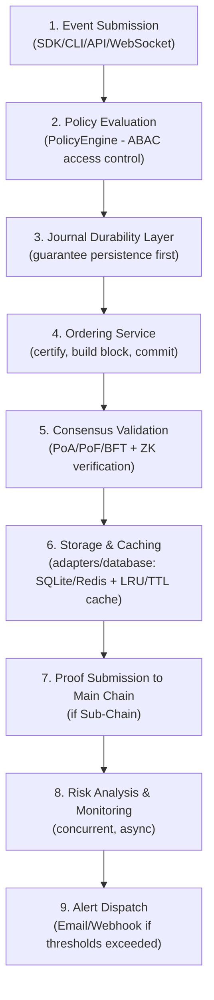
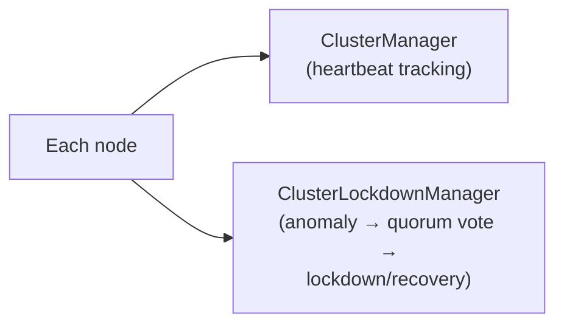

# System Architecture Analysis - HieraChain Enterprise Ledger

---

## Overview: What is HieraChain?

HieraChain is a **hierarchical blockchain enterprise ledger** designed specifically for business applications, completely avoiding cryptocurrency concepts. It's NOT a general-purpose blockchain platform focused on digital currencies—it's a **secure, hierarchical ledger structure for managing business operations and processes**.

## Core Architectural Philosophy

### 1. Event-Centric Design (Not Transaction-Centric)

* All operations are called **"events"**, not "transactions"
* This emphasizes the business application focus over financial/monetary operations
* Events contain metadata like `entity_id`, `event_type`, `timestamp`, and `details`

### 2. Hierarchical Two-Tier Architecture

**Key Design Decision**: The Main Chain **only stores proofs from Sub-Chains**, NOT detailed domain data. This separation ensures:

* Main Chain maintains system-wide integrity and coordination
* Sub-Chains handle domain-specific business operations with detailed event data

---

## System Components Breakdown

### Core Layer (`core/`)

| Component | Purpose | Architectural Pattern |
|-----------|---------|----------------------|
| `block.py` | Event container using Apache Arrow columnar storage | Composite Pattern - Blocks contain multiple events |
| `blockchain.py` | Base blockchain with validation, indexing | Template Method - Extended by MainChain and SubChain |
| `cache.py` / `cache_manager.py` | Hybrid caching (LRU, LFU, FIFO, TTL) | Strategy Pattern - Different cache policies per data type |
| `core/utils.py` | Common utility functions (event structure validation, etc.) | Utility Library |

**Architectural Highlight**: The use of **Apache Arrow for columnar storage** is a deliberate choice for high-performance data processing. The caching engine supports customizable strategies (`LRU`, `LFU`, `FIFO`, `TTL`) to optimize memory access during block query operations.

---

### Hierarchical Layer (`hierarchical/`)

| Component | Purpose | System Role |
|-----------|---------|-------------|
| `main_chain.py` | Root authority storing proofs, not data | Coordinator / Supervisor |
| `sub_chain.py` | Domain-specific chains with detailed events | Worker / Specialist |
| `channel.py` | Isolated data spaces for organizations | Communication Channel |
| `multi_org.py` | Multi-organization architecture with MSP | Enterprise Boundary Manager |
| `proof_aggregation.py` | Batches multiple proofs into one | Aggregator / Compressor |
| `hierarchy_manager.py` | Orchestrates entire chain hierarchy | Facade / Controller |
| `transaction_manager.py` | Cross-chain 2PC transactions | Transaction Coordinator |
| `private_data.py` | **[MỚI]** Private data collections per organization | Data Privacy Guard |
| `k8s_namespace_manager.py` | **[MỚI]** Kubernetes namespace lifecycle management for sub-chain isolation | Infrastructure Manager |
| `rebalancer.py` | **[MỚI]** Dynamic sub-chain splitting when load exceeds threshold | Auto-Scaling Engine |

**Key Additions**:

* **`K8sNamespaceManager`**: Deploys each Sub-Chain into an isolated Kubernetes namespace—ensuring complete resource isolation, fault isolation, independent scaling, and easier monitoring. Supports both real K8s and mock mode.
* **`SubChainRebalancer`**: Monitors sub-chain load in events/second (EPS). When throughput exceeds a configurable threshold, automatically splits the sub-chain into two child branches and migrates state using configurable strategies (`HASH_BASED`, `TIME_BASED`, `ROUND_ROBIN`).
* **`private_data.py`**: Manages private data collections scoped per-organization within a channel, ensuring data isolation even between organizations sharing the same Sub-Chain.

---

### Consensus Layer (`consensus/`)

The system supports **three consensus mechanisms** configurable via `HRC_CONSENSUS_TYPE`:

1. **Proof of Authority (PoA)** - Static/Centralized model

   * Designated authorities create blocks
   * No energy-intensive mining (suitable for business)
   * Main Chain acts as root authority

2. **Proof of Federation (PoF)** - Dynamic/Consortium model

   * Rotating leader schedule: `Leader = Validators[BlockHeight % ValidatorCount]`
   * Designed for semi-trusted consortiums (Healthcare, Education)
   * Removes single point of failure

3. **Byzantine Fault Tolerant (BFT)** - High fault tolerance

   * Tolerates `f` faults with `3f + 1` nodes
   * **3-phase protocol**: PRE-PREPARE → PREPARE (2f votes) → COMMIT (2f+1 votes) → Execute
   * **View Change**: `BFTViewChangeManager` handles leader failure with rotating view and proof verification
   * Integrates with `ErrorClassifier` for auto-recovery when failure threshold exceeded
   * Critical for safety-critical enterprise systems

**Architectural Note**: Both PoA and PoF support **ZK Proof verification** for trustless block validation, configurable via `HRC_ENABLE_ZK_PROOFS`.

#### Ordering Service (`consensus/ordering/`)

**Files**: `service.py` (Facade), `certifier.py`, `block_builder.py`, `processor.py`, `maintenance.py`, `storage.py`, `metrics.py`, `recovery.py`, `types.py`, `utils.py`

**Patterns Used**:

* **Facade Pattern**: `OrderingService` coordinates specialized components
* **Pipeline Pattern**: Event → Certify → Build Block → Persist → Commit
* `OrderingMaintenance` handles lockdown/resume within Ordering layer independently of cluster lockdown

---

### Cluster Management Layer (`cluster/`)

| Component | Purpose | Design Pattern |
|-----------|---------|----------------|
| `cluster_manager.py` | Node health tracking, quorum-based coordination | Observer + Quorum |
| `lockdown_protocol.py` | Gossip-style P2P lockdown broadcast and voting | State Machine + P2P |
| `state_sync_manager.py` | Cross-node state synchronization | Sync Manager |
| `cross_level_sync.py` | Cross-level hierarchical synchronization | Hierarchical Sync |

**Key Feature — Quorum-Based Lockdown**:

This is a critical production-grade feature. When anomalies are detected:

The `ClusterLockdownManager` uses gossip-style P2P messaging via ZeroMQ with HMAC-signed messages and 5-minute message expiry to prevent replay attacks.

---

### Monitoring & Observability Layer (`monitoring/`)

| Component | Purpose | Features |
|-----------|---------|----------|
| `alert_system.py` | Centralized alert management with anomaly detection | Z-score anomaly, Email/Webhook notifications |
| `performance_metrics.py` | System performance metric collection | CPU, memory, throughput tracking |
| `performance_monitor.py` | Real-time performance monitoring daemon | Background thread, threshold-based alerts |

**AlertManager Architecture**:

Alert severity levels: `INFO → WARNING → CRITICAL → EMERGENCY`  
Alert categories: `RISK_MANAGEMENT | PERFORMANCE | SECURITY | CONSENSUS | STORAGE | SYSTEM`

---

### Risk Management Layer (`risk_management/`)

| Component | Purpose | Design Pattern |
|-----------|---------|----------------|
| `risk_analyzer.py` | Multi-domain risk assessment (consensus, security, performance, storage) | Analyzer / Assessment Engine |
| `mitigation_strategies.py` | Automated risk mitigation playbooks | Strategy Pattern |
| `audit_logger.py` | Immutable audit trail for compliance | Audit Log / Event Sourcing |

**Risk Domains Covered**:

| Domain | Example Risks Detected |
|--------|----------------------|
| **Consensus** | Insufficient BFT nodes (`n < 3f+1`), high leader timeout, message verification failures |
| **Security** | Certificate expiry, brute-force attempts, weak encryption key size |
| **Performance** | High CPU/memory, event pool overflow, slow block creation |
| **Storage** | Oversized world state, overdue backups, slow queries |

Each `RiskAssessment` includes: severity, likelihood (0.0–1.0), affected components, and mitigation recommendations.

---

### Networking & Communication Layer (`network/`)

| Component | Purpose | Protocol Pattern |
|-----------|---------|------------------|
| `zmq_transport.py` | ZeroMQ message transport | Pub-Sub, Request-Reply |
| `secure_connection.py` | Encrypted peer connections | TLS-based handshake |
| `peer_trust_manager.py` | Peer trust management | Trust Certificate Chain |
| `message_cryptographic.py` | Message signing/verification | Ed25519 Signatures |
| `network_client.py` | **[MỚI]** HTTP network client for inter-node REST calls | HTTP Client |

---

### Storage & Persistence Layer (`adapters/database/` + `state/`)

| Component | Purpose | Design Pattern |
|-----------|---------|----------------|
| `adapters/database/sqlite_adapter.py` | Dedicated SQLite adapter with raw connection management | Adapter Pattern |
| `adapters/database/redis_adapter.py` | Redis adapter for distributed caching and state management | Redis Backend |
| `state/world_state.py` | Current world state snapshot engine | Snapshot Pattern |

**Note**: The storage layer follows **Ports & Adapters (Hexagonal Architecture)**. The `adapters/database/` directory provides concrete high-performance implementations for SQL (SQLite) and NoSQL (Redis) storage, simplifying database access while keeping it clean and easy to test.

---

### Reliability & Error Mitigation (`error_mitigation/`)

| Component | Purpose |
|-----------|---------|
| `journal.py` | Durability layer using Apache Arrow (`[Length (4 bytes)][Batch Bytes...]`) |
| `recovery_engine.py` | Automated failure recovery |
| `rollback_manager.py` | State rollback capabilities |
| `data_validator.py` | Input validation |
| `error_classifier.py` | **[MỚI]** Classify errors by type for targeted recovery |
| `validator.py` | **[MỚI]** Extended validation framework for business rules |

---

### Enterprise Integration Layer (`integration/`)

| Component | Purpose | System Role |
|-----------|---------|-------------|
| `enterprise.py` | ERP integration (SAP, Oracle, Dynamics) | Enterprise Bridge |
| `erp_ledger.py` | ERP-specific ledger operations | Domain Adapter |
| `arrow_client.py` | **[MỚI]** Apache Arrow Flight client for high-speed data transfer | High-Performance Data Transport |
| `erp_adapters/` | **[MỚI]** ERP-specific adapter implementations | Plugin Directory |

The system converts **ERP business events** → **Blockchain events** via configurable mapping rules, enabling seamless enterprise integration.

---

### API & Interface Layer (`api/`)

| Component | Purpose | Pattern |
|-----------|---------|---------| 
| `api/server.py` | FastAPI REST server (entrypoint) | API Gateway |
| `api/blockchain_explorer.py` | **[MỚI]** Blockchain explorer dashboard (chain overview, analytics, proof flow) | Explorer Dashboard |
| `api/graphql/schema.py` | **[MỚI]** GraphQL schema for flexible querying | GraphQL API |
| `api/websocket/manager.py` | **[MỚI]** `WebSocketManager` — connection lifecycle, subscription routing, ping health | WebSocket Manager |
| `api/websocket/registry.py` | Connection registry with max-connection enforcement | Registry Pattern |
| `api/websocket/subscriptions.py` | Per-chain and per-event-type subscription maps | Subscription Manager |
| `api/websocket/handlers.py` | Ping/health handler, connection health monitor | Health Monitor |
| `api/websocket/builders.py` | Message builders (`BLOCK_ADDED`, `EVENT_RECEIVED`, etc.) | Message Factory |
| `api/storage/ipfs_client.py` | **[MỚI]** Private IPFS Swarm client with AES-256-GCM encryption | Encrypted IPFS Client |
| `api/storage/encryption.py` | **[MỚI]** AES-256-GCM encryption layer for data-at-rest | Encryption Layer |
| `api/storage/endpoint_helpers.py` | **[MỚI]** Common REST endpoint helpers | Utility |
| `api/storage/explorer_helpers.py` | **[MỚI]** Explorer-specific query helpers | Utility |
| `api/ledger/endpoints.py` + `schemas.py` | API version 1 routes + Pydantic schemas | Versioned REST |
| `api/business/endpoints.py` + `schemas.py` | API version 2 routes + Pydantic schemas | Versioned REST |
| `api/admin/endpoints.py` + `schemas.py` | API version 3 routes + Pydantic schemas | Versioned REST |
| `sdk/client.py` | Python client library with retry + circuit breaker | Resilient Client Pattern |
| `cli/` | Click-based CLI (chain, event, node subcommands) | CLI Tool |

**`WebSocketManager` Key Features**:

* Max 1,000 concurrent connections (configurable)
* Subscriptions by chain name AND by event_type within a chain
* Async ping loop (30s interval) with disconnect on timeout
* Thread-safe with `asyncio.Lock()`
* Broadcast modes: `broadcast_to_chain()`, `broadcast_event_type()`, `broadcast_to_all()`, `send_to_connection()`

**`IPFSClient` — Private IPFS Swarm**:

* All data encrypted with AES-256-GCM **before upload** (IPFS stores ciphertext only)
* Auto-pin to prevent garbage collection
* Lazy connection (only connects when needed)
* Environment config: `HRC_IPFS_HOST`, `HRC_IPFS_ENCRYPTION_KEY`, `HRC_IPFS_AUTO_PIN`

**`BlockchainExplorer` Components**:

* **`ChainOverviewComponent`** — Block/event counts across all chains
* **`EntityTracerComponent`** — Trace any entity ID across Main Chain + all Sub-Chains
* **`EventAnalyticsComponent`** — Event type statistics, activity timeline (24h), chain distribution
* **`ProofVisualizerComponent`** — Proof submission flow, validation status, hierarchy view

---

### Security Architecture (`security/`)

| Component | Purpose | Algorithm/Standard |
|-----------|---------|-------------------|
| `identity.py` | Identity management | Ed25519 signatures |
| `certificate.py` | Certificate handling | X.509 |
| `msp.py` | Membership Service Provider | Hyperledger-compatible |
| `key_manager.py` | Key lifecycle management | AES-256-GCM encryption |
| `brute_force_protector.py` | Brute-force attack protection | Configurable thresholds |
| `zk_prover.py` | Zero-knowledge proof generation | SNARKs/STARKs |
| `policy_engine.py` | **[MỚI]** Flexible policy evaluation with conditions, priorities, caching | ABAC (Attribute-Based Access Control) |
| `key_provider.py` | **[MỚI]** Key retrieval abstraction | Key Provider Interface |
| `master_key_provider.py` | **[MỚI]** Master key management with HSM support | HSM-ready Key Vault |
| `key_backup_manager.py` | **[MỚI]** Encrypted key backup and restoration | Secure Backup |
| `integrity.py` | **[MỚI]** Data integrity verification (Merkle proofs, checksums) | Integrity Guard |
| `sanitization.py` | **[MỚI]** Input sanitization to prevent injection attacks | Security Sanitizer |
| `secure_logging.py` | **[MỚI]** Tamper-evident security audit logs | Audit Trail |
| `security_utils.py` | **[MỚI]** Shared cryptographic utilities | Crypto Utilities |
| `security/resource_guard.py` | **[MỚI]** Resource access guard for multi-tenant scenarios | Resource Protector |
| `security/verify/block_verifier.py` | **[MỚI]** `BlockVerifier` — hash, Merkle root, chain-link, signature verification | Block Integrity |
| `security/verify/signature_verifier.py` | **[MỚI]** Ed25519/ECDSA signature verification | Signature Guard |
| `security/verify/api_key_verifier.py` | **[MỚI]** API key verification with rate limiting | API Security |
| `security/verify/zk_verifier.py` | **[MỚI]** ZK proof verification integration | ZK Proof Guard |

**`PolicyEngine` Highlights** (ABAC model):

* Policy types: `ACCESS_CONTROL`, `ENDORSEMENT`, `LIFECYCLE`, `DATA_ACCESS`, `CHANNEL_MANAGEMENT`, `CONTRACT_EXECUTION`
* Condition operators: 12 types including `EQUALS`, `CONTAINS`, `IN`, `MATCHES` (regex)
* Combination logic: `all_allow`, `any_allow`, `majority_allow`
* Built-in LRU cache (TTL=5min) for evaluated policies
* Full audit trail of all policy evaluations

**`BlockVerifier` Highlights**:

* Verifies: block hash, Merkle root, chain-link (prev_hash), block creator signature
* Strict mode / non-strict mode (missing signature treated as error vs. warning)
* Supports ECDSA (EC secp256r1) and RSA signature schemes
* `verify_chain(blocks)` method validates entire block sequence
* Statistics tracking: `blocks_verified`, `valid_blocks`, `hash_failures`, `signature_failures`

---

### Domain Model Layer (`domains/`)

| Component | Purpose | Algorithm/Standard |
|-----------|---------|-------------------|
| `generic/chains/base_chain.py` | Abstract BaseChain with entity registry, domain rules, event handlers | Template Method Pattern - Extended by domain-specific chains |
| `generic/chains/domain_chain.py` | Concrete DomainChain with 2PC, business rules, operation metrics | Factory + Strategy - Business rule validation, metric tracking |
| `generic/events/base_event.py` | Base event schema with Ledger-compliant structure and validation | Composite Pattern - Event container with metadata |
| `generic/events/domain_event.py` | Domain event classes and factory functions | Factory Pattern - Domain-specific event creation |
| `generic/utils/entity_tracer.py` | Cross-chain entity lifecycle tracking across Main Chain + Sub-Chains | Chain Traversal - Event aggregation, lifecycle stage detection |
| `generic/utils/cross_chain_validator.py` | Proof consistency verification + Ledger compliance validation | Consistency Check - Hash verification, cryptocurrency term scanning |

**`DomainChain` (concrete domain implementation)**:

* Default business rules: `entity_must_be_registered`, `no_concurrent_operations`, `quality_check_before_approval`
* Operations: `start_domain_operation()`, `complete_domain_operation()`, `allocate_resource()`, `perform_quality_check()`, `process_approval()`, `check_compliance()`
* `OperationMetricsTracker`: tracks success_rate, quality_pass_rate, approval_rate
* **2PC (Two-Phase Commit)** support: `prepare_transaction()` → `commit_transaction()` or `rollback_transaction()`
* Generates compliance reports per entity and per operation

**`EntityTracer`** — Cross-chain entity tracking:

* `trace_entity(entity_id)`: finds entity across ALL sub-chains
* `get_entity_lifecycle()`: lifecycle stages (registered → in_progress → quality_approved → approved)
* `find_related_entities()`: finds shared_resources, approvers, inspectors, processors
* `get_entity_performance_summary()`: completion_rate, quality_pass_rate, compliance_rate
* `generate_entity_report()`: comprehensive report with recommendations
* 5-minute LRU cache to avoid repeated queries

**`CrossChainValidator`** — System integrity validation:

* `validate_proof_consistency()`: verifies Main Chain proof hashes match Sub-Chain block hashes
* `validate_entity_consistency(entity_id)`: checks entity events for logical consistency across chains
* `validate_system_integrity()`: full system check (chain validity + proofs + Ledger compliance)
* **Ledger Compliance check**: scans all events for forbidden cryptocurrency terminology (`transaction`, `mining`, `coin`, `wallet`, etc.)
* `generate_validation_report()`: comprehensive report with recommendations
* Extensible via `add_validation_rule(name, function)`

---

### Configuration System (`config/`)

The configuration is highly flexible via **environment variables**:

| Key | Purpose | Default |
|-----|---------|---------|
| `HRC_CONSENSUS_TYPE` | Consensus selection (PoA/PoF/BFT) | `proof_of_authority` |
| `HRC_STORAGE_BACKEND` | Storage backend (sqlite/redis/memory) | `sqlite` |
| `HRC_ENABLE_ZK_PROOFS` | Enable ZK proof verification | `false` |
| `HRC_AUTH_ENABLED` | API authentication enforcement | `false` |
| `HRC_CLUSTER_SECRET` | **[MỚI]** Shared HMAC secret for cluster lockdown messages | _(required for cluster)_ |
| `HRC_SMTP_USERNAME` / `HRC_SMTP_PASSWORD` | **[MỚI]** Email alert credentials | _(optional)_ |
| `HRC_IPFS_HOST` | **[MỚI]** IPFS daemon API address (multiaddr) | `/ip4/127.0.0.1/tcp/5001` |
| `HRC_IPFS_ENCRYPTION_KEY` | **[MỚI]** Hex-encoded AES-256 key for IPFS content | _(auto-generated if missing)_ |
| `DATABASE_URL` | Database connection string | `sqlite:///hierachain.db` |

Additional config components:

* `settings.py` — Settings singleton with environment variable fallback
* `env_manager.py` — **[MỚI]** Advanced environment variable management and validation
* `logging.py` — **[MỚI]** Structured logging configuration

---

### Versioning (`config/`)

| Component | Purpose |
|-----------|---------|
| `version.py` | Semantic version management and compatibility checking |

### CLI Layer (`cli/`)

| File | Commands | Purpose |
|------|----------|---------|
| `cli/chain.py` | `chain create --name --parent`, `chain submit-proof`, `chain list` | Chain management |
| `cli/event.py` | `event add`, `event show` | Event submission and tracking |
| `cli/key.py` | `key generate`, `key show`, `key verify` | Key pair management for validators |
| `cli/node.py` | `node start`, `node init` | Node lifecycle management |
| `cli/store.py` | Internal state persistence helpers | In-memory + JSON file storage for CLI sessions |
| `cli/verify.py` | `verify chain`, `verify signatures` | Ledger integrity and signature auditing |

The CLI uses **Click** with context-passing (`ctx.obj`) for config sharing between commands. Supports 4 built-in domain types for chain creation: `supply_chain`, `healthcare`, `finance`, `manufacturing`.

---

## System Design Highlights (From a System Engineer Perspective)

### 1. Separation of Concerns in Hierarchy

* **Main Chain**: System integrity, proof storage, coordination (supervisor role)
* **Sub-Chains**: Domain-specific operations, detailed event data (worker role)

This mirrors enterprise organizational structure: CEO coordinates at high level, department heads handle detailed work.

### 2. Performance-First Design

* **Columnar storage** (Apache Arrow) for efficient data processing
* **Hybrid caching** with different policies per data type
* **Parallel processing** across CPU cores
* **Arrow Flight** for high-speed inter-service data transfer

### 3. Reliability Engineering

* **Durability layer** (Transaction Journal) before processing
* **Circuit breaker pattern** in SDK for resilience
* **Rollback capabilities** for recovery
* **Quorum-based cluster lockdown** for coordinated failure response

### 4. Enterprise Readiness

* **Channel-based isolation** between organizations
* **MSP (Membership Service Provider)** for identity management
* **ERP integration** as first-class feature
* **ABAC PolicyEngine** for fine-grained access control

### 5. Cloud-Native / Kubernetes-Ready

* **K8s Namespace Manager** for sub-chain isolation in production clusters
* **Sub-chain auto-rebalancer** for elastic horizontal scaling
* **Cross-level state sync** for distributed consistency

### 6. Observability & Operations

* **Real-time alert system** with anomaly detection (Z-score)
* **Multi-domain risk analyzer** with actionable recommendations
* **Immutable audit logger** for compliance
* **Blockchain Explorer** for developer inspection

---

## Updated Architectural Patterns

| Pattern | Where Used | Purpose |
|---------|------------|---------|
| **Facade** | `OrderingService`, `HierarchyManager` | Simplify complex subsystem interactions |
| **Repository** | Storage backends | Abstract data access |
| **Adapter** | `adapters/database/`, `integration/erp_adapters/` | Pluggable backend implementations |
| **Cache-Aside** | `caching.py`, `PolicyEngine` | On-demand caching with fallback |
| **Strategy** | Cache policies, consensus types, split strategies | Swappable algorithms |
| **State Machine** | `DomainContract` lifecycle, `ClusterLockdownManager` | Controlled state transitions |
| **Observer** | `AlertManager`, `ClusterManager` callbacks | Event-driven notifications |
| **Composite** | Blocks containing events | Treat single/many uniformly |
| **Pipeline** | Event processing flow | Sequential transformation stages |
| **Template Method** | Base `Blockchain` class | Common algorithm skeleton with customizable steps |
| **Quorum** | `ClusterManager`, `ClusterLockdownManager` | Distributed consensus for operational decisions |
| **ABAC** | `PolicyEngine` | Attribute-Based Access Control |

---

## System Flow Summary

**Cluster-level flow (parallel)**:

---

## My Interpretation as a System Architect

HieraChain is designed as an **enterprise-grade business ledger** that:

1. Avoids cryptocurrency concepts entirely (no mining, no tokens)
2. Uses hierarchical structure mirroring enterprise org charts
3. Prioritizes **performance** (Arrow columnar storage, parallel processing, Arrow Flight)
4. Prioritizes **reliability** (durability journal, rollback, circuit breakers, cluster quorum)
5. Integrates seamlessly with existing ERP systems
6. Is **cloud-native** (K8s namespace isolation, auto-rebalancing)
7. Provides **enterprise-grade security** (ABAC policies, ZK proofs, key backup, sanitization)
8. Offers **full observability** (alerts, risk analysis, explorer, audit trail)

The system is built for **business process management** at enterprise scale, where multiple organizations need a shared, trustworthy ledger without the complexity of cryptocurrency consensus mechanisms. The addition of Cluster Management, Monitoring, and Risk Management layers makes it production-ready for critical business operations.
