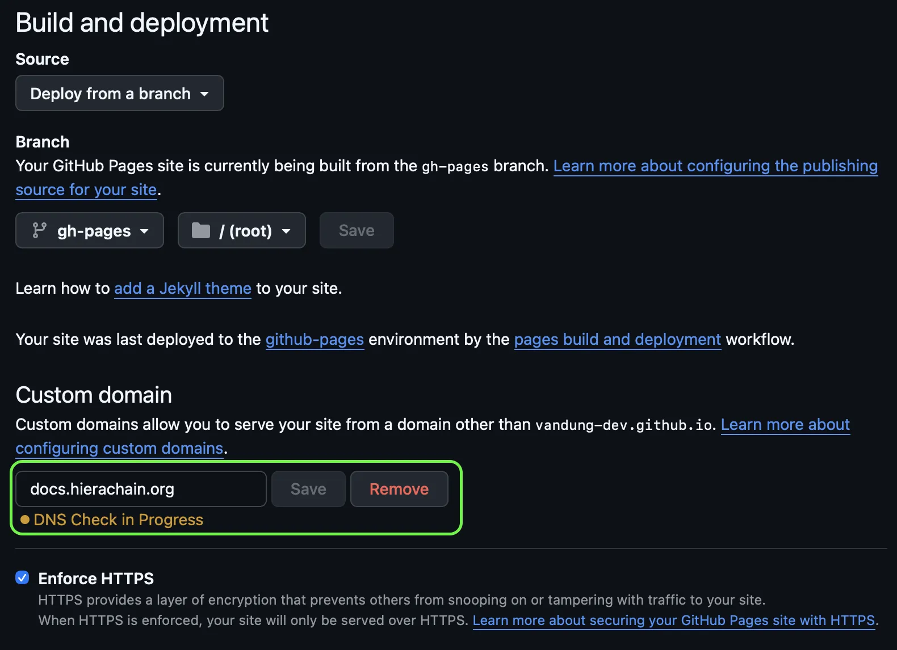

# HieraChain Documentation Guide

The HieraChain documentation is written in Markdown and built using [Zensical](https://zensical.org/). The documentation structure is designed to support multiple languages natively, with Vietnamese (`vi`) currently configured as the primary language.

Inside the `docs` directory, the documentation source code is neatly separated into language-specific folders (e.g., `docs/vi/` for Vietnamese).

## Prerequisites

Before testing or building the documentation locally, ensure all required dependencies are installed:

```bash
pip install -r requirements_dev.txt
```

## Current Configuration for Vietnamese (`vi`)

The `mkdocs.yml` file located at the root directory contains the core configuration for language-based publishing. The key settings that instruct Zensical to process the Vietnamese documentation are:

* **Source Directory**: `docs_dir: docs/vi/` (specifies the path containing the Markdown files)
* **UI Language**: `theme.language: vi` (sets the theme's interface language to Vietnamese)
* **Date Localization**: `locale: vi` under the `git-revision-date-localized` plugin.

## Publishing and Testing the Documentation

Make sure to run the following commands from the **root directory of the project** (where the `mkdocs.yml` file is located).

### 1. Serve Locally (Live Preview)

During development, you can start a local server that automatically reloads your changes. As noted in the `docs/DEV_GUIDE.md`, use the `zensical` CLI:

```bash
zensical serve
```

Open your browser at `http://127.0.0.1:8000` to view the documentation with the current language configuration.

### 2. Build Static Files (Production)

To export the documentation as a static HTML website ready for deployment (e.g., to GitHub Pages, Vercel, Nginx), run:

```bash
zensical build
```

This will quickly generate all static assets and output them to the `site/` directory.

## Expanding to Other Languages (e.g., English - `en`)

The current architecture allows you to easily plug in new languages. To configure an additional translation such as English, follow these steps:

1. **Duplicate the Content**: Copy the `docs/vi/` directory and rename it to `docs/en/`. Then, translate the Markdown files inside.
2. **Enable the Language Switcher**: Open `mkdocs.yml`, locate the `extra.alternate` block, and uncomment the English setup to display the language selection menu on the website:

   ```yaml
   extra:
     alternate:
       - name: 🇻🇳 Tiếng Việt
         link: /
         lang: vi
       - name: 🇬🇧 English
         link: /en/
         lang: en
   ```

3. **Build Each Language**: To achieve the URL structure `docs.hierachain.org` (Vietnamese), `docs.hierachain.org/en` (English), `docs.hierachain.org/ru` (Russian), etc., create separate config files for each language and build them to isolated directories:

   * `mkdocs.yml` → build to `site/` (Vietnamese as default)
   * `mkdocs.en.yml` → build to `site/en/` (English)
   * `mkdocs.ru.yml` → build to `site/ru/` (Russian)

   Example `mkdocs.en.yml`:

   ```yaml
   site_name: HieraChain Documentation
   docs_dir: docs/en/
   site_dir: site/en/
   theme:
     language: en
   extra:
     alternate:
       - name: 🇻🇳 Tiếng Việt
         link: /
         lang: vi
       - name: 🇬🇧 English
         link: /en/
         lang: en
   ```

   Build each language:

   ```bash
   zensical build -f mkdocs.yml        # Vietnamese → docs.hierachain.org
   zensical build -f mkdocs.en.yml     # English → docs.hierachain.org/en
   zensical build -f mkdocs.ru.yml     # Russian → docs.hierachain.org/ru
   ```

## Custom Domain Configuration (GitHub Pages)

If you are hosting the documentation on GitHub Pages and want to use a custom domain (e.g., `docs.hierachain.org`), configure it directly in your repository's settings:

1. Navigate to your GitHub repository.
2. Go to **Settings** > **Pages**.
3. Scroll down to the **Custom domain** section.
4. Enter your domain (e.g., `docs.hierachain.org`) and click **Save**. 
5. GitHub will perform a DNS check. Ensure to tick **Enforce HTTPS** when it becomes available.

Below is an illustration of configuring the custom domain in GitHub settings:


