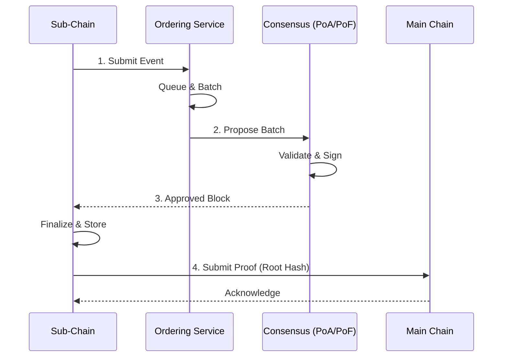

# Consensus & Ordering

## Purpose

Describes the Consensus mechanisms and Ordering Service used by HieraChain to ensure the integrity, order, and verifiability of Blocks/Events.

## Architecture & Concepts

* Base Consensus: `hierachain/consensus/base_consensus.py` — Base interface/framework for consensus algorithms.
* Proof of Authority (PoA): `hierachain/consensus/proof_of_authority.py` — Centralized/static validator environment; high speed, simple configuration.
* Proof of Federation (PoF): `hierachain/consensus/proof_of_federation.py` — Dynamic organization federation; suitable for consortiums.
* BFT Consensus: `hierachain/consensus/bft/` — Byzantine fault tolerance at the hierarchical level.
* Ordering Service: `hierachain/consensus/ordering/` — Orders Events before block creation; multi-component architecture (Processor, Certifier, BlockBuilder).

### Typical Flow



1. Sub-Chain receives Event → pushes to Ordering Service queue.
2. Ordering Service creates batch per policy (size/time threshold) → sends to selected Consensus mechanism.
3. Consensus mechanism (PoA/PoF or BFT) confirms batch/Block → Sub-Chain closes Block.
4. If Main Chain anchoring is enabled: Sub-Chain sends Proof (Merkle root/hash) for Main Chain recording.

## Configuration

Variables in `hierachain/config/settings.py`:

* `CONSENSUS_TYPE`: `proof_of_authority` (default) or `proof_of_federation`.
* `BFT_ENABLED`: Enable/disable BFT layer for Byzantine-resistant scenarios.
* `VALIDATOR_TIMEOUT`: Timeout between validators.
* `CONSENSUS_FEDERATION_CONFIG`: federation parameters (e.g. `min_validators`, `block_interval`).

Environment example:

```dotenv
HRC_CONSENSUS_TYPE=proof_of_authority
HRC_ZK_REQUIRED_MAINCHAIN=false
```

## Features & Limitations

* PoA: simple deployment, low latency; trust dependency on centralized validator.
* PoF: balance between trust and distribution; requires federation membership management.
* BFT: good Byzantine fault tolerance; trades off complexity/higher message overhead.
* Ordering: ensures stable event ordering/batching before block finalization.

## Related

* Architecture Overview: [Overview](overview.md)
* Hierarchical module: [Hierarchical](../modules/hierarchical.md)
* Data Models: [Data Models](../reference/data-models.md)
* Config: [Config](../reference/config.md)
