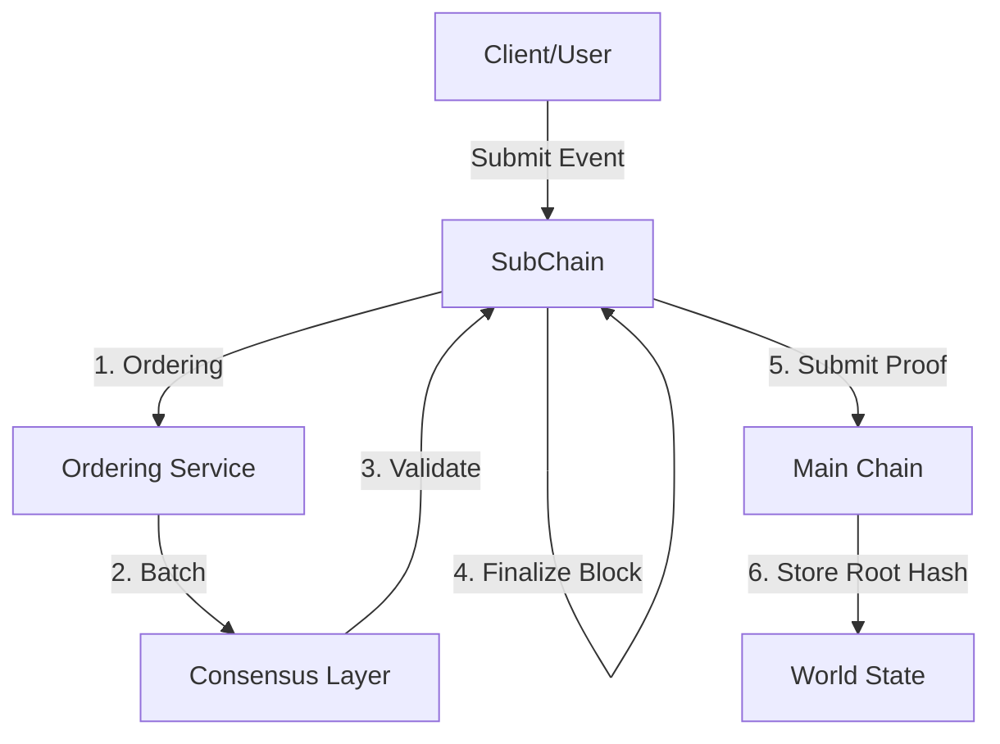

# Hierarchical Architecture (Detailed)

## Purpose

This page explains how HieraChain organizes its hierarchy. It covers how Sub-Chains interact with the Main Chain through `HierarchyManager`, how channels and the multi-org model work, how private data is handled, how cross-chain transactions use 2PC, how proofs are anchored, and how Sub-Chains are rebalanced.

## Components and concepts

* Main Chain: `hierachain/hierarchical/main_chain/base.py` stores proofs from Sub-Chains and aggregates integrity reports.
* Sub-Chain (Domain Chain): `hierachain/hierarchical/sub_chain/base.py` processes domain events, orders and closes blocks, and generates proofs.
* Hierarchy Manager: `hierachain/hierarchical/hierarchy_manager/base.py` coordinates the chain system, manages Sub-Chain lifecycle, cross-chain transactions and system statistics.
* Channel: `hierachain/hierarchical/channel/channel.py` provides a private communication space for groups of organizations and holds channel creation policies.
* Multi-Org: `hierachain/hierarchical/multi_org.py` handles organization initialization, the multi-org network, and the relationship between channels and organizations.
* Private Data: `hierachain/hierarchical/private_data.py` holds private data collections at the Sub-Chain level.
* Cross-Chain Transaction Manager: `hierachain/hierarchical/transaction_manager.py` coordinates 2PC transactions between Sub-Chains.

### Typical flow

1. Create a Sub-Chain with `HierarchyManager.create_sub_chain(name, domain_type, metadata)`. This initializes a DomainChain and connects it to the Main Chain.
2. Write an event and close a block with `SubChain.add_event()`, which goes through ordering and consensus to `finalize_block()`.
3. Anchor the proof to the Main Chain with `SubChain.submit_proof_to_main(main_chain, ...)` or `HierarchyManager.submit_proof_to_main_chain(name)`.
4. Run cross-chain transactions (2PC) with `HierarchyManager.transaction_manager.initiate_transaction(src, dst, payload)`, which handles prepare, commit and rollback.
5. Channels and private data: create a channel between organizations. Private collections are stored at the Sub-Chain according to the channel policy.

## Related configuration (settings.py, actual `HRC_*`)

* Consensus/Ordering: see [Consensus & Ordering](consensus.md) and `HRC_CONSENSUS_TYPE`/`HRC_MAINCHAIN_CONSENSUS`, `VALIDATOR_TIMEOUT`, `HRC_BLOCK_INTERVAL`.

## Features and limitations

* Features: domain data separation, centralized proof anchoring on the Main Chain, 2PC support, channels and multi-org, and private data.
* Limitations: channel and multi-org operations need clear policies, and 2PC needs good synchronization.

## Related

* Overview: [Overview](overview.md)
* Consensus & Ordering: [Consensus & Ordering](consensus.md)
* Hierarchical module: [Hierarchical](../modules/hierarchical.md)
* Config: [Config](../reference/config.md)
