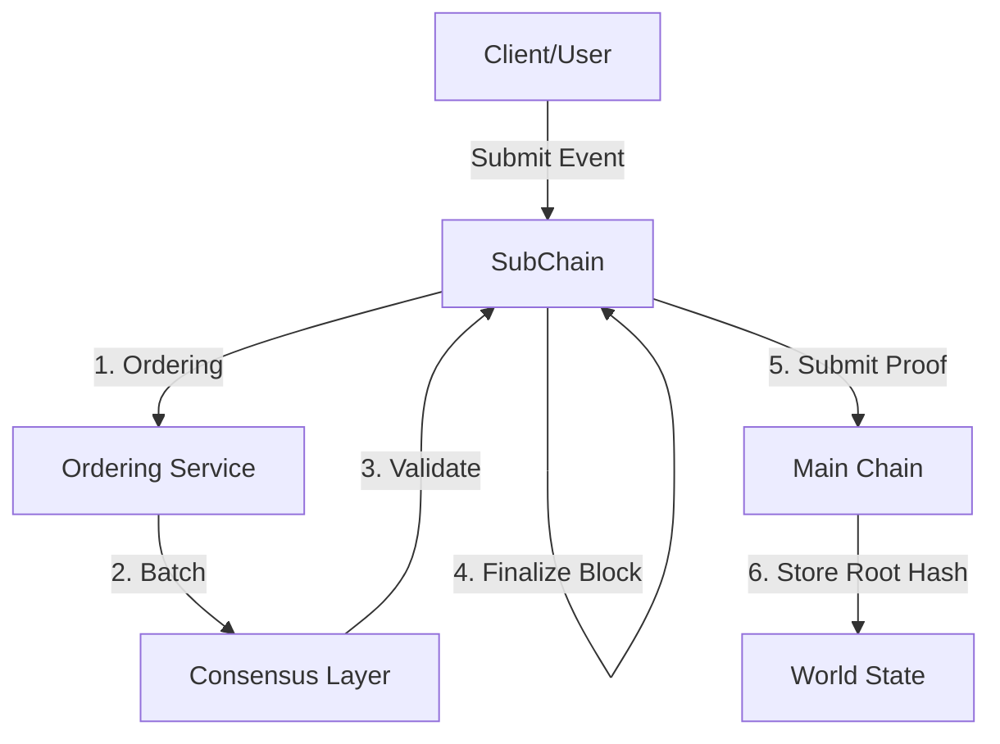

# Hierarchical Architecture (Detailed)

## Purpose

Detailed explanation of HieraChain's hierarchical mechanism: how Sub-Chains interact with the Main Chain via `HierarchyManager`, Channel and multi-org model, private data, cross-chain transactions (2PC), Proof anchoring, and Sub-Chain rebalancing.

## Components & Concepts

* Main Chain: `hierachain/hierarchical/main_chain/base.py` — Stores Proofs from Sub-Chains; aggregates integrity reports.
* Sub-Chain (Domain Chain): `hierachain/hierarchical/sub_chain/base.py` — Processes domain Events, Ordering/closes Blocks, generates Proofs.
* Hierarchy Manager: `hierachain/hierarchical/hierarchy_manager/base.py` — Coordinates the Chain system, manages Sub-Chain lifecycle, cross-chain transactions, system statistics.
* Channel: `hierachain/hierarchical/channel/channel.py` — Private communication space for organization groups, channel creation policy settings.
* Multi-Org: `hierachain/hierarchical/multi_org.py` — Organization initialization, multi-org network, Channel ↔ Organization relationships.
* Private Data: `hierachain/hierarchical/private_data.py` — Private data collections at Sub-Chain level.
* Cross-Chain Transaction Manager: `hierachain/hierarchical/transaction_manager.py` — Coordinates 2PC transactions between Sub-Chains.
* Proof Aggregation: `hierachain/hierarchical/proof_aggregation/aggregator.py` — Groups, compresses proofs before sending/recording (configurable).
* Rebalancer: `hierachain/hierarchical/rebalancer/rebalancer.py` — Automatically splits/balances Sub-Chains under high load based on thresholds.

### Typical Flow

1. Create Sub-Chain: `HierarchyManager.create_sub_chain(name, domain_type, metadata)` → initializes DomainChain, connects to Main Chain.
2. Write Event and close Block: `SubChain.add_event()` → Ordering → Consensus → `finalize_block()`.
3. Anchor Proof to Main Chain: `SubChain.submit_proof_to_main(main_chain, ...)` or via `HierarchyManager.submit_proof_to_main_chain(name)`.
4. Cross-chain transactions (2PC): `HierarchyManager.transaction_manager.initiate_transaction(src, dst, payload)` → prepare/commit/rollback.
5. Channels & Private Data: Create Channel between organizations; private collections stored at Sub-Chain per channel policy.
6. Sub-Chain Rebalancing: Rebalancer monitors EPS/thresholds → proposes branch splitting/load movement.

## Related Configuration (settings.py)

* Proof: `PROOF_AGGREGATION_ENABLED`, `PROOF_BATCH_SIZE`, `PROOF_BATCH_TIMEOUT`, `PROOF_COMPRESSION_ENABLED`.
* Rebalance: `REBALANCE_ENABLED`, `REBALANCE_THRESHOLD_EPS`, `REBALANCE_CHECK_INTERVAL`, `REBALANCE_MIN_EVENTS_FOR_SPLIT`, `REBALANCE_COOLDOWN`.
* K8s (Sub-Chain isolation): `K8S_ENABLED`, `K8S_NAMESPACE_PREFIX`, `K8S_*_LIMIT/REQUEST`, `K8S_CONFIG_PATH`.
* Consensus/Ordering: see [Consensus & Ordering](consensus.md) and `CONSENSUS_TYPE`, `VALIDATOR_TIMEOUT`.

## Features & Limitations

* Features: domain data separation, centralized proof anchoring on Main Chain, 2PC support, channels/multi-org, private data, rebalancing.
* Limitations: channel/multi-org operations require clear policies; 2PC requires good synchronization; rebalancing may need out-of-band operational intervention.

## Related

* Overview: [Overview](overview.md)
* Consensus & Ordering: [Consensus & Ordering](consensus.md)
* Hierarchical module: [Hierarchical](../modules/hierarchical.md)
* Config: [Config](../reference/config.md)
