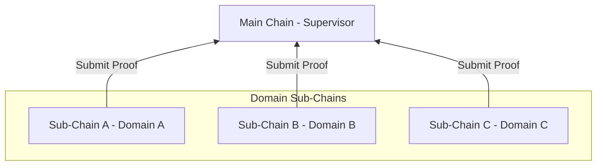
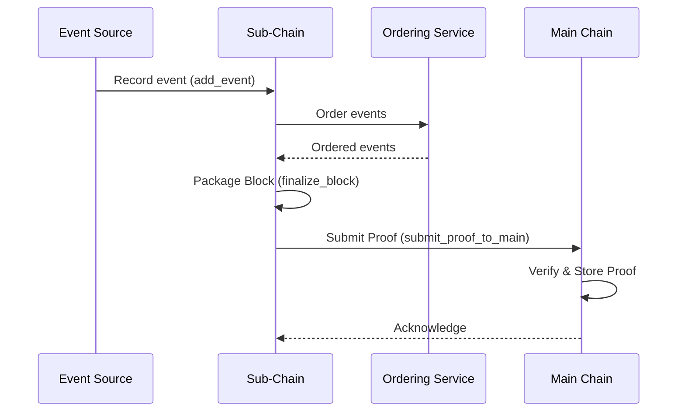

# Architecture Overview

## Purpose

Introduces HieraChain's hierarchical architecture: Main Chain serves as the root authority storing only proofs from Sub-Chains; Sub-Chains process business data (events) per domain. This page helps position each component's role and main flows.

## Architecture & Concepts

* Sub-Chain is responsible for recording domain Events, Ordering into Blocks, and maintaining internal World State.
* Main Chain does not store detailed domain data; only stores cryptographic Proofs to ensure system-wide integrity.
* HierarchyManager coordinates Sub-Chain creation/registration, Proof submission, and multi-chain operational tasks.

### Key Components

* Main Chain: `hierachain/hierarchical/main_chain/base.py`, stores and verifies proofs from Sub-Chains, aggregates integrity reports.
* Sub-Chain: `hierachain/hierarchical/sub_chain/base.py`, records domain events, orders/packages into blocks, generates proofs and sends to Main Chain.
* Hierarchy Manager: `hierachain/hierarchical/hierarchy_manager/base.py`, coordinates multi-chain system, manages Sub-Chain lifecycle, automatic proof submission, cross-chain verification.
* IPFS Storage (Off-chain): `hierachain/api/storage/ipfs_client.py`, stores large or sensitive business data off-chain, only anchors CID on Blockchain.
* Ordering Service: `hierachain/consensus/ordering/service.py`, event ordering component before block creation (integrated and initialized by Sub-Chain).

### Typical Flow

1. Record Event → Create Block (Sub-Chain): event is received by `SubChain.add_event()`, passed through internal Ordering, batched into Block and `finalize_block()` when conditions are met.
2. Submit Proof to Main Chain: `SubChain.submit_proof_to_main()` generates Proof (e.g. from Merkle root/block hash), sends `MainChain.add_proof()` for anchoring.
3. Global Reporting: Main Chain aggregates `get_main_chain_stats()` and statistics per Sub-Chain.
4. System Coordination: `HierarchyManager` supports periodic proof submission (`configure_auto_proof_submission`), synchronization, and cross-chain consistency checks.

## Related

* Quickstart: [Quickstart](../getting-started/quickstart.md)
* Glossary: [Glossary](../glossary.md)
* Core Module: [Core](../modules/core.md)
