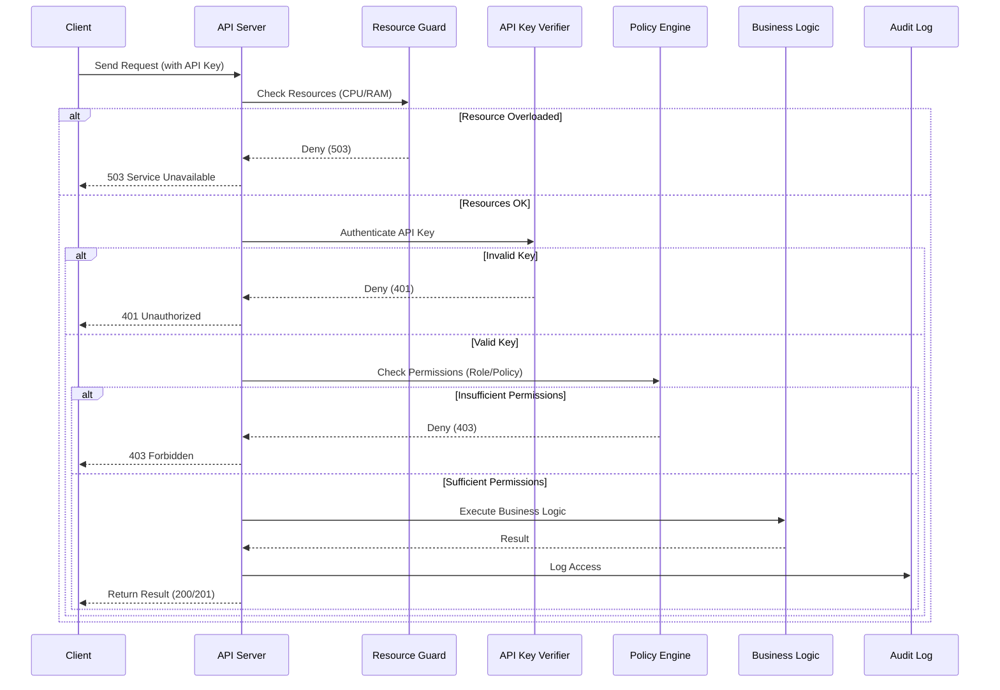

# Security Architecture

This page describes the security mechanisms at the architectural level and how they integrate into HieraChain. The system follows strict enterprise security strategy: a multi-layered defense architecture spanning the entire application lifecycle.

## Main Security Pillars

The defense architecture consists of 6 main coordinated streams:

* **Authorization & Access Control**: 

    * `hierachain/security/{msp.py, identity.py}`: manages Organization, User, Role, and PKI Identity.
    * `hierachain/security/policy_engine.py`: permission control (ABAC).
    * `hierachain/security/verify/api_key_verifier.py`: API key authentication.

* **Lockdown & Logging**: 

    * `hierachain/security/secure_logging.py`: Tamper-evident log, PII data masking.
    * `hierachain/cluster/lockdown_protocol.py`: Emergency Lockdown with Quorum (contains `ClusterLockdownManager`).

* **Fault-tolerance & Integrity**: 

    * `hierachain/security/resource_guard.py`: Steel shield against DoS/DDoS under high load.
    * `hierachain/security/integrity.py`: Signature checksum scanning of startup files.

* **Risk Analyzer**: 

    * `hierachain/risk_management/risk_analyzer.py`: Z-score anomaly indicator tracking.
    * `hierachain/security/sanitization.py`: Input injection prevention.

* **Encryption & Keys**: 

    * `hierachain/security/{key_manager.py, key_provider.py, key_backup_manager.py, certificate.py}`: AES-GCM, Ed25519 and X.509 lifecycle for mTLS.

* **Decentralized Zero-Knowledge Proofs**:

    * `hierachain/security/zk_prover.py` & `hierachain/security/verify/zk_verifier.py`: Zero-Knowledge proof implementation for anonymous Sub-Chain data verification.

System security configuration is flexibly toggled at `hierachain/config/settings.py` (AUTH, CORS, HSTS, rate limit…).

## System Integration

* API Server (`hierachain/api/server.py`): inserts middleware (e.g. `ResourceGuardMiddleware`) and API key authentication if `AUTH_ENABLED=true`.
* Sub-Chain/Main Chain: all state-changing operations must pass authentication (when AUTH is enabled) and are logged for audit.
* Secure logging: `security/secure_logging.py`, `security/sanitization.py` reduce sensitive data leakage.

## Related Configuration (excerpt)

Variables in `settings.py`:

* `AUTH_ENABLED`, `API_KEY_LOCATION`, `API_KEY_NAME`
* `CORS_ALLOW_ALL`, `CORS_ORIGINS`
* `HSTS_ENABLED`, `HSTS_MAX_AGE`
* `RATE_LIMIT_ENABLED`, `RATE_LIMIT_REQUESTS_PER_MINUTE`

## Typical Flow

1. Request to API → (optional) ResourceGuard checks CPU/RAM → API key authentication → policy/role check → execute → audit log.
2. Signature/ZK handling: events/transactions with signatures/ZK are verified by `verify/*` before acceptance.

## Related

* Security Module: [Security](../modules/security.md)
* Config Reference: [Config](../reference/config.md)
* API Ledger: [API Ledger](../reference/api-ledger.md)
