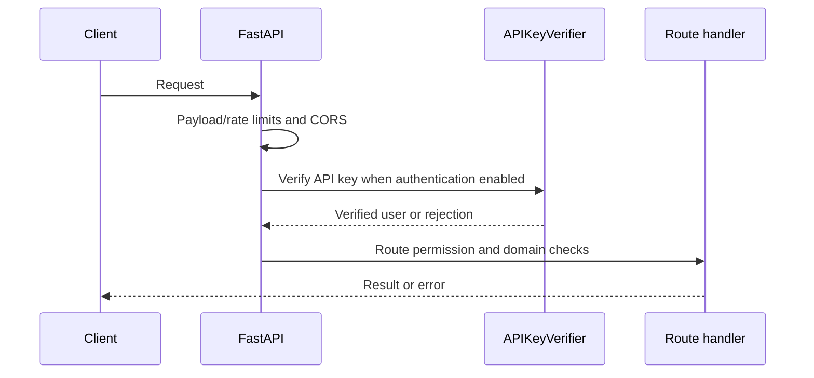

# Security architecture

This page describes security mechanisms at the architectural level and how they fit into HieraChain. The scope of each check depends on the runtime path and caller integration.

## Main security pillars

The defense is organized into six coordinated areas:

* Authorization and access control:

    * `hierachain/security/{msp.py, identity.py}` manages organizations, users, roles and lightweight internal certificates.
    * `hierachain/security/policy_engine.py` handles permission control (ABAC).
    * `hierachain/security/verify/api_key_verifier.py` handles API key authentication.

* Logging and integrity:

    * `hierachain/security/secure_logging.py` writes structured JSON logs and masks sensitive named fields; it has no tamper-verification mechanism.
    * `hierachain/risk_management/audit_logger.py` records operational audit events and supports verification against a separately trusted manifest.

* Fault tolerance and integrity:

    * `hierachain/error_mitigation/{consensus_validator.py, resource_validator.py}` and `hierachain/cluster/lockdown_types.py` provide validation, resource checks and HMAC lockdown. There is no `security/resource_guard.py` or `security/integrity.py`; those paths were removed or never existed.

* Input sanitization:

    * `hierachain/security/sanitization.py` helps prevent injection by neutralizing HTML/templates and enforcing a filename allowlist.

* Encryption and keys:

    * `hierachain/security/{key_manager.py, key_provider.py}` and `hierachain/security/msp.py` (`Certificate`/`CertificateAuthority`) provide Ed25519 support and `FileVaultProvider` (Fernet/PBKDF2, dev only). There is no `key_backup_manager.py` or `certificate.py` and no mTLS.

* Decentralized zero-knowledge proofs:

    * `hierachain/security/zk_prover.py` and `hierachain/security/verify/zk_verifier.py` provide development mocks. Production ZK proving/verifying is unimplemented.

Authentication, CORS and rate limits are configured in `hierachain/config/settings.py`. HSTS settings are declared there but do not add an HTTP header; configure HSTS at the HTTPS reverse proxy.

## System integration

* API Server (`hierachain/api/server.py`) uses payload/rate-limit middleware, `CORSMiddleware` and `APIKeyVerifier` when authentication is enabled. There is no CPU/RAM guard on every request.
* API-key authentication and scopes apply at HTTP handlers. Direct Python calls require a trusted caller and do not pass through HTTP middleware; domain/channel policies are checked by their respective paths.
* Secure logging: `security/secure_logging.py` and `security/sanitization.py` reduce leakage of sensitive data.

## Related configuration (excerpt)

Variables in `settings.py` (all use the `HRC_*` prefix):

* `HRC_AUTH_ENABLED`, `HRC_API_KEY_LOCATION`, `HRC_API_KEY_NAME`
* `HRC_CORS_ALLOW_ALL`, `HRC_CORS_ORIGINS`
* `HRC_HSTS_ENABLED`, `HRC_HSTS_MAX_AGE`
* `HRC_RATE_LIMIT`, `HRC_RATE_LIMIT_RPM`, `HRC_RATE_LIMIT_BACKEND`, `HRC_TRUSTED_PROXIES`

## Typical flow

```mermaid
sequenceDiagram
    participant Client
    participant API as FastAPI
    participant Auth as APIKeyVerifier
    participant Handler as Route handler
    Client->>API: Request
    API->>API: Payload/rate limits and CORS
    API->>Auth: Verify API key when authentication enabled
    Auth-->>API: Verified user or rejection
    API->>Handler: Route permission and domain checks
    Handler-->>Client: Result or error
```

1. Payload/rate limits and API-key verification run at the API; scope/role checks depend on the route. Redis rate-limit errors return 503 for non-exempt requests.
2. Signed blocks are verified against trusted keys. ZK checks apply when enabled; mocks do not prove business correctness.

## Related

* Security Module: [Security](../modules/security.md)
* Config Reference: [Config](../reference/config.md)
* API Ledger: [API Ledger](../reference/api-ledger.md)
