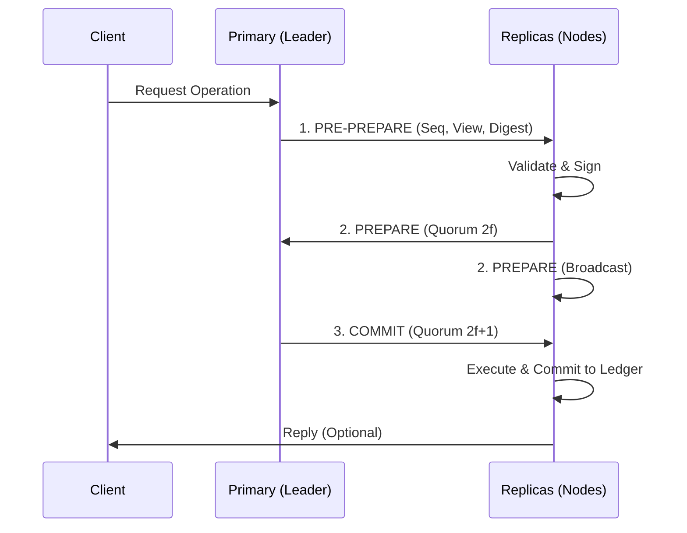

# BFT Consensus (`hierachain/consensus/bft/*`)

## Overview

**BFT Consensus** is HieraChain's advanced Byzantine fault-tolerant consensus mechanism, allowing the system to maintain consistency even when some nodes (`f`) fail or exhibit malicious behavior (data corruption, denial of service). The system follows the formula `n >= 3f + 1`, ensuring maximum security for Main Chains or enterprise consortiums.

---

## BFT Module Architecture

The system is divided into specialized components to ensure modularity and maintainability:

*   :material-gavel:{ .lg .middle } __BFT Engine__

    ---

    __File__: `consensus.py`

    Executes the core **PBFT** protocol with 3-phase commit: **Pre-prepare**, **Prepare**, and **Commit**.

*   :material-refresh-circle:{ .lg .middle } __View Manager__

    ---

    __File__: `view_manager.py`

    Automatically detects Primary node failure and triggers the **View Change** process to elect a new Leader, ensuring the system does not halt.

*   :material-swap-horizontal-bold:{ .lg .middle } __BFT Network__

    ---

    __File__: `network.py`

    Specialized communication layer using **ZeroMQ**, supporting broadcast and consensus message routing with ultra-low latency.

*   :material-key-variant:{ .lg .middle } __BFT Crypto__

    ---

    __File__: `cryptographic.py`

    Handles Ed25519 signing, hashing, and **Zero-Knowledge (ZK)** proof verification for each consensus message.

---

## PBFT Protocol Flow

The system requires consensus from at least `2f + 1` nodes before executing commands:

---

## Advanced Protection Mechanisms

### 1. View Change Proof
When a node detects the current Leader is unresponsive (Timeout), it requests a View change. This process requires **Proof** including at least `2f + 1` signatures from other nodes, preventing unauthorized takeovers.

### 2. Sequence Number & Nonce
Every BFT message has an incrementing sequence number and a unique random value (Nonce) to defend against **Replay Attacks**.

### 3. ZK Integration
The system supports Zero-Knowledge proof verification directly in the `Pre-prepare` phase, allowing data validity checking without revealing detailed content during the election process.

---

## BFT Configuration

| Parameter | Description | Default |
| :--- | :--- | :--- |
| `f` | Maximum tolerable faults | `1` (Requires at least 4 nodes) |
| `view_change_timeout` | Leader response wait time | `30.0` seconds |
| `strictness` | Signature verification level | `high` |
| `enable_zk_proofs` | Enable ZK verification in BFT | `false` |

---

## Related

*   [P2P Network](../modules/network.md)
*   [Signature Verification (Security)](../security/encryption-keys.md)
*   [Ordering Service](./ordering.md)
