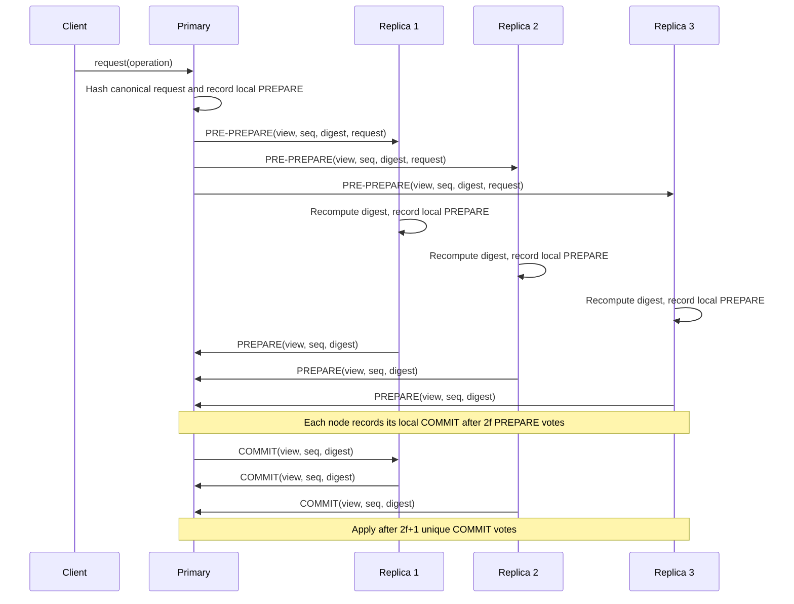

# BFT Consensus (`hierachain/consensus/bft/*`)

## Overview

**BFT Consensus** is HieraChain's Byzantine fault-tolerant consensus mechanism. The protocol uses `n >= 3f + 1` to tolerate up to `f` faulty or malicious nodes, including nodes that corrupt data or deny service. This implementation is separate from the MainChain and SubChain runtime paths.

---

## BFT Module Architecture

The module contains these components:

*   :material-gavel:{ .lg .middle } __BFT Engine__

    ---

    __Files__: `consensus.py`, `engine.py`

    `BFTConsensus.request()` starts the **PBFT** phases. `BFTConsensusEngine` validates PRE-PREPARE messages, records phase votes, and applies a committed operation when its application write succeeds.

*   :material-refresh-circle:{ .lg .middle } __View Manager__

    ---

    __File__: `view_change.py`

    Detects when the Primary node is unresponsive and triggers **View Change** to elect a new Leader.

*   :material-swap-horizontal-bold:{ .lg .middle } __BFT Network__

    ---

    __File__: `dispatcher.py`

    Uses **ZeroMQ** to broadcast and route consensus messages.

*   :material-key-variant:{ .lg .middle } __BFT Crypto__

    ---

    __Files__: `helpers.py`, `types.py`

    Handles Ed25519 signing, hashing, and **Zero-Knowledge (ZK)** proof verification for each consensus message.

---

## PBFT Protocol Flow

The standalone BFT component is separate from the current MainChain and SubChain runtime paths. The demo and library API use `BFTConsensus` explicitly.

The primary hashes the complete request as canonical JSON. Each replica recomputes that digest before it accepts PRE-PREPARE, so changing any request field while retaining the original digest and signature is rejected. The digest is included in the signed BFT message.

Canonical request encoding uses Python standard-library `json` through `hierachain.serialization.dumps_canonical_json`. It preserves the established BFT request digest format: sorted fields, compact separators, unescaped UTF-8 text and Python finite-number formatting. Non-finite numbers, circular values and unsupported JSON types are rejected.

Local phase votes are tracked per sequence. An admitted request's PREPARE quorum can produce its local COMMIT even while another sequence has changed the displayed consensus state.

Each node records its own signed PREPARE and COMMIT vote once before broadcasting it. Quorums count unique senders, including the local vote: `2f` PREPARE votes and `2f + 1` COMMIT votes.

```mermaid
sequenceDiagram
    participant C as Client
    participant P as Primary
    participant R1 as Replica 1
    participant R2 as Replica 2
    participant R3 as Replica 3
    C->>P: request(operation)
    P->>P: Hash canonical request and record local PREPARE
    P->>R1: PRE-PREPARE(view, seq, digest, request)
    P->>R2: PRE-PREPARE(view, seq, digest, request)
    P->>R3: PRE-PREPARE(view, seq, digest, request)
    R1->>R1: Recompute digest, record local PREPARE
    R2->>R2: Recompute digest, record local PREPARE
    R3->>R3: Recompute digest, record local PREPARE
    R1->>P: PREPARE(view, seq, digest)
    R2->>P: PREPARE(view, seq, digest)
    R3->>P: PREPARE(view, seq, digest)
    Note over P,R3: Each node records its local COMMIT after 2f PREPARE votes
    P->>R1: COMMIT(view, seq, digest)
    R1->>P: COMMIT(view, seq, digest)
    R2->>P: COMMIT(view, seq, digest)
    Note over P,R3: Apply after 2f+1 unique COMMIT votes
```

For a node with an attached application chain, a failed `chain.add_event()` leaves the commit quorum and a stable in-memory event, with a deterministic event ID, available for retry. A repeated valid COMMIT can retry the same event; the node advances `committed_sequence` only after the write succeeds. The component does not persist this retry state across process restarts. Recent sequence messages are retained; cleanup removes messages only when their sequence is more than 100 behind the committed sequence.

When no application chain is attached, BFT runs in protocol-only mode and records consensus status without writing an application event. The standalone demo uses this mode.

A later request cannot advance the committed sequence past an earlier unapplied or missing request. Application proceeds contiguously from sequence 1. Quorums already received for later requests are retained and attempted in order after the earlier write succeeds. Retry state remains in memory. If a backend persists an event and then raises, retry can duplicate that event unless the backend deduplicates the stable `event_id`; the current `SubChain.add_event()` does not use this BFT ID for deduplication. This component therefore does not guarantee exactly-once application across ambiguous writes or restarts.

---

## Advanced Protection Mechanisms

### 1. View Change Proof
When a node detects the current Leader is unresponsive (Timeout), it requests a View change. The new view requires a proof with at least `2f + 1` valid signatures from unique nodes, including the local vote when present, preventing unauthorized takeovers.

### 2. Sequence Number & Nonce
Every BFT message has an incrementing sequence number and a unique random value (Nonce) to defend against **Replay Attacks**.

### 3. ZK Integration
The system supports Zero-Knowledge proof verification directly in the `Pre-prepare` phase, allowing data validity checking without revealing detailed content during the election process.

---

## BFT Configuration

| Parameter | Description | Default |
| :--- | :--- | :--- |
| `f` | Maximum tolerable faults | `1` (Requires at least 4 nodes) |
| `view_change_timeout` | Leader response wait time | `30.0` seconds |
| `strictness` | Signature verification level | `high` |
| `enable_zk_proofs` | Enable ZK verification in BFT | `false` |

---

## Related

*   [P2P Network](../modules/network.md)
*   [Signature Verification (Security)](../security/encryption-keys.md)
*   [Ordering Service](./ordering.md)
