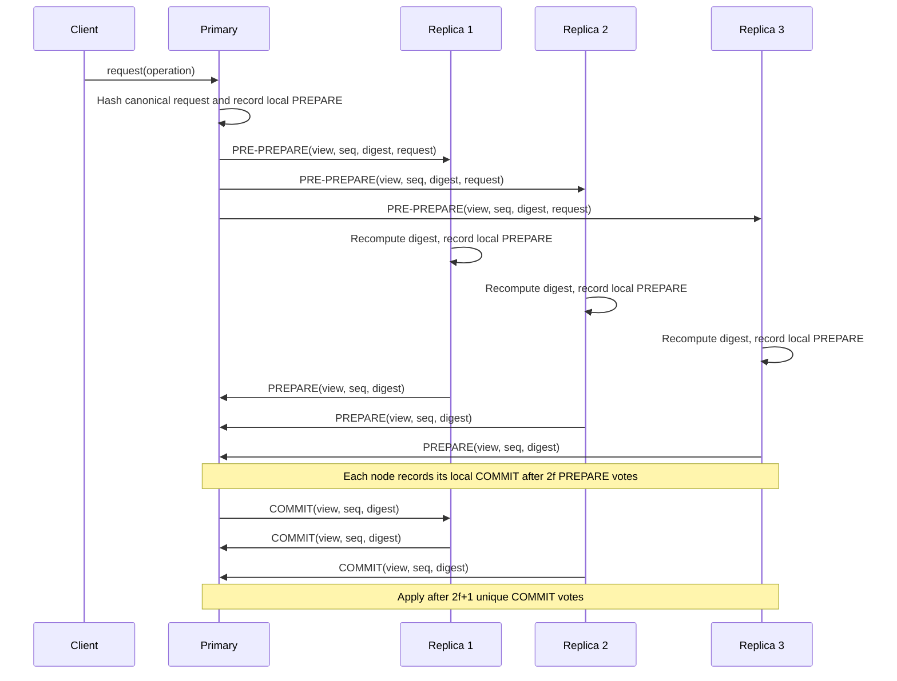

# BFT consensus (`hierachain/consensus/bft/*`)

## Scope

`BFTConsensus` is a separate library component. MainChain and SubChain do not instantiate it; running several API nodes or setting `BFT_ENABLED` does not connect PBFT to those chains. Callers supply a signing key or node identity, approved node public keys, transport and application integration.

The constructor requires `n >= 3f + 1`, where `n` is the length of `all_nodes`. Four nodes are required when `f=1`. Every node must agree on the ordered membership list because the primary is `all_nodes[view % n]`.

## Components

| Component | File | Responsibility |
|:----------|:-----|:---------------|
| `BFTConsensus` | `consensus.py` | Request admission, message dispatch and consensus state |
| `BFTConsensusEngine` | `engine.py` | PRE-PREPARE validation, phase votes and application writes |
| `BFTViewChangeManager` | `view_change.py` | Timeout, VIEW-CHANGE votes and NEW-VIEW proof validation |
| `BFTMessageDispatcher` | `dispatcher.py` | Send through a supplied ZeroMQ node or caller-provided send function |
| Signature and request helpers | `helpers.py`, `types.py` | Signed message payloads, canonical request hashes and optional ZK checks |

## PBFT phases

`request()` starts a request at the primary. Other nodes forward it through their configured send function and return `False`; the primary's `True` response confirms admission, not quorum commitment.

The primary hashes the complete request using `hierachain.serialization.dumps_canonical_json`. Replicas recompute the digest before accepting PRE-PREPARE. Canonical encoding sorts fields, uses compact separators and unescaped UTF-8, and preserves Python finite-number formatting. Non-finite numbers, circular values and unsupported JSON types are rejected.

Each node records its own signed PREPARE and COMMIT once before broadcasting. Votes count unique senders, including the local vote: `2f` PREPARE votes and `2f + 1` COMMIT votes. Phase votes are tracked per sequence even when another sequence changes the displayed consensus state.

```mermaid
sequenceDiagram
    participant C as Client
    participant P as Primary
    participant R1 as Replica 1
    participant R2 as Replica 2
    participant R3 as Replica 3
    C->>P: request(operation)
    P->>P: Hash canonical request and record local PREPARE
    P->>R1: PRE-PREPARE(view, seq, digest, request)
    P->>R2: PRE-PREPARE(view, seq, digest, request)
    P->>R3: PRE-PREPARE(view, seq, digest, request)
    R1->>R1: Recompute digest, record local PREPARE
    R2->>R2: Recompute digest, record local PREPARE
    R3->>R3: Recompute digest, record local PREPARE
    R1->>P: PREPARE(view, seq, digest)
    R2->>P: PREPARE(view, seq, digest)
    R3->>P: PREPARE(view, seq, digest)
    Note over P,R3: Each node records its local COMMIT after 2f PREPARE votes
    P->>R1: COMMIT(view, seq, digest)
    R1->>P: COMMIT(view, seq, digest)
    R2->>P: COMMIT(view, seq, digest)
    Note over P,R3: Apply after 2f+1 unique COMMIT votes
```

## Application and retry

With an attached application chain, a failed `chain.add_event()` keeps the commit quorum and the same in-memory event with a deterministic `event_id`. A repeated valid COMMIT retries the write; `committed_sequence` advances only after success. Future quorums are buffered and applied contiguously from sequence 1 after earlier writes succeed. Recent messages are retained; cleanup removes sequences more than 100 behind the committed sequence.

Without an attached chain, the component records protocol commitment without writing an application event. The standalone demo uses this mode. Retry state is not persisted across restarts. If a backend persists an event and then raises, a retry can duplicate it unless that backend deduplicates `event_id`; the current `SubChain.add_event()` does not deduplicate by this BFT ID. The component does not guarantee exactly-once application after ambiguous writes or restarts.

## View changes and replay limits

The view-change timer initiates a new view when it expires. The new primary is selected from the ordered node list, and the new view requires `2f + 1` valid signatures from distinct nodes, including the local vote when present.

Sequence numbers track request order; messages in different phases can share the same sequence. A message nonce and timestamp are signed, but the receive path does not maintain a nonce replay cache. Signature, age, view, sequence and phase checks apply; a repeated valid COMMIT can intentionally retry application. A signed nonce alone does not provide general replay rejection.

## Optional ZK check

`handle_pre_prepare()` calls `verify_operation_zk_proof(message.data)` when `HRC_ENABLE_ZK_PROOFS` is enabled. Missing-proof handling uses `HRC_ZK_REQUIRED_MAINCHAIN`. The helper reads a top-level operation from message data, while `request()` places its operation inside the request object; it does not automatically extract that nested operation. This path should not be treated as proof that every admitted operation was ZK-verified. Mock proofs are development fixtures, and production proving/verifying is unimplemented.

## Configuration

| Setting | Location | Default |
|:--------|:---------|:--------|
| `f` | Constructor argument | `1` |
| `view_change_timeout` | Instance attribute; the constructor starts a timer | `30.0` seconds |
| `verification_strictness` | `error_config["consensus"]["bft"]["verification_strictness"]`; controls rejection of slow messages | `high` |
| `HRC_ENABLE_ZK_PROOFS` | Environment setting shared with other consensus paths | `false` |
| `HRC_ZK_REQUIRED_MAINCHAIN` | Shared missing-proof policy | `false` |

There is no BFT constructor option named `enable_zk_proofs`. If changing the timeout after construction, reset the view-change timer to use the new interval. Call `shutdown()` when closing the component to cancel its timer.

## Related

* [Network](../modules/network.md)
* [Keys and signatures](../security/encryption-keys.md)
* [Ordering Service](./ordering.md)
