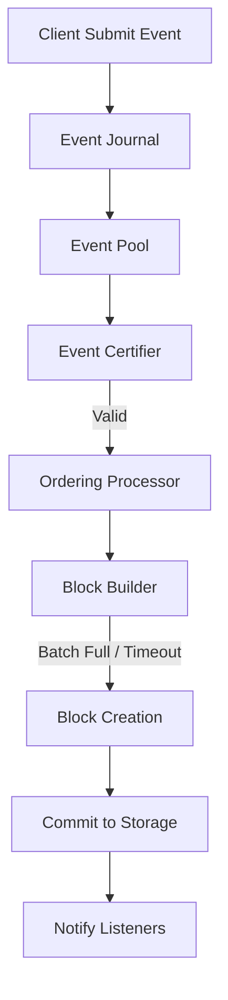

# Ordering Service (`hierachain/consensus/ordering/*`)

## Overview

**Ordering Service** is the central component in HieraChain's consensus architecture, responsible for receiving raw events, ordering them in a unique sequence, and packaging them into blocks. This is a **Crash Fault Tolerance (CFT)** mechanism, ensuring the system remains stable when some nodes go down.

---

## System Architecture

Ordering Service is designed using the **Facade** pattern, coordinating multiple specialized components:

| Component | Role | File |
| :--- | :--- | :--- |
| **OrderingService** | Main access point, lifecycle and configuration management. | `service.py` |
| **Processor** | Async processing, event flow coordination. | `processor.py` |
| **Block Builder** | Event batching and block structure construction. | `block_builder.py` |
| **Certifier** | Validates event signatures and permissions before ordering. | `certifier.py` |
| **Storage** | Manages persistent storage for pending events. | `storage.py` |
| **Recovery** | Restores state from **Event Journal** after failures. | `recovery.py` |

---

## Event Processing Flow (Ordering Pipeline)



---

## Core Features

### 1. Persistence & Durability
Before entering the processing queue, every event is written to the **Event Journal**. If the service stops unexpectedly, the `Recovery` module reads the Journal to reconstruct state, ensuring no data is lost.

### 2. Batching Strategy
To optimize performance, Ordering Service does not create a block for each individual event but uses batching:
*   `batch_size`: Maximum events per block (Default: 100).
*   `batch_timeout`: Maximum wait time before forcing block creation (Default: 2.0 seconds).

### 3. Event Certification
The `Certifier` module integrates closely with the **Security** system to check:
*   Data format (Schema Validation).
*   Submitter's digital signature (Identity Verification).
*   Channel access permissions (Policy Enforcement).

---

## Usage Example

```python
from hierachain.consensus.ordering.service import OrderingService

# Initialize with enterprise configuration
config = {
    "batch_size": 200,
    "batch_timeout": 1.5,
    "storage_dir": "/data/ordering"
}

service = OrderingService(config=config)

# Submit event to queue
event_id = service.receive_event(
    event_data={"item": "container_45", "status": "shipped"},
    channel_id="logistics_chain",
    submitter_org="ORG_SUPPLY"
)
```

---

## Related

*   [Journal System](../modules/error-mitigation.md)
*   [Block Structure](../modules/core.md)
*   [BFT Consensus](./bft_consensus.md)
