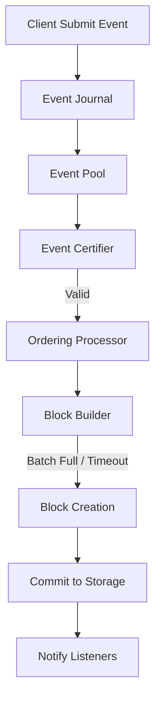

# Ordering Service (`hierachain/consensus/ordering/*`)

## Overview

**Ordering Service** is the central component in HieraChain's consensus architecture, responsible for receiving raw events, ordering them in a unique sequence, and packaging them into blocks. This is a **Crash Fault Tolerance (CFT)** mechanism, ensuring the system remains stable when some nodes go down.

---

## System Architecture

Ordering Service is designed using the **Facade** pattern, coordinating multiple specialized components:

| Component | Role | File |
| :--- | :--- | :--- |
| **OrderingService** | Main access point, lifecycle and configuration management. | `service.py` |
| **Processor** | Async processing, event flow coordination. | `processor.py` |
| **Block Builder** | Event batching and block structure construction. | `block_builder.py` |
| **Certifier** | Validates event signatures and permissions before ordering. | `certifier.py` |
| **Storage** | Manages persistent storage for pending events. | `storage.py` |
| **Recovery** | Restores state from **Event Journal** after failures. | `recovery.py` |
| **Journal lookup** | Indexes durable ID/channel/content commitments for stable-ID admission. | `journal_lookup.py` |

---

## Event Processing Flow (Ordering Pipeline)


```mermaid
graph TD
    A[Client Submit Event] --> B[Event Journal]
    B --> C[Event Pool]
    C --> D[Event Certifier]
    D -- Valid --> E[Ordering Processor]
    E --> F[Block Builder]
    F -- Batch Full / Timeout --> G[Block Creation]
    G --> H[Commit to Storage]
    H --> I[Notify Listeners]
```

---

## Core Features

### 1. Persistence & Durability
Accepted events are synchronously written to the **Event Journal** and fsynced before they are queued. Fsync is always enabled and cannot be disabled through configuration. On restart, `Recovery` replays journal entries and commits recovered events to block storage before the ordering service becomes active. An incomplete final frame in the active journal is truncated before the file is reopened for append. A complete frame with corrupt Arrow data fails recovery, and replay, certification, or block-processing errors leave the service in `MAINTENANCE` rather than activating with events missing.

The `GET /api/ledger/ready` endpoint returns HTTP 200 only when every registered Sub-Chain's Ordering Service is `ACTIVE`; it returns HTTP 503 while any service is recovering or in maintenance.

`TransactionJournal.log_event()` still flushes and fsyncs every successful append before returning. `read_since()` reads records from disk but reuses a successful sync when the active file's device, inode, size, modification time and change time match the synchronized state. Opening/closing the writer, rotation and failed writes invalidate that state. Unknown or changed state requires another fsync; read and sync failures propagate. An active path replaced with another inode is rejected. Explicit `flush()` continues to synchronize every call. These rules retain the single-owner append-only journal contract; they do not make read-back a memory-only ACK.

Stable IDs first check live pending/batch/processed state and block storage. For remaining IDs, `JournalEventLookup` scans journal history once on first use, then reads only the suffix after its cursor and stores compact channel/content commitments. It rejects conflicting IDs, including conflicting repeated records. An older journal-only event whose payload must be requeued still uses a full disk read; no historical payload copies are retained in the index. Custom or replaced journals without this lookup keep the compatibility scan. Missing/truncated cursor history fails closed. Initial scanning, archive enumeration and index metadata still grow with retained history; no retention/compaction is added.

`lockdown()` waits for any in-flight commit to finish, then blocks further commits and incoming events until `resume()`. Queued events and an already cut batch remain available for resume; their journal entries are retained for crash recovery. Recovery completion does not override `LOCKDOWN`, and `resume()` cannot reactivate a stopped service.

### 2. Batching Strategy
Queue admission waits at most `enqueue_timeout` seconds (default `1.0`, allowed range greater than zero through `60`). A full queue or shutdown raises `OrderingBackpressureError`, carrying `event_id` and `journaled`. New submissions reserve capacity before writing, so rejection at this boundary has `journaled=False`. Reconciliation of an existing durable event reports `journaled=True` and can retry the same ID without another append. `POST /api/ledger/chains/{chain_name}/events` maps this error to HTTP 503 with these fields in `detail`. Shutdown wakes waiting producers. Admission holds the queue condition through fsync; disk latency therefore also delays consumers.

To optimize performance, Ordering Service does not create a block for each individual event but uses batching:
*   A directly initialized `OrderingService` uses `batch_size=100` and `batch_timeout=2.0` seconds by default.
*   Sub-Chain defaults are `block_size=50` and `batch_timeout=1.0` second.

### 3. Event Certification
The `Certifier` module integrates closely with the **Security** system to check:
*   Data format (Schema Validation).
*   Submitter's digital signature (Identity Verification).
*   Channel access permissions (Policy Enforcement).

The certifier retains the most recent 10,000 results by default (`EventCertifier(max_history=...)`). Rejected events leave the pending map. After a result is evicted, `get_event_status()` queries durable storage for committed events and returns `ordered` without a certification result; an older rejected event can return `None`. This history is not durable certification evidence.

### 4. Commit and cross-chain costs

Block index assignment, previous-hash linkage, signing and storage commitment remain serialized per Ordering Service. Signature verification retains the existing batch thread pool and certification checks. The 2PC coordinator keeps durable phase records and read-back before participant commits; uncertain COMMIT decisions remain in doubt and cannot trigger rollback. Reducing journal rereads does not remove these integrity boundaries or imply that an event acceptance ACK is block finality. Independent chains can partition load with separate journal owners; batching blocks does not batch event durability ACKs.

---

## Usage Example

```python
from hierachain.consensus.ordering.service import OrderingService

# Initialize with enterprise configuration
config = {
    "batch_size": 200,
    "batch_timeout": 1.5,
    "storage_dir": "/data/ordering"
}

service = OrderingService(config=config)

# Submit event; the returned ID acknowledges journaling and enqueueing, not block finality
event_id = service.receive_event(
    event_data={"item": "container_45", "status": "shipped"},
    channel_id="logistics_chain",
    submitter_org="ORG_SUPPLY"
)
```

---

## Local journal ownership

A local journal path has one owning instance/process at a time, enforced by a nonblocking POSIX advisory writer lock. A second owner fails to open until the first closes or exits; this guard does not turn the journal into a shared multiwriter log. Multiple threads must share the same `TransactionJournal` instance. Give independent writers distinct node identities and storage directories, or separate local volumes on a filesystem that supports POSIX locks and directory fsync. The Kubernetes StatefulSet's per-pod PVC pattern keeps node journals separate. Upgrade every process using a path before writing the new journal format; older versions do not acquire the writer lock.

## Related

*   [Journal System](../modules/error-mitigation.md)
*   [Block Structure](../modules/core.md)
*   [BFT Consensus](./bft_consensus.md)
