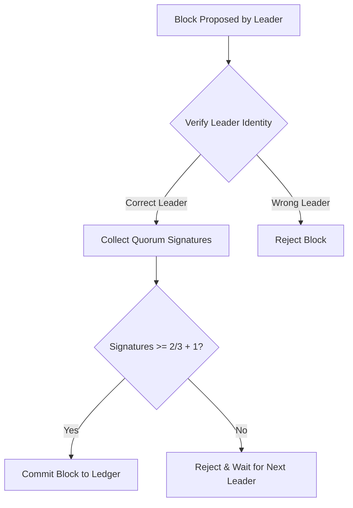

# Proof of Federation (`hierachain/consensus/proof_of_federation.py`)

## Overview

**Proof of Federation (PoF)** is a consensus protocol designed specifically for **Consortium** networks, where multiple organizations (banks, hospitals, supply chain partners) jointly govern without any single entity holding absolute control. PoF combines PoA performance with the security of majority voting (Quorum).

---

## How It Works

PoF uses a rotation model combined with multi-signature verification:
1.  **Leader Rotation**: The Leader with block proposal rights is determined by a deterministic mathematical formula: `Leader = Validators[BlockIndex % TotalValidators]`. This prevents any node from permanently seizing control.
2.  **Quorum Voting**: For a block to be valid, it needs not only the Leader's signature but also confirmation from a minimum number of nodes in the consortium (typically **2/3 + 1**).
3.  **Sorted Validator List**: The list of participating nodes is automatically sorted by ID to ensure consistent block creation scheduling across the network.

---

## Key Features

*   :material-account-group:{ .lg .middle } __Multi-party Governance__

    ---

    Eliminates Single Point of Failure. If the current Leader fails, block creation rights automatically transfer to the next node in the cycle.

*   :material-vote-outline:{ .lg .middle } __Quorum Voting__

    ---

    Provides an additional security layer by requiring consensus from the majority of member organizations before committing data.

*   :material-scale-balance:{ .lg .middle } __Fairness & Transparency__

    ---

    Every member organization has equal opportunity to contribute and control the ledger through the predetermined schedule.

---

## Configuration Parameters

| Parameter | Description | Default |
| :--- | :--- | :--- |
| `min_validators` | Minimum number of nodes for network operation. | `3` |
| `block_interval` | Target block creation cycle. | `5.0` seconds |
| `enforce_rotation` | Mandatory leader rotation after each block. | `True` |

---

## Block Verification Flow

---

## Advantages and Limitations

*   **Advantages**: Suitable for multi-party consortium networks, resistant to domination by a small group, high availability.
*   **Limitations**: Requires additional network bandwidth for Quorum signature collection compared to PoA, performance slightly degrades when the number of Validators grows too large.

---

## Related

*   [Proof of Authority (PoA)](./poa.md)
*   [P2P Network Architecture](../modules/network.md)
*   [Security System](../security/authorization-access-control.md)
