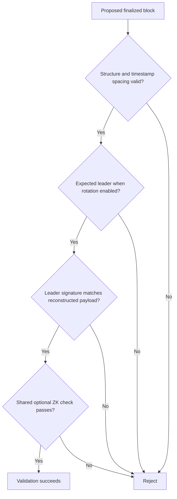

# Proof of Federation (PoF)

`hierachain/consensus/proof_of_federation.py` implements sorted validator membership, deterministic leader rotation and Ed25519 finalization signatures. Select it explicitly for MainChain with `HRC_MAINCHAIN_CONSENSUS=proof_of_federation`. PoA remains the default.

## Configuration

| Python configuration key | Default | Meaning |
|--------------------------|---------|---------|
| `min_validators` | `3` | Minimum membership for `can_create_block()` |
| `block_interval` | `5.0` | Validation requires at least 80% of this spacing |
| `enforce_rotation` | `True` | Validate the signer against `validators[index % count]` |

These keys belong to the consensus instance's configuration. The current MainChain/SubChain constructors do not apply `CONSENSUS_FEDERATION_CONFIG` automatically.

Supply each validator's real public key when calling `add_validator(validator_id, metadata={"public_key": ...})`. Membership and keys must agree across nodes. Setting the selector alone does not provision a federation.

## Validation flow

```mermaid
flowchart TD
    A[Proposed finalized block] --> B{Structure and timestamp spacing valid?}
    B -->|Yes| C{Expected leader when rotation enabled?}
    C -->|Yes| D{Leader signature matches reconstructed payload?}
    D -->|Yes| E{Shared optional ZK check passes?}
    E -->|Yes| F[Validation succeeds]
    B -->|No| R[Reject]
    C -->|No| R
    D -->|No| R
    E -->|No| R
```

The ordinary `_verify_block_quorum()` helper checks the leader signature, not multi-party quorum signatures. The separate `verify_quorum_signatures(message, signatures, required_count=None)` counts distinct registered validators and defaults to `floor(2n/3)+1`. It is not automatically invoked to collect votes during block finalization. This class does not implement automatic failover or timeout-based leader replacement.

ZK verification is optional and shared with PoA. Development mock proofs are not zero-knowledge guarantees; production proving/verifying is unavailable. `HRC_BLOCK_INTERVAL` changes PoA spacing and does not change PoF's interval.

## Related

* [PoA](poa.md)
* [Consensus runtime scope](../workflows/consensus_mechanisms.md)
* [ZK implementation](../architecture/zk-proofs.md)
