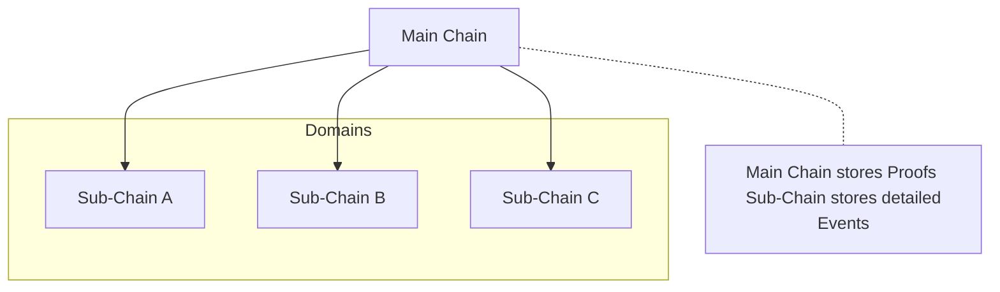
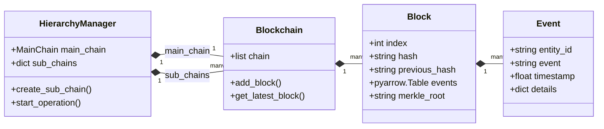

# Core concepts

These concepts describe the ledger's data and hierarchy. See the [Glossary](../glossary.md) for other terms.

## Key concepts

* Chain: A sequence of blocks linked by `previous_hash`. HieraChain has a `Main Chain` and domain-specific `Sub-Chains`.
* Block: A group of events stored in an Arrow table, with a header containing the block index, timestamp, previous hash, nonce, Merkle root and creator identity. See `hierachain/core/block.py`.
* Event: A business record with `entity_id`, `event` and `timestamp`. Details can describe the operation. `EVENT_SCHEMA` in `hierachain/core/block.py` defines storage columns; canonical event bytes preserve JSON fields and typed details.
* Proof: An anchor containing a Sub-Chain block hash and summary metadata, including its Merkle root. A ZK proof can be included under the configured proof policy. This anchor is distinct from an individual event inclusion proof.
* Hierarchy: The MainChain and registered SubChains coordinated by `HierarchyManager`.

### Data structure

The diagram shows runtime classes and a conceptual event record. `Block.events` is a `pyarrow.Table`; exported event snapshots are lists of dictionaries.

## Basic flow

1. Submit an event to a Sub-Chain. The event ID confirms acceptance into ordering; size and time settings determine when events are batched into a block.
2. Ordering finalizes, signs and persists the block. The Sub-Chain consumer validates and applies it. Proof submission anchors a finalized block hash and summary metadata to the MainChain according to the proof schedule or an explicit request.
3. Query committed events by entity or inspect blocks and chain statistics through the API.

## Related source files

* Core: `hierachain/core/block.py`, `hierachain/core/blockchain.py`
* Hierarchical: `hierachain/hierarchical/main_chain/base.py`, `hierachain/hierarchical/sub_chain/base.py`, `hierachain/hierarchical/hierarchy_manager/base.py`
* API: `hierachain/api/ledger/router.py`, `hierachain/api/ledger/schemas.py`
* Security: `hierachain/security/*`
* Configuration: `hierachain/config/settings.py`

## Related

* Quickstart: [Quickstart](quickstart.md)
* Architecture Overview: [Overview](../architecture/overview.md)
* Glossary: [Glossary](../glossary.md)
