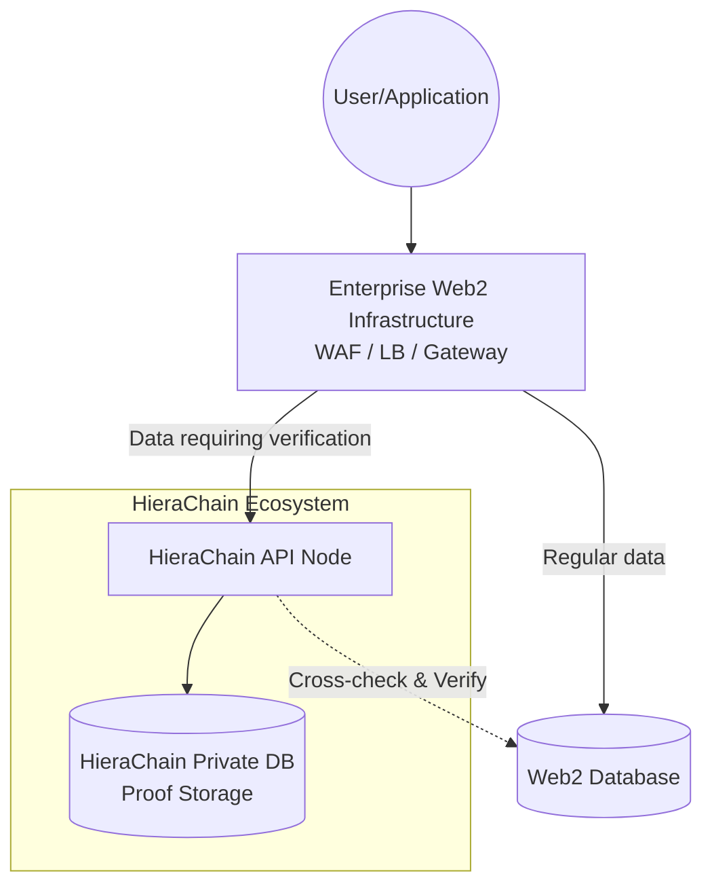

## Overview

HieraChain is designed as a specialized **Plugin Layer** for enterprises, focusing on data immutability and verification rather than replacing existing Web2 infrastructure. Therefore, HieraChain has strict regulations regarding transport protocols.

## Why No HTTP/2 and HTTP/3 Support?

HieraChain **does not support** and **has no plans to support** HTTP/2 or HTTP/3 (QUIC) protocols directly from within the core. This stems from the "Don't reinvent the wheel" design philosophy and Python performance optimization.

### 1. Position in System Architecture

HieraChain does not replace existing databases but operates **alongside** them as a supplementary verification layer. Data is routed based on immutability needs:

* **Regular data**: Goes directly to Web2 DB for maximum speed.
* **Data requiring verification**: Passes through HieraChain to create digital proofs before syncing.

### 2. "Plugin Layer" Philosophy

HieraChain is built to **run alongside** and add blockchain value to existing Enterprise Web2 systems:

* **Separate data flow**: Not all data needs blockchain. HieraChain only processes important "events" that require immutability, preventing the main system from being overloaded.
* **Separate database**: HieraChain maintains its own DB (World State/Ledger) for distributed proof storage, completely separate from Web2's business DB.
* **Cross-check capability**: HieraChain has a mechanism to connect (read-only) to Web2 DB for cross-verifying integrity between business data and on-chain proofs.
* **HTTP port security**: Security at the communication port (Port 80/443) is still handled by the Web2 network infrastructure.

### 3. Why HTTP/1.1

* **Speed in internal network**: In a trusted network environment between Reverse Proxy and HieraChain, HTTP/1.1 is the simplest protocol, with the least overhead and highest performance for API tasks.
* **Compatibility**: 100% of current API Gateway and Load Balancer solutions perfectly support forwarding down to HTTP/1.1.
* **Resource focus**: Instead of spending CPU on complex connection negotiation, HieraChain dedicates all resources to:

    * Event signature verification.
    * BFT consensus.
    * Ensuring ledger integrity.

## Standard Enterprise Deployment

If your system requires modern features like HTTP/2, HTTP/3, or gRPC for optimizing client connections, you **must** use the **Reverse Proxy Offloading** model.

1. **Web2 Layer (NGINX/Traefik/F5)**: Accepts HTTPS connections (HTTP/2 or HTTP/3 QUIC) from users, decrypts SSL.
2. **HieraChain Layer**: Receives decrypted requests from the Proxy via high-speed HTTP/1.1 connections.

!!! important

    HieraChain will never replace existing Web2 infrastructure. HieraChain is built to run **underneath** those systems, providing auditability and immutability that traditional databases lack.

## Security Notes

Even though it only runs HTTP/1.1, HieraChain maintains internal security layers:

* **API Key Verification**: Application-level access authentication.
* **Trusted Proxies**: Only accepts requests from predefined Load Balancer IPs (via `HRC_TRUSTED_PROXIES` variable).
* **Payload Sanitization**: Cleans input data to prevent application-layer attacks.
