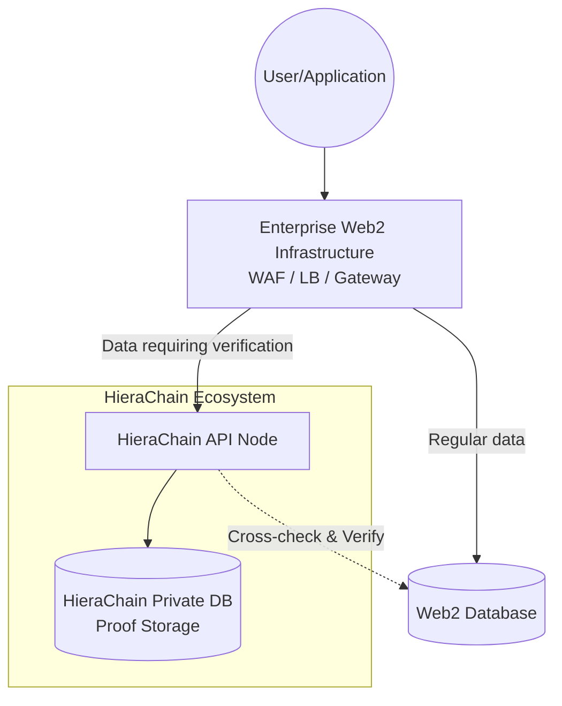

## Overview

HieraChain runs alongside enterprise Web2 infrastructure as a layer for data immutability and verification. This guide describes the transport protocols supported by the core and how to place a proxy in front of it.

## Why No HTTP/2 and HTTP/3 Support?

The HieraChain core currently supports HTTP/1.1. It does not serve HTTP/2 or HTTP/3 (QUIC) directly; terminate those client connections at a reverse proxy and forward requests to HieraChain over HTTP/1.1.

### 1. Position in System Architecture

HieraChain does not replace existing databases but operates **alongside** them as a supplementary verification layer. Data is routed based on immutability needs:

* **Regular data**: Goes directly to the Web2 database.
* **Data requiring verification**: Passes through HieraChain to create digital proofs before syncing.

```mermaid
graph TD
    User((User/Application)) --> Web2[Enterprise Web2 Infrastructure<br/>WAF / LB / Gateway]
    
    Web2 -- "Data requiring verification" --> HC[HieraChain API Node]
    Web2 -- "Regular data" --> DB_Web2[(Web2 Database)]
    
    subgraph HieraChain_Internal [HieraChain Ecosystem]
        HC --> DB_HC[(HieraChain Private DB<br/>Proof Storage)]
    end
    
    HC -. "Cross-check & Verify" .-> DB_Web2
```

### 2. "Plugin Layer" Philosophy

HieraChain runs alongside existing enterprise Web2 systems:

* **Separate data flow**: HieraChain processes events that require immutability; other data can remain in the Web2 system.
* **Separate database**: HieraChain maintains its own DB (World State/Ledger) for distributed proof storage, completely separate from Web2's business DB.
* **Cross-check capability**: HieraChain has a mechanism to connect (read-only) to Web2 DB for cross-verifying integrity between business data and on-chain proofs.
* **HTTP port security**: The Web2 network infrastructure handles security at ports 80 and 443.

### 3. Why HTTP/1.1

* **Internal network**: The reverse proxy forwards API requests to HieraChain over HTTP/1.1.
* **Compatibility**: API gateways and load balancers can forward requests to HTTP/1.1 upstreams.
* **Request handling**: HieraChain can use its resources for:

    * Event signature verification.
    * BFT consensus in the separate BFT component.
    * Ledger integrity checks.

## Standard Enterprise Deployment

If your system requires HTTP/2 or HTTP/3 for client connections, use the **Reverse Proxy Offloading** model.

1. **Web2 Layer (NGINX/Traefik/F5)**: Accepts HTTPS connections (HTTP/2 or HTTP/3 QUIC) from users, decrypts SSL.
2. **HieraChain Layer**: Receives decrypted requests from the Proxy over HTTP/1.1.

!!! important

    In this deployment, HieraChain runs alongside Web2 infrastructure and provides auditability and immutability for data that passes through it.

## Security Notes

Even though it only runs HTTP/1.1, HieraChain maintains internal security layers:

* **API Key Verification**: Application-level access authentication.
* **Trusted Proxies**: Only accepts requests from predefined Load Balancer IPs (via `HRC_TRUSTED_PROXIES` variable).
* **Payload Sanitization**: Cleans input data to prevent application-layer attacks.
