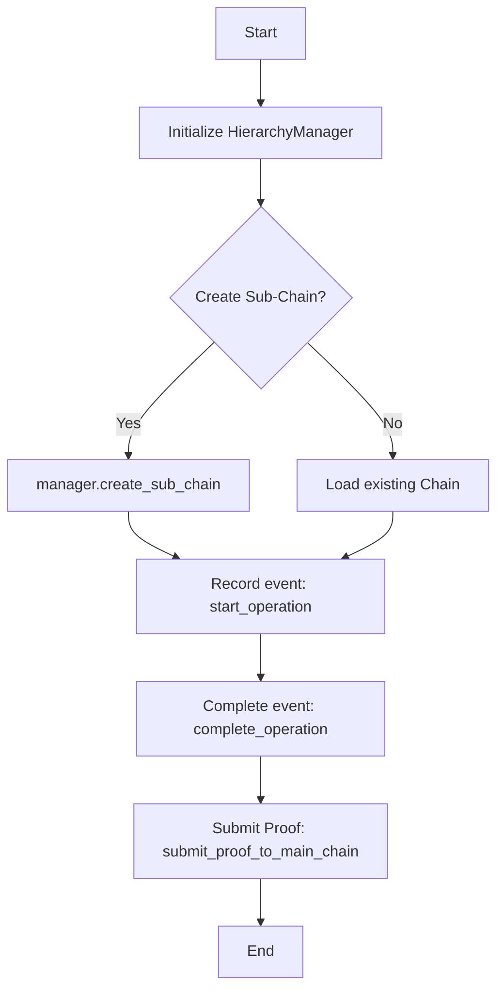

# Create Sub-Chain

## Purpose

Create a Sub-Chain (domain chain) and operate its basic lifecycle: initialize → record events → submit proof to Main Chain.

## Prerequisites

* Package installed and environment activated per [Getting Started](../getting-started/install.md).
* Can run API server: `python -m hierachain.api.server` (default `http://localhost:2661`).

## Method 1: Using Python API (HierarchyManager)



```python
from hierachain.hierarchical import HierarchyManager

# 1. Create manager (implicitly initializes Main Chain)
manager = HierarchyManager()

# 2. Create Sub-Chain by domain
ok = manager.create_sub_chain("supply_chain", domain_type="supply_chain")
assert ok, "Sub-chain name already exists?"

# 3. Record a domain operation/event
manager.start_operation(
    sub_chain_name="supply_chain",
    entity_id="PROD-001",
    operation_type="production_start",
    details={"batch": "BATCH-001"}
)
manager.complete_operation(
    sub_chain_name="supply_chain",
    entity_id="PROD-001",
    operation_type="production_start",
    result={"status": "ok"}
)

# 4. (Optional) Submit proof to Main Chain
manager.submit_proof_to_main_chain("supply_chain")

# 5. System overview
print(manager.get_system_overview())
```

Notes: The above methods follow `hierachain/hierarchical/hierarchy_manager.py`:

* `create_sub_chain(name, domain_type, metadata=None)`
* `start_operation(...)`, `complete_operation(...)`
* `submit_proof_to_main_chain(sub_chain_name)`

## Method 2: Using REST API Ledger

Assuming API server is running at `http://localhost:2661`:

```bash
# 1. Create sub-chain (POST)
curl -X POST "http://localhost:2661/api/ledger/chains/production/create"

# 2. Record event in sub-chain
curl -X POST "http://localhost:2661/api/ledger/chains/production/events" \
  -H "Content-Type: application/json" \
  -d '{
    "entity_id": "PROD-001",
    "event_type": "quality_check",
    "details": {"result": "pass"}
  }'

# 3. Submit proof
curl -X POST "http://localhost:2661/api/ledger/chains/production/submit-proof"

# 4. View sub-chain blocks
curl "http://localhost:2661/api/ledger/chains/production/blocks?limit=5&offset=0"

# 5. Trace by entity
curl "http://localhost:2661/api/ledger/entities/PROD-001/trace?chain_name=production"
```

Reference signatures and status codes: see [Reference: API Ledger](../reference/api-ledger.md).

## Common Errors & Troubleshooting

* 404 `Sub-chain 'X' not found` → Create the sub-chain first before sending events/proofs.
* 500 `Failed to add event/submit proof/...` → Check server logs for details; verify payload is valid per schema.
* Sub-chain not showing in list → try `GET /api/ledger/chains` to verify and see `block_count`.

## Related

* Hierarchical Architecture: [Overview](../architecture/overview.md)
* Hierarchical Module: [Hierarchical](../modules/hierarchical.md)
* API Ledger Reference: [API Ledger](../reference/api-ledger.md)
