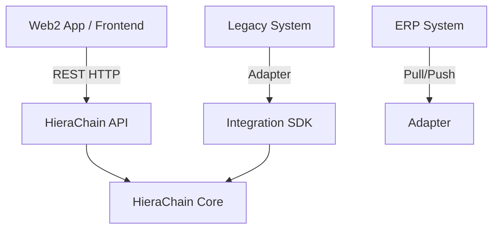
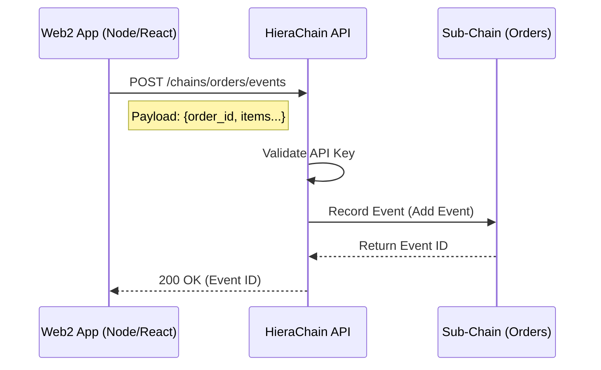
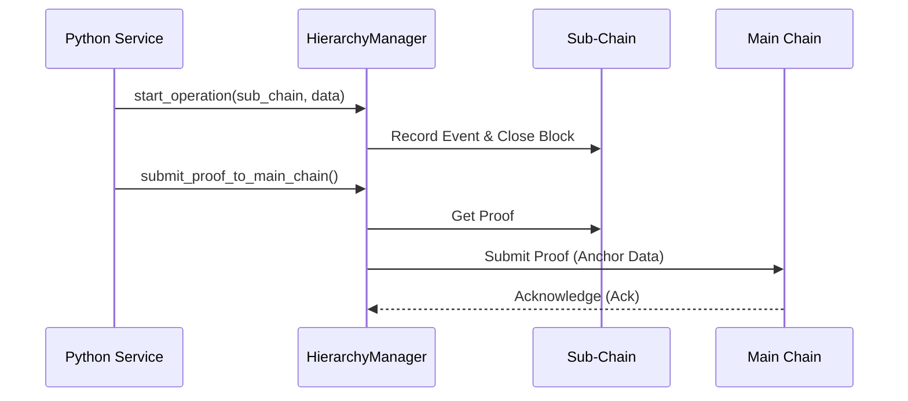

# Web2 & Existing System Integration

## Purpose

Guide to patterns for connecting traditional Web2 applications (Node.js, Java, PHP, etc.) or legacy ERP systems with the HieraChain network.

## Integration Patterns

There are 3 main integration models:

1. **REST API (Loose Coupling)**: Most common, used for Web/Mobile Apps.
2. **Integration SDK (High Performance)**: Used for Python backend services needing high performance.
3. **ERP Adapter (Enterprise)**: Used for ERP systems (SAP, Oracle) requiring periodic data synchronization.



## Method 1: Using REST API (Recommended)

This is the simplest method, using standard HTTP protocol.

### Scenario

You have an E-commerce Website (Node.js/React) and want to record product traceability on the Blockchain when an order is completed.



### Implementation Example (Python/Requests)

```python
import requests
import json

API_URL = "http://localhost:2661/api/v1"
API_KEY = "your-api-key-here"  # If AUTH is enabled

def log_order_to_chain(order_id, items):
    # 1. Create Sub-Chain for orders (or use shared 'orders' chain)
    # Assuming using shared 'orders' chain
    
    # 2. Submit event
    payload = {
        "entity_id": order_id,
        "event_type": "order_completed",
        "details": {
            "items_count": len(items),
            "total_value": sum(i['price'] for i in items)
        }
    }
    
    headers = {
        "Content-Type": "application/json",
        "X-API-Key": API_KEY
    }
    
    try:
        response = requests.post(
            f"{API_URL}/chains/orders/events", 
            json=payload, 
            headers=headers,
            timeout=5
        )
        response.raise_for_status()
        print(f"Success: {response.json()}")
        return response.json().get("event_id")
    except requests.exceptions.RequestException as e:
        print(f"Error logging to blockchain: {e}")
        return None
```

### Implementation Example (JavaScript/Fetch)

```javascript
const API_URL = "http://localhost:2661/api/v1";

async function logOrder(orderId, items) {
  try {
    const response = await fetch(`${API_URL}/chains/orders/events`, {
      method: "POST",
      headers: {
        "Content-Type": "application/json",
        // "X-API-Key": "your-key"
      },
      body: JSON.stringify({
        entity_id: orderId,
        event_type: "order_completed",
        details: { count: items.length }
      })
    });
    
    if (!response.ok) throw new Error(`HTTP error! status: ${response.status}`);
    const result = await response.json();
    console.log("Logged event:", result.event_id);
    return result.event_id;
    
  } catch (error) {
    console.error("Blockchain integration error:", error);
  }
}
```

## Method 2: Integration SDK (Python Backend)

If you are building a Python service within the same internal network or cluster, using the SDK directly provides higher performance (bypasses HTTP overhead).



```python
from hierachain.hierarchical import HierarchyManager

# Initialize manager (connects directly to DB or via internal ZMQ)
manager = HierarchyManager()

def process_batch_data(batch_items):
    # Write directly to processing queue
    for item in batch_items:
        manager.start_operation(
            sub_chain_name="supply_chain",
            entity_id=item["id"],
            operation_type="ingest",
            details=item["metadata"]
        )
    
    # Trigger immediate proof submission (optional)
    manager.submit_proof_to_main_chain("supply_chain")
```

## Method 3: ERP Adapter

Use the `hierachain/integration` ledger to build bidirectional data sync adapters.

See details at: [Integration Module](../modules/integration.md).

## Important Notes

1. **Security**: Always use HTTPS and API Key (or OAuth if custom deployment) when connecting over public networks.
2. **Asynchronous**: Blockchain writes can be slower than regular DB writes. Use a queue (e.g., RabbitMQ, Kafka) on the Web2 app side to send requests to HieraChain workers, avoiding blocking the user UI.
3. **Error Handling**: Design Retry mechanisms if HieraChain API temporarily becomes unresponsive (503, timeout).

## Related

* API v1 Reference: [API v1](../reference/api-v1.md)
* Integration Module: [Integration](../modules/integration.md)
