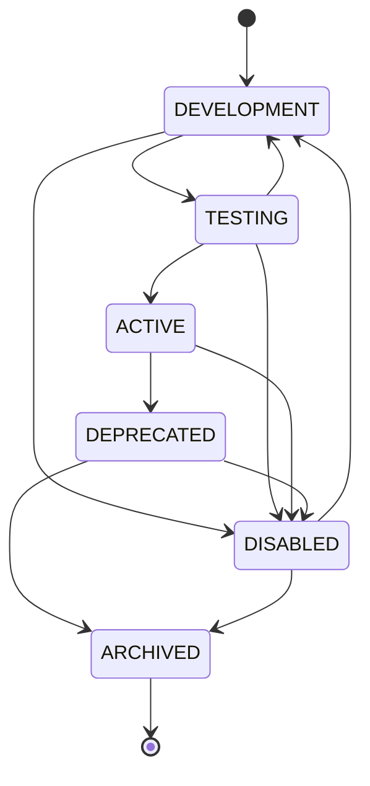

# Writing Domain Contracts

## Domain Contracts

HieraChain uses a flexible Domain Contracts system that supports processing business logic specific to each type of data or event. The code management system is defined directly in `hierachain/core/domain_contract.py`.

### 1. Initializing a Domain Contract

Each contract provides several core properties including an identifier, version, execution callback, and metadata:

```python
from hierachain.core.domain_contract import DomainContract

contract = DomainContract(
    contract_id="logistics_tracker_ledger",
    version="1.0.0",
    implementation=my_custom_logic_function,
    metadata={"department": "supply_chain"}
)
```

### 2. Lifecycle Management

Contracts on HieraChain never go straight to production; they go through a quality control cycle (ContractStatus):

* `DEVELOPMENT`: Default state upon creation. For dev/debugging.
* `TESTING`: QA phase, testing with test data.
* `ACTIVE`: Contract is officially live on the network, allowed to activate transaction processing via `activate()`.
* `DEPRECATED`: Marked as obsolete but retained to support old blocks via `deprecate()`.
* `DISABLED`: Emergency disable via `disable()`.
* `ARCHIVED`: Fully archived, cannot be reactivated.



### 3. Versioning

Instead of overwriting old contracts, which would distort the blockchain history, users can easily upgrade to a new contract logic version while the system still retains `previous_versions`. This mechanism ensures network maintenance never causes **Downtime**.

```python
contract.upgrade_to_version(
    new_version="1.1.0",
    new_implementation=optimized_logic_function,
    metadata={"upgrade_reason": "Performance improvement"}
)
```

### 4. Registering Event Handlers

Transactions or Events arriving at a DomainContract can be split and routed to different callback functions depending on the `event_type`.

```python
def quality_check_handler(event, context, storage):
    # Reconciliation logic, modify storage as needed...
    return {"status": "passed"}

# Register this handler specifically for the "quality_inspection" event
contract.register_event_handler(
    event_type="quality_inspection",
    handler=quality_check_handler
)
```

This helps clearly separate verification, reconciliation, and approval logic across distinct modules.
