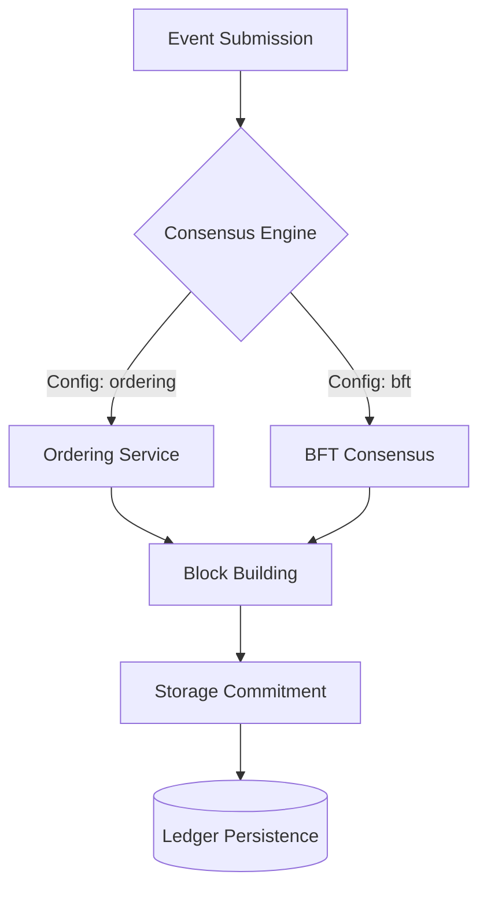

# Consensus Module (`hierachain/consensus/*`)

## Overview

The **Consensus** module is responsible for ensuring consistency and deterministic ordering of data across the entire HieraChain network. The system provides flexible consensus mechanisms, allowing enterprises to choose between extreme performance in trusted environments or absolute security in environments at risk of attack.

---

## Supported Consensus Protocols

HieraChain natively integrates 3 main protocols, configurable via `HRC_CONSENSUS_TYPE`:

*   :material-order-bool-ascending:{ .lg .middle } __Ordering Service (CFT)__

    ---

    * Suitable for Consortium or Single-org networks.
    * Crash Fault Tolerance.
    * High performance with batching mechanism.
    * [:octicons-arrow-right-24: Details](../consensus/ordering.md)

*   :material-shield-key:{ .lg .middle } __BFT Consensus (PBFT)__

    ---

    * Suitable for untrusted environments.
    * Byzantine Fault Tolerance with condition `n >= 3f + 1`.
    * Ensures integrity even when nodes are compromised.
    * [:octicons-arrow-right-24: Details](../consensus/bft_consensus.md)

*   :material-account-tie:{ .lg .middle } __Proof of Authority / Federation__

    ---

    * **PoA**: Authorized nodes sign blocks.
    * **PoF**: Rotating leader mechanism within a consortium.
    * Suitable for Sub-Chains requiring fast processing.

---

## Overall Architecture

---

## Integration into Hierarchy

In HieraChain's hierarchical model:

1.  **Main Chain**: Typically uses **BFT Consensus** for maximum system-wide security.
2.  **Sub-Chains**: Can use **Ordering Service** or **PoA** for high transaction processing speed, then periodically submit Proofs to the Main Chain.

---

## Related

*   [Hierarchical Model](./hierarchical.md)
*   [Network System](./network.md)
*   [Error Mitigation](./error-mitigation.md)
