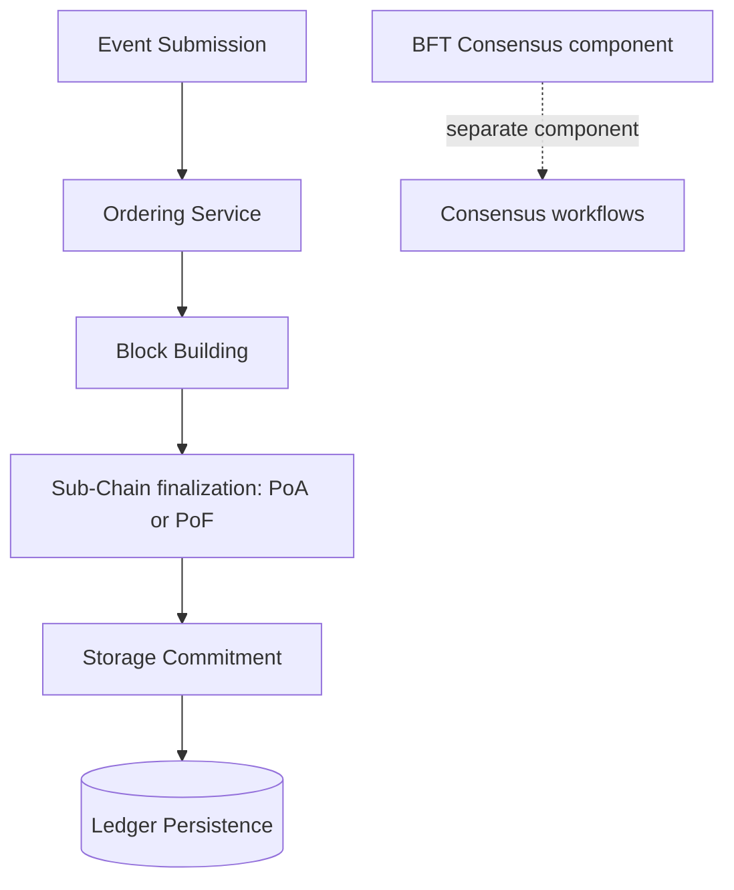

# Consensus Module (`hierachain/consensus/*`)

## Overview

The **Consensus** module is responsible for ensuring consistency and deterministic ordering of data across the entire HieraChain network. The system provides flexible consensus mechanisms, allowing enterprises to choose between extreme performance in trusted environments or absolute security in environments at risk of attack.

---

## Supported Consensus Protocols

The Ordering Service batches events, while PoA and PoF finalize Sub-Chain blocks. The repository also contains a separate BFT component. `HRC_CONSENSUS_TYPE` selects `proof_of_authority` or `proof_of_federation`; it does not select BFT:

*   :material-order-bool-ascending:{ .lg .middle } __Ordering Service (CFT)__

    ---

    * Suitable for Consortium or Single-org networks.
    * Crash Fault Tolerance.
    * High performance with batching mechanism.
    * [:octicons-arrow-right-24: Details](../consensus/ordering.md)

*   :material-shield-key:{ .lg .middle } __BFT Consensus (PBFT)__

    ---

    * Suitable for untrusted environments.
    * Byzantine Fault Tolerance with condition `n >= 3f + 1`.
    * Ensures integrity even when nodes are compromised.
    * [:octicons-arrow-right-24: Details](../consensus/bft_consensus.md)

*   :material-account-tie:{ .lg .middle } __Proof of Authority / Federation__

    ---

    * **PoA**: Authorized nodes sign blocks.
    * **PoF**: Rotating leader mechanism within a consortium.
    * Suitable for Sub-Chains requiring fast processing.

---

## Overall Architecture

```mermaid
graph TD
    A[Event Submission] --> B[Ordering Service]
    B --> C[Block Building]
    C --> D[Sub-Chain finalization: PoA or PoF]
    D --> E[Storage Commitment]
    E --> F[(Ledger Persistence)]
    G[BFT Consensus component] -. separate component .-> H[Consensus workflows]
```

---

## Integration into Hierarchy

In HieraChain's hierarchical model:

1.  **Main Chain**: Uses **PoA** by default and can be configured for **PoF** through `HRC_MAINCHAIN_CONSENSUS`. The BFT implementation is a separate consensus component; `MainChain` does not select it as its default.
2.  **Sub-Chains**: Use the **Ordering Service** for batching and can finalize blocks with the configured Sub-Chain consensus (PoA by default). Proofs can then be submitted to the Main Chain.

---

## Related

*   [Hierarchical Model](./hierarchical.md)
*   [Network System](./network.md)
*   [Error Mitigation](./error-mitigation.md)
