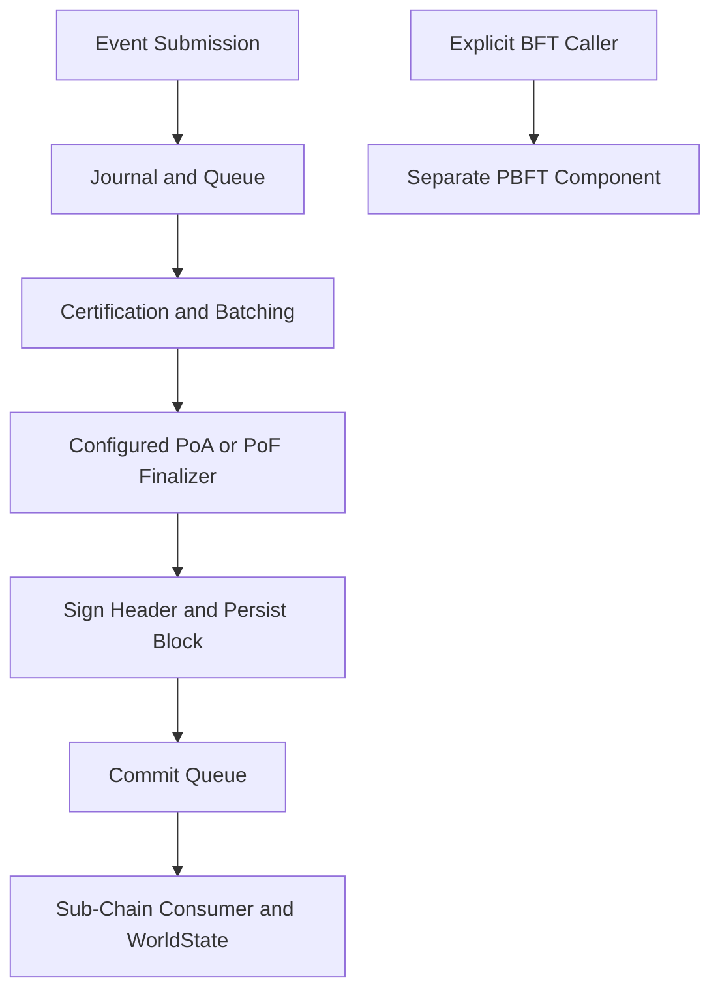

# Consensus module (`hierachain/consensus/*`)

## Scope

The module provides PoA and PoF block finalization, an event ordering service, and a separate BFT library. Their validation rules and integration requirements differ.

## Components

| Component | Behavior | Reference |
|:----------|:---------|:----------|
| Ordering Service | Journals, queues, certifies and batches local events; signs and persists blocks before queueing them for the consumer | [Ordering](../consensus/ordering.md) |
| PoA | Checks registered authority membership, block signatures and optional timestamp spacing | [PoA](../consensus/poa.md) |
| PoF | Checks federation membership, scheduled leader and its finalization signature; quorum signature verification is a separate helper | [PoF](../consensus/pof.md) |
| BFT | Runs PBFT phases with `n >= 3f + 1`; callers supply signing keys, transport and application integration | [BFT](../consensus/bft_consensus.md) |

Ordering recovery uses a local durable journal. It does not elect a replicated orderer cluster or provide automatic service failover. BFT is not selected by the MainChain/Sub-Chain consensus settings.

## Ordering path

```mermaid
graph TD
    A[Event Submission] --> B[Journal and Queue]
    B --> C[Certification and Batching]
    C --> D[Configured PoA or PoF Finalizer]
    D --> E[Sign Header and Persist Block]
    E --> F[Commit Queue]
    F --> G[Sub-Chain Consumer and WorldState]
    H[Explicit BFT Caller] --> I[Separate PBFT Component]
```

The submission ID acknowledges journal/queue acceptance. The consumer validates and applies the persisted block later; an acceptance response is not block finality.

## Hierarchy configuration

MainChain defaults to PoA. `HRC_MAINCHAIN_CONSENSUS` selects PoA or PoF and falls back to `HRC_CONSENSUS_TYPE`. Sub-Chains default to PoA and use their Python `config` to select PoF. `BFT_ENABLED` does not connect BFT to either chain path.

Provision a complete signing identity and approved trusted block keys before creating chains. PoF also needs matching federation membership and validator public keys across nodes. See [Consensus mechanisms](../workflows/consensus_mechanisms.md) and [Quickstart](../getting-started/quickstart.md).

## Related

* [Hierarchical module](./hierarchical.md)
* [Network](./network.md)
* [Error mitigation](./error-mitigation.md)
