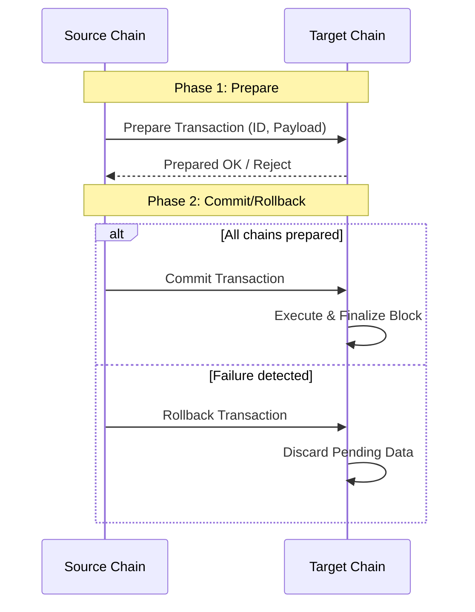

# Domains Module (`hierachain/domains/*`)

## Overview

The **Domains** module is a critical intermediary layer connecting the core Blockchain infrastructure with real-world enterprise business processes. It provides standardized templates for building business chains (Sub-Chains), managing entity lifecycles, and ensuring data consistency across the entire HieraChain system.

---

## Core Components

<div class="grid cards" markdown>

*   :material-link-variant:{ .lg .middle } __Business Chains__

    ---

    __Files__: `base_chain.py`, `domain_chain.py`

    * Abstract base class for specialized business processes.
    * Built-in entity state management (Registration, Status Update).
    * **Two-Phase Commit (2PC)** mechanism for cross-chain transactions.

*   :material-calendar-check:{ .lg .middle } __Enterprise Events__

    ---

    __Files__: `base_event.py`, `domain_event.py`

    * Standardized enterprise events: Approval, Quality Check, Compliance.
    * Automatic event structure validation according to Ledger rules.
    * Factory functions for fast and accurate event creation.

*   :material-shield-search:{ .lg .middle } __Integrity Utils__

    ---

    __Files__: `cross_chain_validator.py`, `entity_tracer.py`

    * **Cross-Chain Validator**: Detects logical inconsistencies between chains.
    * **Entity Tracer**: Traces the complete history of an object across all Sub-Chains.
    * **Compliance Scanner**: Scans and blocks cryptocurrency terminology.

</div>

---

## Domain Management

### Entity Lifecycle

Every `DomainChain` supports automatic entity state management through default Event Handlers:

1.  **Registration**: Register a new entity in the business chain.
2.  **Status Tracking**: Track current status (e.g., `In Production`, `Quality Passed`, `Shipped`).
3.  **Resource Allocation**: Attach resources (personnel, machinery, materials) to an entity.
4.  **Compliance Monitoring**: Record regulatory compliance check results.

### Operation Metrics

The system automatically tracks key KPIs through `OperationMetricsTracker`:
*   **Success Rate**: Rate of successful task completion.
*   **Quality Pass Rate**: Rate of passing quality inspections.
*   **Approval Rate**: Rate of management approvals.
*   **Compliance Violations**: Number of detected process violations.

---

## Two-Phase Commit (2PC) Mechanism

To ensure consistency when performing operations affecting multiple chains, `DomainChain` integrates the 2PC protocol:



---

## Compliance and Security Control

### Cryptocurrency Terminology Prevention

According to HieraChain's philosophy, `CrossChainValidator` performs strict scanning and flags violations if cryptocurrency-related terms are detected in event data:
*   **Banned list**: `transaction`, `mining`, `coin`, `token`, `wallet`, `address`, `amount`, `fee`, etc.
*   **Action**: Records violations in the system compliance report (`Ledger_compliance`).

### Cross-Chain Tracing

`EntityTracer` allows administrators to reconstruct the complete "journey" of an entity across multiple departments or chains:

```python
from hierachain.domains.utils.entity_tracer import EntityTracer

tracer = EntityTracer(hierarchy_manager)
# Get the history of entity "ORDER-789" across the entire system
trace_results = tracer.trace_entity_across_chains("ORDER-789")

for chain_name, events in trace_results.items():
    print(f"Activity at {chain_name}: {len(events)} events.")
```

---

## Standardized Event Types

| Event Type | Business Role | Details Fields |
| :--- | :--- | :--- |
| `operation_start` | Start a process | `operation_type`, `operator_id` |
| `quality_check` | Quality inspection | `check_type`, `check_result`, `inspector_id` |
| `approval` | Management approval | `approval_type`, `approval_status`, `approver_id` |
| `compliance_check` | Compliance check | `compliance_type`, `compliance_status`, `regulation_ref` |
| `resource_assigned` | Resource allocation | `resource_id`, `resource_type`, `allocation_type` |

---

## Related

*   [Hierarchical System](./hierarchical.md)
*   [Core Blockchain Structure](./core.md)
*   [ERP Integration Guide](../workflows/erp-integration.md)
