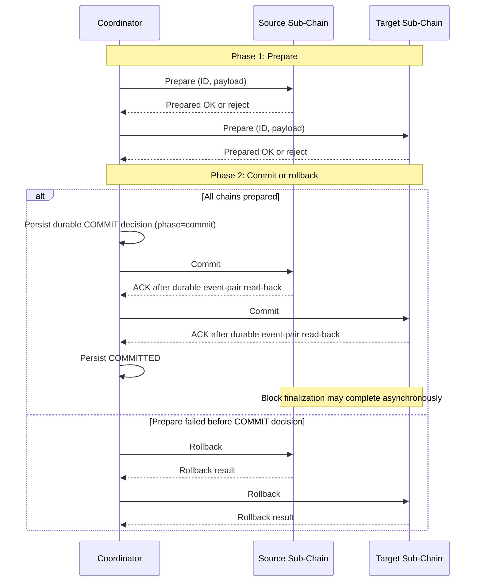

# Domains Module (`hierachain/domains/*`)

## 1. Overview

The `domains` module bridges the core blockchain infrastructure with enterprise business logic. It provides base classes for domain-specific Sub-Chains, standardized event creators, entity lifecycle helpers, and cross-chain tracing tools.

## 2. Core components

Components are organized into three sub-packages under `hierachain/domains/`:

### 2.1 Business chains (`chains/base_chain.py`, `chains/domain_chain.py`)

* `BaseChain`: Abstract base class managing chain states, entity registries, and event pipelines.
* `DomainChain`: Concrete implementation supporting domain operations, operation validation, and transaction managers.
* `chains/metrics.py`: Tracks aggregate operation counts and rates; it does not record execution latency.

### 2.2 Enterprise events (`events/base_event.py`, `events/event_creators.py`)

* `BaseEvent`: Base class for structured business events with schema validation.
* `event_creators.py`: Helper factories producing event objects for operations: `create_quality_check`, `create_approval`, `create_resource_allocation`, and `create_status_update`.

### 2.3 Integrity utilities (`utils/cross_chain_validator.py`, `utils/entity_tracer.py`)

* `CrossChainValidator`: Evaluates consistency across sub-chains and scans for forbidden cryptocurrency terminology.
* `EntityTracer`: Reconstructs complete entity histories across the chain hierarchy.
* `utils/compliance_checker.py`: Validates compliance parameters against regulatory rules.

## 3. Domain management and entity lifecycle

`DomainChain` provides built-in lifecycle transitions:

1. Registration: Links a unique `entity_id` to an entity type and metadata attributes.
2. Status updates: Tracks sequential states (`in_progress`, `quality_approved`, `completed`).
3. Resource allocation: Tracks assigned and reserved resources. `assigned` adds a resource to `allocated_resources` (and removes its reservation); `reserved` adds it to `reserved_resources`; `released` removes it from either list; `transferred` moves an allocated resource to another registered entity named by `details.target_entity_id`. Invalid transitions are rejected before the event is submitted.
4. Operation metrics: `OperationMetricsTracker` exposes aggregate operation counts and rates, with no latency or per-operation-type breakdown.

Domain events require a registered entity. `register_entity` stores the supplied initial data in the Sub-Chain registration event so the registry can be reconstructed after restart; that data is ledger content and must not contain secrets. Older registration events without `initial_data` restore the supported registration metadata only.

Initial entity data uses standard-library JSON with finite numbers. Python integer values, including values larger than 64 bits, are restored exactly within Python's configured integer conversion limit. Use strings for numeric identifiers that must also pass through clients with smaller integer ranges. Unsupported values make `register_entity` return `False` before appending the registration event.

Operation starts and completions append their event and update the in-memory projection under the chain lock. An accepted start sets `current_operation`, so another start for the same entity is rejected until completion. A domain event returning `False` was rejected before append. A `True` return means the ordering service accepted the event; it does not mean a signed block has been finalized or durably committed. If the post-append handler fails, the event remains accepted, the failure is logged, and `domain_projection_healthy` becomes false. Domain writes then fail closed until `rebuild_domain_state()` succeeds. Rebuild replays deterministic built-in projections only; custom handlers that appear in stored history are reported as unrecoverable automatically, because replaying them could repeat external side effects.

The completed-operation count is rebuilt from accepted operation events. Detailed `OperationMetricsTracker` counters remain process-local and restart at zero. Participant 2PC prepares keep a deep snapshot of the validated payload. `pending_transactions` returns a detached snapshot, and a repeated prepare succeeds only when both the payload and participant role match. Proof consistency checks report proof events missing `sub_chain_name`, `proof_hash`, or `timestamp` as inconsistent. Malformed event details are reported structurally and skipped by logical consistency analysis instead of raising.

## 4. Two-Phase Commit (2PC) coordination

Cross-chain operations coordinating multiple Sub-Chains execute through the Two-Phase Commit protocol:


```mermaid
sequenceDiagram
    participant Coordinator
    participant Source as Source Sub-Chain
    participant Target as Target Sub-Chain

    Note over Coordinator, Target: Phase 1: Prepare
    Coordinator->>Source: Prepare (ID, payload)
    Source-->>Coordinator: Prepared OK or reject
    Coordinator->>Target: Prepare (ID, payload)
    Target-->>Coordinator: Prepared OK or reject

    Note over Coordinator, Target: Phase 2: Commit or rollback
    alt All chains prepared
        Coordinator->>Coordinator: Persist durable COMMIT decision (phase=commit)
        Coordinator->>Source: Commit
        Source-->>Coordinator: ACK after durable event-pair read-back
        Coordinator->>Target: Commit
        Target-->>Coordinator: ACK after durable event-pair read-back
        Coordinator->>Coordinator: Persist COMMITTED
        Note over Source, Target: Block finalization may complete asynchronously
    else Prepare failed before COMMIT decision
        Coordinator->>Source: Rollback
        Source-->>Coordinator: Rollback result
        Coordinator->>Target: Rollback
        Target-->>Coordinator: Rollback result
    end
```

After the durable COMMIT decision, a missing participant ACK leaves the operation `IN_DOUBT` for forward recovery. The coordinator does not roll back a commit decision that has already been persisted.

## 5. Compliance and cross-chain tracing

### Cryptocurrency term filtration

`CrossChainValidator` scans event payloads to enforce enterprise terminology rules. If terms such as `coin`, `token`, `mining`, or `wallet` appear in business payloads, the validator flags the event as non-compliant.

### Cross-chain entity tracing

`EntityTracer` aggregates events for an entity across all Sub-Chains:

```python
from hierachain.domains.utils.entity_tracer import EntityTracer

tracer = EntityTracer(hierarchy_manager)
trace_results = tracer.trace_entity("ORDER-789")

print(f"Total events found: {trace_results['total_events']}")
for chain_name, summary in trace_results.get("chain_details", {}).items():
    print(f"Activity at {chain_name}: {summary['total_events']} events")
```

## 6. Standardized operation types

| Operation Type | Business Role | Required Fields |
| :--- | :--- | :--- |
| `quality_check` | Quality inspection | `check_type`, `check_result` |
| `approval` | Management approval | `approval_type`, `approver_id` |
| `resource_allocation` | Resource assignment | `resource_type`, `resource_id` |
| `compliance_check` | Regulatory verification | `compliance_type` |

## Related

* [Hierarchical Module](./hierarchical.md)
* [Writing Domain Logic](../how-to/write-domain-contracts.md)
* [ERP Integration](../workflows/erp-integration.md)
