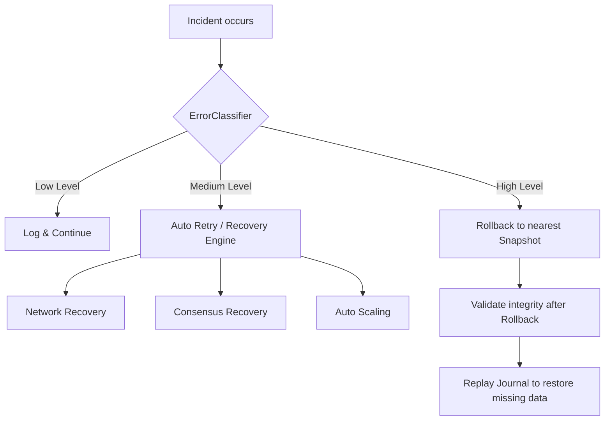

# Error Mitigation Module (`hierachain/error_mitigation/*`)

## Overview

The **Error Mitigation** module acts as HieraChain's "safety net," ensuring the system always maintains integrity and resilience against hardware, software, or network incidents. This system combines durable journaling techniques, intelligent error classification, and automated recovery scenarios.

---

## Multi-layered Defense Architecture

<div class="grid cards" markdown>

*   :material-shield-check:{ .lg .middle } __Validation Layer__

    ---

    __Files__: `validator.py`, `data_validator.py`

    * **Validator**: Checks Block/Event structure according to Ledger guidelines.
    * **DataValidator**: Deep validation of business logic, Arrow schema, and input data validity.

*   :material-notebook-edit:{ .lg .middle } __Durable Journaling__

    ---

    __File__: `journal.py`

    * Uses **Apache Arrow** for high-speed transaction journaling.
    * **Append-only** mechanism ensures data is never overwritten.
    * Guarantees persistence before events are committed to the chain.

*   :material-history:{ .lg .middle } __Rollback & Snapshots__

    ---

    __File__: `rollback_manager.py`

    * Manages restore points (Snapshots) for the entire system or individual components.
    * Automatic periodic snapshot creation (Auto-snapshot).
    * Validates data integrity before performing rollback.

*   :material-auto-fix:{ .lg .middle } __Adaptive Recovery__

    ---

    __File__: `recovery_engine.py`

    * Automatic handling of network errors and partition detection.
    * Consensus state recovery when a Leader fails.
    * Integrates **AutoScaler** to scale resources based on system load.

</div>

---

## Error Classification Strategy

The `ErrorClassifier` not only logs errors but also proposes mitigation strategies based on severity:

| Level | Meaning | Suggested Action |
| :--- | :--- | :--- |
| **INFO / WARNING** | Information or minor error | Log & Continue |
| **ERROR** | Transaction processing error | RETRY / REJECT |
| **CRITICAL** | Data / consistency error | ROLLBACK & QUARANTINE |
| **FATAL** | Critical system error | EMERGENCY SHUTDOWN |

---

## Transaction Journal

HieraChain uses **Apache Arrow** IPC format for Journaling to achieve optimal performance:

1.  **Durable Write**: Events are written to disk and `fsync` is called before proceeding.
2.  **Schema Enforcement**: Ensures every journal record conforms to the core event schema.
3.  **Replay Ability**: When the system restarts after a failure, the Journal can replay uncommitted events to restore state.

```python
from hierachain.error_mitigation.journal import TransactionJournal

# Initialize a secure journal (Path Traversal protected)
journal = TransactionJournal(storage_dir="data/journal")

# Write a durable event
journal.log_event(event_dict)
```

---

## Recovery Workflow

When an error is detected, the system follows this processing flow:



---

## Snapshot Management

`RollbackManager` supports different Snapshot types:

*   **CONFIGURATION**: Backup only system configuration files.
*   **CHAIN_STATE**: Backup Main Chain and Sub-Chains state.
*   **CONSENSUS_STATE**: Stores View Number and current Leader information.
*   **FULL_SYSTEM**: Snapshot of the entire system state.

---

## Related

*   [Storage System](./adapters.md)
*   [Core Architecture](./core.md)
*   [Cluster System](./cluster.md)
