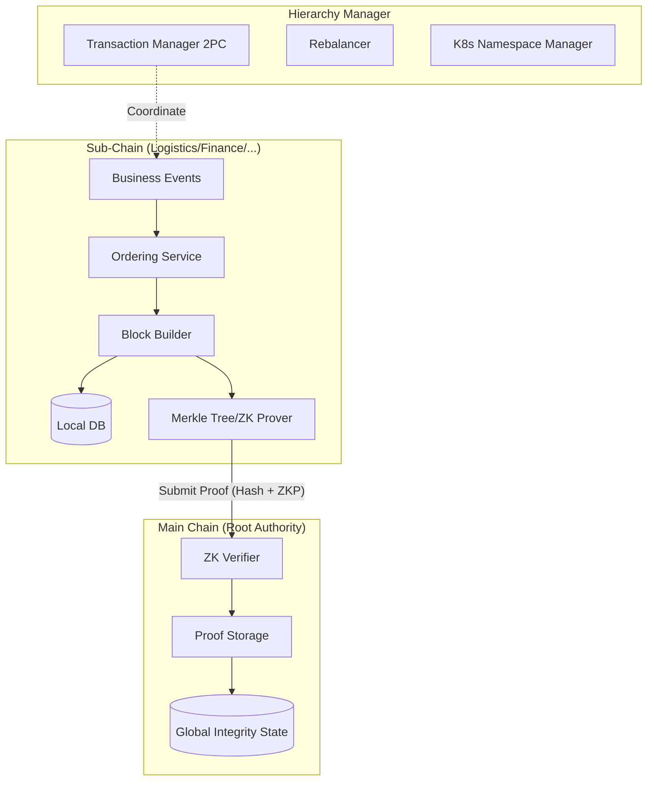

# Hierarchical Module (`hierachain/hierarchical/*`)

## Overview

The **Hierarchical** module is the "heart" of HieraChain's architecture, implementing the Two-Tier Blockchain model designed specifically for enterprise structures. It allows separating detailed business data (at Sub-Chains) from global verification proofs (at Main Chain), ensuring privacy, high performance, and unlimited scalability.

---

## Foundational Components

<div class="grid cards" markdown>

*   :material-link-variant:{ .lg .middle } __Main Chain (Root of Trust)__

    ---

    __File__: `main_chain.py`

    * Acts as the "CEO" of the system, storing only Proofs.
    * Integrates **Zero-Knowledge Proof (ZKP)** for verification without data disclosure.
    * Uses PoA/PoF consensus for optimized enterprise validation speed.

*   :material-source-branch:{ .lg .middle } __Sub-Chain (Execution Layer)__

    ---

    __File__: `sub_chain.py`

    * Each Sub-Chain serves a business domain or a specific department.
    * Executes business logic, packages Blocks, and generates periodic Proofs.
    * Ensures detailed domain data is always locally isolated.

*   :material-file-tree:{ .lg .middle } __Hierarchy Manager (Orchestrator)__

    ---

    __File__: `hierarchy_manager.py`

    * Orchestrates the entire lifecycle of chains and organizations in the network.
    * Manages Channels, private data, and cross-chain transactions.
    * Provides comprehensive reports on system-wide integrity.

*   :material-shield-account:{ .lg .middle } __Multi-Org & Channels__

    ---

    __Files__: `multi_org.py`, `channel.py`, `private_data.py`

    * **Multi-Org**: Manages multiple participating organizations with their own MSP configurations.
    * **Channels**: Completely isolates data between specific groups of organizations.
    * **Private Data**: Stores sensitive data off-chain, sharing only hash values.

</div>

---

## Data Flow Architecture (System Workflow)

The hierarchical model ensures that detailed data never "leaks" to the global verification layer:



---

## Scalability & Infrastructure Management

### 1. Sub-Chain Rebalancer (`rebalancer.py`)
Automatically monitors system load and performs Sub-Chain splitting when transaction volume exceeds the threshold (EPS Threshold), ensuring performance does not bottleneck:

* **Strategies**: Hash-based, Time-based, Load-based.
*   **Mechanism**: Smoothly migrates entities to new chains.

### 2. Kubernetes Namespace Manager (`k8s_namespace_manager.py`)
Integrates directly with Cloud-Native infrastructure to completely isolate resources (CPU, RAM, Network) of each Sub-Chain in a separate Namespace.

---

## Cross-Chain Transactions

HieraChain uses the **Two-Phase Commit (2PC)** protocol via `CrossChainTransactionManager` to ensure atomicity when performing operations involving multiple Sub-Chains:

```python
# Example of initiating a cross-chain transaction
tx_id = hierarchy_manager.initiate_cross_chain_transaction(
    source_chain_name="supply_chain",
    dest_chain_name="finance_chain",
    payload={"asset_id": "INV-100", "action": "settle_payment"}
)
```

---

## Advanced Security and Privacy

### Zero-Disclosure Verification (ZK Proofs)
Main Chain supports strict verification mode, requiring every Sub-Chain to submit ZK proofs. This proves that:

1.  The new Sub-Chain state is a valid result from the previous state.
2.  All business rules have been followed without requiring Main Chain to read raw data.

### Private Data Collections

Allows members within a chain to share sensitive data that even other members of the same chain (but not in the Collection) cannot read.

---

## Key Public API

### HierarchyManager

*   `create_sub_chain(name, domain_type)`: Create a new business chain.
*   `create_organization(org_id, name)`: Register a participating organization in the network.
*   `create_channel(channel_id, org_ids)`: Set up a data isolation channel.
*   `get_system_integrity_report()`: Report on overall system health.

### MainChain

*   `add_proof(sub_chain, proof_hash, metadata, zk_proof)`: Accept a proof from a Sub-Chain.
*   `verify_proof(proof_hash, sub_chain)`: Verify the validity of a proof.

---

## Related

*   [BFT Consensus](../consensus/bft_consensus.md)
*   [Ordering Service](../consensus/ordering.md)
*   [Domains Module (Business Logic)](./domains.md)
