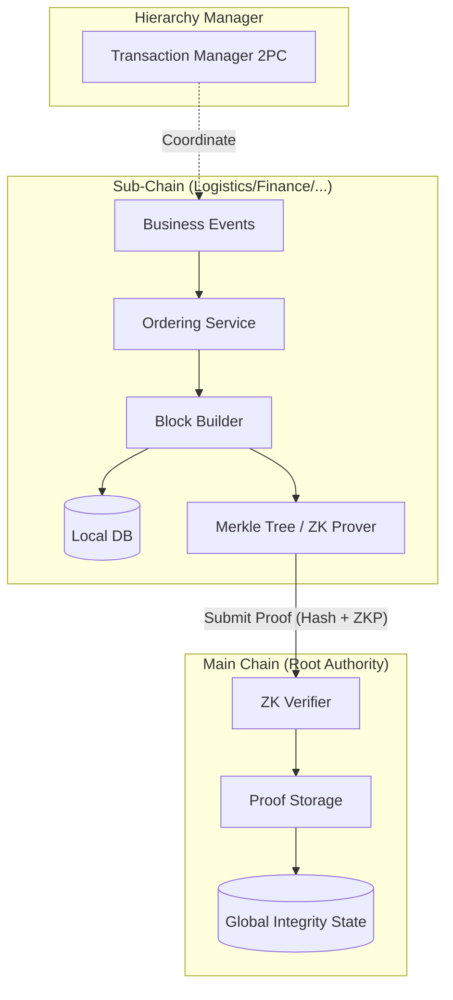

# Hierarchical Module (`hierachain/hierarchical/*`)

## 1. Overview

The `hierarchical` module implements the two-tier ledger architecture of HieraChain. Sub-Chains process domain business events and store detailed state locally. The Main Chain stores cryptographic proofs and root hashes submitted by Sub-Chains. This separation maintains business data privacy, keeps Main Chain verification lightweight, and scales horizontally by partitioning load across chains.

## 2. Foundational components

Components reside in dedicated packages under `hierachain/hierarchical/`.

### 2.1 Main Chain (`main_chain/base.py`)

* Stores cryptographic block proofs rather than raw business event records.
* Recursively sanitizes Sub-Chain registration metadata before storing it in the registry, consensus authority, or registration event; summaries expose only the sanitized copy.
* Verifies state transitions using zero-knowledge proofs when enabled.
* Validates cross-chain anchors under consortium or authority consensus.

### 2.2 Sub-Chain (`sub_chain/base.py`)

* Operates dedicated business workflows for a specific domain or department.
* Packages business events into blocks and calculates Merkle roots.
* Generates periodic state proofs for submission to the Main Chain.

Startup loads block headers and ordered events with one SQL range query, while retaining Merkle, hash, trusted-signature, gap, and chain-link checks. Sub-Chain consumes the verified ordering bootstrap snapshot once instead of reading the full chain again; later synchronization reads fresh storage. Recovery rebuilds entity and event-type indexes and counters through the shared Blockchain index helper, so queries reflect the restored ledger.

### 2.3 Hierarchy Manager (`hierarchy_manager/base.py`)

* Coordinates chain lifecycles, cross-chain verification, and multi-organization setups.
* Manages communication channels, private data collections, and two-phase commit (2PC) transactions.
* Compiles system-wide integrity reports across all registered chains.

Organization/member/channel access state is persisted with an internal `_revision`. SQLite and PostgreSQL use atomic conditional writes; Redis uses WATCH/MULTI. Manager provisioning reloads and retries up to three times on an unsuccessful write. REST member provisioning rechecks the authenticated administrator on every retry. Channel configuration conflicts return failure and roll back the local change, requiring fresh endorsement before retry. Reads and channel access checks refresh shared state without replacing an existing channel's in-memory ledger; unavailable or missing persisted state fails closed. Memory-only managers retain local state.

Snapshots without a revision are upgraded on their next successful write. Upgrade all registry writers together: mixing older unconditional writers with revision-aware writers is unsupported. Custom storage adapters must support `save_hierarchy_registry(state, expected_revision=...)` and reject stale revisions.

### 2.4 Multi-organization, channels, and private data

* `multi_org.py`: Manages member organizations, certificates, and MSP identities.
* `channel/manager.py`: Partitions communication between specific groups of organizations.
* `private_data.py`: Stores confidential payloads off-chain while anchoring cryptographic hashes on-chain.

## 3. Data flow

Detailed data remains on Sub-Chains. Only Merkle roots and cryptographic proofs anchor to the Main Chain:


```mermaid
graph TD
    subgraph "Sub-Chain (Logistics/Finance/...)"
        A[Business Events] --> B[Ordering Service]
        B --> C[Block Builder]
        C --> D[(Local DB)]
        C --> E[Merkle Tree / ZK Prover]
    end

    subgraph "Main Chain (Root Authority)"
        F[ZK Verifier] --> G[Proof Storage]
        G --> H[(Global Integrity State)]
    end

    E -- "Submit Proof (Hash + ZKP)" --> F
    
    subgraph "Hierarchy Manager"
        I[Transaction Manager 2PC]
    end
    
    I -. "Coordinate" .-> A
```

## 4. Cross-chain operations (2PC)

`CrossChainTransactionManager` in `hierachain/hierarchical/transaction_manager.py` implements a two-phase commit protocol to maintain atomicity across Sub-Chains:

Coordinator phase ACKs and participant commit ACKs still require durable journal read-back. Native journals use `read_since(cursor)` to decode new records after an initial history scan, including records in rotated files. Participant retries retain durable event IDs to avoid duplicate appends; ambiguous submissions invalidate their marker snapshot. Custom journals exposing only `replay()` keep the full replay path. Transaction history and archive count remain unbounded; this change does not add retention or compaction.

```python
from hierachain.hierarchical.hierarchy_manager import HierarchyManager

manager = HierarchyManager()
tx_id = manager.initiate_cross_chain_transaction(
    source_chain_name="supply_chain",
    dest_chain_name="finance_chain",
    payload={"asset_id": "INV-100", "action": "settle_payment"}
)
```

## 5. Privacy and zero-knowledge verification

* Main Chain verification: Sub-Chains can submit zero-knowledge proofs confirming valid state transitions according to consensus rules without revealing raw event details.
* Private data collections: Sensitive payloads are restricted to authorized member nodes, while only hashes are propagated across the common ledger.

## Related

* [Consensus Module](./consensus.md)
* [Domains Module](./domains.md)
* [Two-Phase Commit Guide](../how-to/cross-chain-transactions.md)
