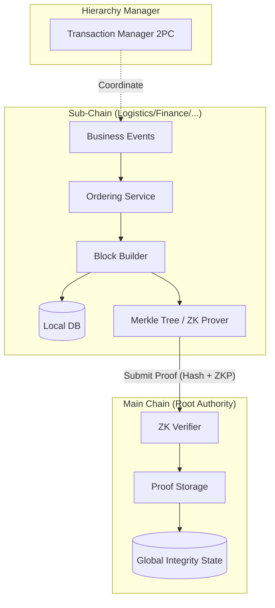

# Hierarchical Module (`hierachain/hierarchical/*`)

## 1. Overview

The `hierarchical` module implements the two-tier ledger architecture of HieraChain. Sub-Chains process domain business events and store detailed state locally. The Main Chain stores cryptographic proofs and root hashes submitted by Sub-Chains. This separation maintains business data privacy, keeps Main Chain verification lightweight, and scales horizontally by partitioning load across chains.

## 2. Foundational components

Components reside in dedicated packages under `hierachain/hierarchical/`.

### 2.1 Main Chain (`main_chain/base.py`)

* Stores cryptographic block proofs rather than raw business event records.
* Recursively sanitizes Sub-Chain registration metadata before storing it in the registry, consensus authority, or registration event; summaries expose only the sanitized copy.
* Exposes a ZK verification hook; production proving and verification are not implemented.
* Validates cross-chain anchors under consortium or authority consensus.

### 2.2 Sub-Chain (`sub_chain/base.py`)

* Operates dedicated business workflows for a specific domain or department.
* Packages business events into blocks and calculates Merkle roots.
* Generates periodic state proofs for submission to the Main Chain.

Startup loads block headers and ordered events with one SQL range query, while retaining Merkle, hash, trusted-signature, gap, and chain-link checks. Sub-Chain consumes the verified ordering bootstrap snapshot once instead of reading the full chain again; later synchronization reads fresh storage. Recovery rebuilds entity and event-type indexes and counters through the shared Blockchain index helper, so queries reflect the restored ledger.

`validate_cross_chain_consistency()` compares each Sub-Chain tip hash with its latest durably stored MainChain proof. A missing or mismatched proof always sets `overall_consistent` to `false`. When the tip has advanced but the configured proof interval has not elapsed, the per-chain result is `consistent: false, pending: true`; `pending` explains the scheduled wait but does not certify the unanchored tip. A MainChain proof is not treated as an anchor until its signed block has passed durable read-back.

### 2.3 Hierarchy Manager (`hierarchy_manager/base.py`)

* Coordinates chain lifecycles, cross-chain verification, and multi-organization setups.
* Manages communication channels, private data collections, and two-phase commit (2PC) transactions.
* Compiles system-wide integrity reports across all registered chains.

`HierarchyManager` remains the public coordinator and owns resources, shared state, and locks. Internal `recovery.py` replays and verifies durable chain history; `registry.py` handles access snapshots, migration, conditional persistence, refresh, and rollback. `organization.py` builds member/channel views, and `validation.py` produces integrity reports. These helpers share the coordinator's state without creating another registry or storage owner. Existing method signatures, recovery order, cleanup hooks, and storage contracts remain available.

#### Feature support boundary

| Feature | Current behavior |
| :--- | :--- |
| Organization/member/channel registry | SQLite/PostgreSQL persistence and revision checks; explicit memory mode is ephemeral. |
| Organization-to-chain assignment | `assign_organization_to_chain()` returns `False`; valid IDs log an unsupported-operation warning. It grants no access. Configure channel membership and policies for channel access. |
| Private collections | Library objects provide an in-memory data store; the manager does not persist collections in its registry. REST private-data writes return HTTP 501. |
| ZK proofs | Mock hashes are development fixtures. Production proving/verification are unimplemented; see [ZK scope](../security/decentralized-zkp.md). |
| ERP vendor connectors | SAP/Oracle/Dynamics fixtures require explicit simulation opt-in. Real transport is application-provided; see [Integration](./integration.md). |
| Contract execution | REST contract registration stores metadata; execution returns HTTP 501. |

`get_cross_chain_statistics()["cross_chain_operations"]` is a reserved field that currently returns `0`, not a measured completed-operation count. A facade method or configuration option alone does not establish end-to-end feature support.

Organization/member/channel access metadata is persisted with an internal `_revision` and `_channel_ledger_version: 1`. Registry snapshots omit channel ledger history. SQLite and PostgreSQL use atomic conditional writes. Redis adapter helpers support channel records, but Redis remains rejected as the manager's ledger backend because its other signed-block/proof persistence contracts are incomplete. Manager provisioning reloads and retries up to three times on an unsuccessful write. REST member provisioning rechecks the authenticated administrator on every retry. Channel configuration conflicts return failure and roll back the local change, requiring fresh endorsement before retry. Reads and channel access checks refresh shared metadata and consume only unseen records for the requested channel while retaining the channel object; unavailable or missing persisted state fails closed. Memory-only managers retain local state.

Legacy registry snapshots containing embedded ledgers are validated and migrated during recovery. Registry replacement and per-channel seed records commit atomically; a failed migration preserves the old snapshot. Upgrade all registry writers together and stop older writers before migration: mixing snapshot writers with append-only writers is unsupported. Custom storage adapters must support `save_hierarchy_registry(state, expected_revision=..., channel_ledgers=...)`, atomically initialize the supplied ledger seeds, and reject stale revisions. They must also implement `append_channel_record(channel_id, record, expected_sequence=..., expected_registry_revision=...)` and `load_channel_records(channel_id, after_sequence=...)`.

Channel submission appends one durable event record before returning success; a storage failure returns HTTP 503 and leaves pending events and counters unchanged. Each append atomically checks both the registry access revision and the channel sequence, so stale workers cannot overwrite history or append using a revoked access snapshot. Finalization appends a signed block record that consumes the current pending batch. SQL adapters store the channel head and records in `channel_ledger_heads` and `channel_ledger_records`; Redis helpers use a per-channel list with WATCH/MULTI checks. Event writes leave registry metadata unchanged and do not serialize earlier blocks or other channels. Finalization writes only the new block batch.

Restart replays channel records, restores pending events, verifies every finalized block against trusted keys and its pending batch, and rebuilds submission counters. Subsequent refreshes apply only the new suffix and update counters incrementally. Invalid suffixes leave local ledger state unchanged. Queries still return finalized blocks; an acceptance ACK does not mean finalization has occurred. Direct channels and explicit memory-only managers remain ephemeral. Full startup verification, ledger memory usage and retained record storage still grow with history; this change adds no retention/compaction. Local access operations retain the manager registry lock.

### 2.4 Multi-organization, channels, and private data

* `multi_org.py`: Manages member organizations, certificates, and MSP identities.
* `channel/manager.py`: Partitions communication between specific groups of organizations.
* `private_data.py`: Provides in-memory encrypted collections and hash helpers; durable storage and automatic ledger anchoring require caller integration.

## 3. Data flow

Detailed data remains on Sub-Chains. Merkle roots and signed block proofs anchor to the Main Chain. The optional ZK branch in this design flow has only a mock implementation:


```mermaid
graph TD
    subgraph "Sub-Chain (Logistics/Finance/...)"
        A[Business Events] --> B[Ordering Service]
        B --> C[Block Builder]
        C --> D[(Local DB)]
        C --> E[Merkle Tree / ZK Prover]
    end

    subgraph "Main Chain (Root Authority)"
        F[ZK Verifier] --> G[Proof Storage]
        G --> H[(Global Integrity State)]
    end

    E -- "Submit Proof (Hash + ZKP)" --> F
    
    subgraph "Hierarchy Manager"
        I[Transaction Manager 2PC]
    end
    
    I -. "Coordinate" .-> A
```

## 4. Cross-chain operations (2PC)

The coordinator acquires its journal writer on first use. Registry/channel-only managers can share a SQL registry without acquiring a 2PC writer when no coordinator history exists. Existing `data/transactions` history is recovered at startup and retains the exclusive journal lease. Shared 2PC or SubChain journal paths still require one owning writer; registry concurrency does not provide multiple ordering/coordinator writers.

Call `HierarchyManager.close()` when its owner finishes. It closes sub-chain orderers, an acquired coordinator, and storage without creating an unused journal. `SubChain.stop()` drains committed blocks and releases its orderer and writer lease, allowing a replacement instance to recover the same paths. Entity consistency validation tracks operation and status state separately for each chain.

`CrossChainTransactionManager` in `hierachain/hierarchical/transaction_manager.py` implements a two-phase commit protocol to maintain atomicity across Sub-Chains:

Coordinator phase ACKs and participant commit ACKs still require durable journal read-back. Native journals use `read_since(cursor)` to decode new records after an initial history scan, including records in rotated files. Participant retries retain durable event IDs to avoid duplicate appends; ambiguous submissions invalidate their marker snapshot. Custom journals exposing only `replay()` keep the full replay path. Transaction history and archive count remain unbounded; this change does not add retention or compaction.

```python
from hierachain.hierarchical.hierarchy_manager import HierarchyManager

manager = HierarchyManager()
tx_id = manager.initiate_cross_chain_transaction(
    source_chain_name="supply_chain",
    dest_chain_name="finance_chain",
    payload={"asset_id": "INV-100", "action": "settle_payment"}
)
```

## 5. Privacy and zero-knowledge verification

* Main Chain verification: Signed block proofs and Merkle anchors provide the implemented integrity path. Mock ZK proofs do not establish state-transition correctness or zero-knowledge privacy; production ZK is unavailable.
* Private data collections: The library offers encrypted in-memory payloads and organization checks. Applications must integrate durable storage and hash anchoring; REST writes remain unimplemented.

## Related

* [Consensus Module](./consensus.md)
* [Domains Module](./domains.md)
* [Two-Phase Commit Guide](../how-to/cross-chain-transactions.md)

## Entity projection and proof roots

A Sub-Chain initializes `WorldState` from its local genesis before startup synchronization. Rehydration clears the projection and applies the persisted history once; repeated synchronization with an unchanged tip does not increment entity event counts.

`WorldState.get_state_root()` hashes the current entity projection for diagnostics. Cross-level proof metadata and ZK public inputs use block event Merkle roots: the previous block root and the latest block root (or the existing genesis/hash fallback where applicable). Anchoring therefore commits the block event history contract, not the entity projection root. Changing that commitment would require a separate proof schema and verifier migration.
