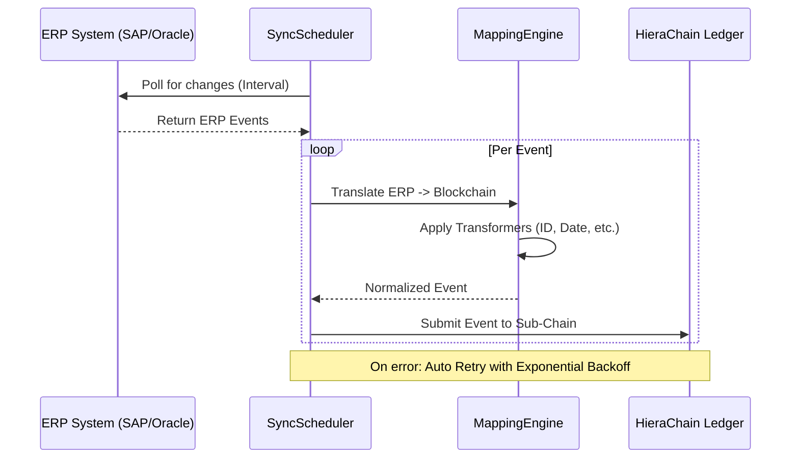

# Integration Module (`hierachain/integration/*`)

## Overview

The **Integration** module is the "doorway" that allows HieraChain to operate as a Plugin Layer for existing enterprise Web2 infrastructure. It provides powerful tools to connect, extract, and standardize data from leading ERP systems (SAP, Oracle, Microsoft Dynamics) into the blockchain ledger with maximum performance.

---

## Core Components

<div class="grid cards" markdown>

*   :material-sync:{ .lg .middle } __ERP Integration Ledger__

    ---

    __File__: `erp_ledger.py`

    * Central coordinator for ERP system integration.
    * **Mapping Engine**: Maps complex data from ERP to Blockchain.
    * **Sync Scheduler**: Schedules automatic synchronization with smart Retry mechanism.

*   :material-factory:{ .lg .middle } __Enterprise Adapters__

    ---

    __File__: `enterprise.py`

    * Standardized connectors for **SAP**, **Oracle**, and **Dynamics**.
    * Supports configuration via environment variables for secure connection details.
    * Handles authentication and connection to enterprise APIs.

*   :material-table-column:{ .lg .middle } __Arrow Client__

    ---

    __File__: `arrow_client.py`

    * Optimizes large-volume data exchange using **Apache Arrow** columnar format.
    * Increases IO speed and reduces memory consumption when processing reports or data extraction.

*   :material-magnify-scan:{ .lg .middle } __Change Detector__

    ---

    __File__: `erp_ledger.py`

    * Automatically detects changes between data states in ERP.
    * Only records meaningful changes (Delta) to the blockchain to optimize storage space.

</div>

---

## Mapping Engine

The Mapping Engine allows defining flexible transformation rules for each data field:

| Transformer | Function | Example Transformation |
| :--- | :--- | :--- |
| `date` | Standardizes time format | `12/04/2024` → `ISO-8601` |
| `amount` | Converts numeric and currency types | `5000` → `5000.0` (Float) |
| `status` | Maps business status | `REQ` → `REQUESTED` |
| `id` | Adds identifier prefix | `123` → `ERP_123` |
| `boolean` | Logic conversion | `1/Yes/On` → `True` |

---

## Synchronization Flow

The system uses `SyncScheduler` to ensure blockchain data is always updated from ERP:



---

## Deployment Example

### 1. Configure SAP Mapping
```python
sap_mapping = {
    "entity_id": "material.document_number",
    "event": {
        "source_path": "material.event_type",
        "transformer": "status",
        "params": {"mapping": {"GR": "GOODS_RECEIPT"}}
    },
    "details.quantity": {
        "source_path": "material.qty",
        "transformer": "amount"
    }
}
```

### 2. Start Automatic Sync
```python
from hierachain.integration.erp_ledger import ERPIntegrationLedger

ledger = ERPIntegrationLedger()
# Start syncing 'SAP_Logistics' profile every 60 seconds
ledger.start_scheduled_sync(
    profile_name="SAP_Logistics",
    interval_seconds=60,
    chain=sub_chain_instance
)
```

---

## Performance and Security

*   **Performance**: Uses `ThreadPoolExecutor` to process multiple ERP profiles simultaneously without congestion.
*   **Security**: ERP credentials and passwords are managed via environment variables (e.g., `HRC_SAP_PASSWORD`), following the principle of not storing secrets in source code.
*   **Resilience**: Retry mechanism with Exponential Backoff helps the system self-recover when the ERP connection is temporarily interrupted.

---

## Related

*   [Hierarchical System](./hierarchical.md)
*   [Core Blockchain Structure](./core.md)
*   [Error Mitigation and Risk Reduction](./error-mitigation.md)
