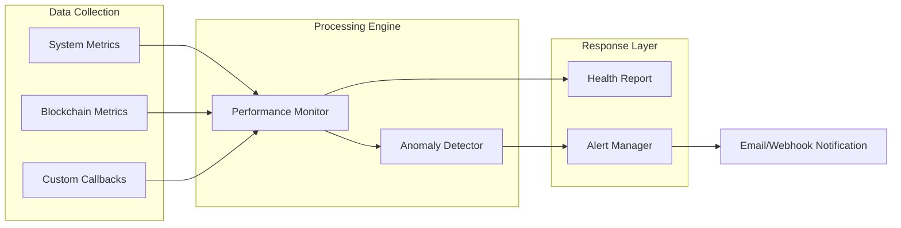

# Monitoring Module (`hierachain/monitoring/*`)

## Overview

The **Monitoring** module provides 360-degree observability for the HieraChain system. It not only tracks traditional infrastructure metrics (CPU, RAM, Disk) but also deeply monitors blockchain-specific indicators such as event throughput, block closing time, and BFT consensus success rate.

---

## Main Components

<div class="grid cards" markdown>

*   :material-monitor-dashboard:{ .lg .middle } __Performance Monitor__

    ---

    __File__: `performance_monitor.py`

    * Collects real-time metrics from the system and HieraChain processes.
    * Supports custom metrics via callback functions.
    * Computes **Health Score** for instant system health assessment.

*   :material-bell-ring:{ .lg .middle } __Alert System__

    ---

    __File__: `alert_system.py`

    * Manages alert lifecycle: from detection, notification to acknowledgment and resolution.
    * Supports multiple notification channels: **Email (SMTP/TLS)** and **Webhooks**.
    * Automatic **Escalation** mechanism when alerts are not handled.

*   :material-graph:{ .lg .middle } __Anomaly Detector__

    ---

    __File__: `alert_system.py`

    * Detects abnormal behavior based on **Z-Score** algorithm.
    * Analyzes historical data in sliding windows to determine standard deviation.
    * Helps early detection of DDoS attacks or bottleneck congestion.

*   :material-chart-bar:{ .lg .middle } __Blockchain Metrics__

    ---

    __File__: `performance_metrics.py`

    * **Throughput**: Number of events processed per second (EPS).
    * **Latency**: Average time for an event to be validated and block-closed.
    * **Consensus Health**: Ratio of successful consensus rounds and convergence time.

</div>

---

## Monitoring and Alert Workflow

The system operates in a continuous loop to ensure high availability:



---

## System Health Score

HieraChain computes an overall health score (0-100) based on weighted alert thresholds:

| Status | Score | Meaning |
| :--- | :--- | :--- |
| **Excellent** | 90 - 100 | System operating perfectly, no alerts. |
| **Good** | 70 - 89 | Stable operation, possibly a few minor alerts. |
| **Poor** | < 70 | Performance noticeably affected, needs review. |
| **Critical** | N/A | At least one metric at **Critical Alert** level. |

---

## Deployment Example

### 1. Start Performance Monitoring
```python
from hierachain.monitoring import PerformanceMonitor

monitor = PerformanceMonitor(config={"collection_interval": 10.0})
monitor.start_monitoring()

# Get instant health report
health_score, status = monitor.get_health_score()
print(f"System Health: {status} ({health_score}/100)")
```

### 2. Define Alert Rules
```python
from hierachain.monitoring.alert_system import AlertRule, AlertSeverity, AlertCategory

rule = AlertRule(
    rule_id="TPS_DROP",
    name="Sharp throughput drop",
    description="Event throughput dropped below minimum threshold",
    category=AlertCategory.PERFORMANCE,
    metric_name="event_throughput",
    condition="less_than",
    threshold=10.0,
    severity=AlertSeverity.CRITICAL,
    escalation_time=600  # Escalate after 10 minutes if not handled
)
alert_manager.add_alert_rule(rule)
```

---

## Notifications and Escalation

When an alert is created but not **Acknowledged** within the specified time:

1.  The system automatically increases the severity level (e.g., from WARNING to CRITICAL).
2.  Sends additional notifications to emergency recipient lists via Email/Webhook.
3.  Records detailed logs in the Audit system for post-incident investigation.

---

## Related

*   [Risk Management](./risk-management.md)
*   [Security and Resource Guard](./security.md)
*   [System Configuration](./config.md)
