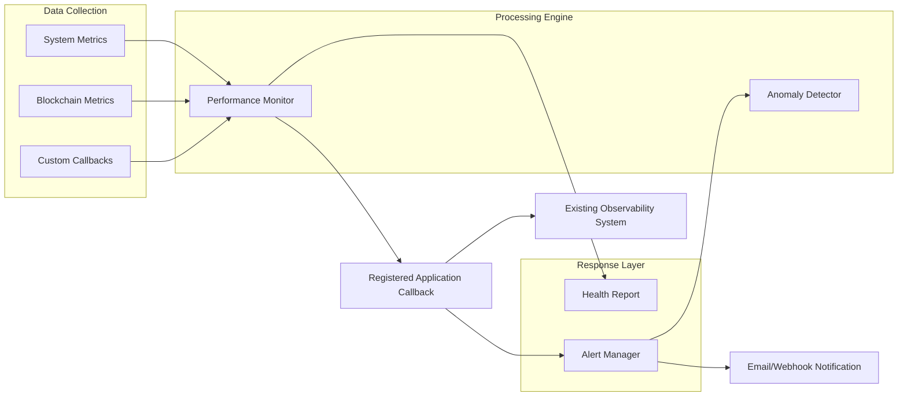

# Monitoring Module (`hierachain/monitoring/*`)

## Overview

The **Monitoring** module tracks infrastructure metrics such as CPU, RAM, and disk use. It also records HieraChain metrics, including event throughput, block closing time, and BFT consensus success rate.

The module is opt-in. Importing `PerformanceMonitor` loads metric collection independently of alerting; importing `AlertManager` loads the alert engine independently of metric collection. The host application starts and stops monitoring explicitly, records ledger activity through the `record_*` methods, and can register `add_alert_handler()` callbacks for its existing observability system. Collection, threshold checks and reports belong to `PerformanceMonitor`; rules, alert state and delivery belong to `AlertManager`.

---

## Main Components

<div class="grid cards" markdown>

*   :material-monitor-dashboard:{ .lg .middle } __Performance Monitor__

    ---

    __File__: `performance_monitor.py`

    * Collects real-time metrics from the system and HieraChain processes.
    * Supports custom metrics via callback functions.
    * Computes **Health Score** for instant system health assessment.

*   :material-bell-ring:{ .lg .middle } __Alert System__

    ---

    __File__: `alert_system.py`

    * Manages alert lifecycle: from detection, notification to acknowledgment and resolution.
    * Supports multiple notification channels: **Email (SMTP/TLS)** and **Webhooks**.
    * Automatic **Escalation** mechanism when alerts are not handled.

*   :material-graph:{ .lg .middle } __Anomaly Detector__

    ---

    __File__: `alert_system.py`

    * Detects abnormal behavior based on **Z-Score** algorithm.
    * Analyzes historical data in sliding windows to determine standard deviation.
    * Identifies statistical outliers in metric values.

</div>

---

## Monitoring and Alert Workflow

Calling `start_monitoring()` starts the collection loop. Alert callbacks run only when registered and `enable_alerts` is enabled. The host application feeds the optional alert engine through `check_metric()`, `create_alert()` or `send_alert()`.


```mermaid
graph LR
    subgraph "Data Collection"
        A[System Metrics]
        B[Blockchain Metrics]
        C[Custom Callbacks]
    end

    subgraph "Processing Engine"
        D[Performance Monitor]
        E[Anomaly Detector]
    end

    subgraph "Response Layer"
        F[Health Report]
        G[Alert Manager]
    end

    A & B & C --> D
    D --> F
    D --> K[Registered Application Callback]
    K --> J[Existing Observability System]
    K --> G
    G --> E
    G --> H[Email/Webhook Notification]
```

---

## System Health Score

The monitor averages scores for metrics with data: normal = 100, warning = 50, critical = 0. Metrics without data are excluded:

| Status | Score | Meaning |
| :--- | :--- | :--- |
| `excellent` | 100 | All metrics with data are normal. |
| `warning` | 50 to below 100 | At least one warning; no critical metrics. |
| `critical` | 0 to below 100 | At least one critical metric. |
| `no_data` | 0 | No metrics have data. |

---

## Deployment Example

### 1. Start Performance Monitoring
```python
from hierachain.monitoring import PerformanceMonitor

monitor = PerformanceMonitor(config={"collection_interval": 10.0})
try:
    monitor.start_monitoring()
    health_score, status = monitor.get_health_score()
    print(f"System Health: {status} ({health_score}/100)")
finally:
    monitor.stop_monitoring()
```

### 2. Define Alert Rules
```python
from hierachain.monitoring import AlertManager
from hierachain.monitoring.alert_system import AlertRule, AlertSeverity, AlertCategory

alert_manager = AlertManager()
rule = AlertRule(
    rule_id="TPS_DROP",
    name="Sharp throughput drop",
    description="Event throughput dropped below minimum threshold",
    category=AlertCategory.PERFORMANCE,
    metric_name="event_throughput",
    condition="less_than",
    threshold=10.0,
    severity=AlertSeverity.CRITICAL,
    escalation_time=600  # Escalate after 10 minutes if not handled
)
alert_manager.add_alert_rule(rule)
```

The host application supplies metric values to `alert_manager.check_metric("event_throughput", value)`. The two components are not connected automatically. With `enable_alerts=False`, the monitor continues collecting metrics and generating reports without invoking alert callbacks.

---

## Notifications and Escalation

When an alert is created but not **Acknowledged** within the specified time:

1.  The escalation counter increases and a critical notification is created.
2.  Configured Email/Webhook notifiers receive that notification.
3.  The escalation is logged. Acknowledging or resolving the original alert cancels its pending escalation timer.

---

## Related

*   [Risk Management](./risk-management.md)
*   [Security and Resource Guard](./security.md)
*   [System Configuration](./config.md)

For the default PerformanceMonitor metric, consensus success rate is healthy above 95%, warning at or below 95%, and critical at or below 90%. Critical metric alerts replace active lower-severity alerts. Notification delivery uses one worker and a queue of at most 128 alerts; a full queue records a failed notification while preserving alert history. SMTP and webhook requests use a 10-second timeout. Call `AlertManager.close()` to stop accepting notifications and wait for queued delivery up to its timeout; abrupt process exit can lose queued notifications.
