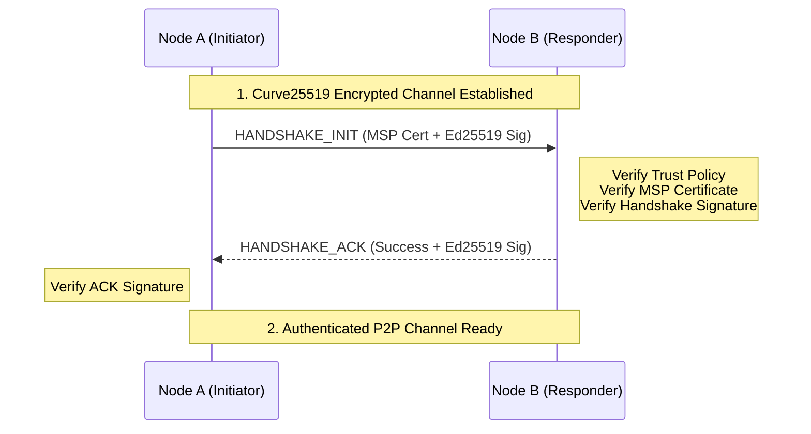

# Network Module (`hierachain/network/*`)

## Overview

The **Network** module handles communication between HieraChain nodes over **ZeroMQ**. It uses cryptographic checks to encrypt and authenticate network messages.

---

## Layered Security Architecture

HieraChain uses three independent security layers for network communication:

<div class="grid cards" markdown>

*   :material-lock-check:{ .lg .middle } __Layer 1: CurveZMQ (Transport)__

    ---

    __Technology__: Curve25519

    * Encrypts the entire transmission path between ZeroMQ Sockets.
    * Ensures privacy and prevents eavesdropping on Web2 networks.
    * Uses ephemeral keys to guarantee Forward Secrecy.

*   :material-account-check:{ .lg .middle } __Layer 2: MSP Handshake (Identity)__

    ---

    __Technology__: Ed25519 + Certificates

    * Authenticates node identity through MSP (Membership Service Provider) certificates.
    * Only allows nodes from valid organizations to join the network.
    * 2-step Handshake process: `INIT` and `ACK`.

*   :material-shield-sync:{ .lg .middle } __Layer 3: Integrity & Replay Protection__

    ---

    __Technology__: Ed25519 + Nonce + Timestamp

    * Every P2P message is digitally signed.
    * Prevents replay attacks by checking unique Nonce and Timestamp within the allowed window (60s).

</div>

---

## Core Components

### 1. ZMQ Transport (`zmq_transport.py`)
Implements the asynchronous P2P model using **ROUTER** (for receiving) and **DEALER** (for sending) sockets.

*   **Transport**: Uses asynchronous sockets; broadcasts send to registered peers sequentially.
*   **Identity Management**: Manages node identities at the socket level for accurate routing.
*   **Replay buffer**: Retains at most 1,000 timestamp/nonce pairs with nonce strings of at most 128 characters. When all entries are still within the 60-second window, new messages are rejected until an entry expires.

`NetworkClient` tracks seed and manually registered peers in the same registry. Removing a peer also closes its outbound DEALER socket. A peer is initially healthy for 60 seconds after registration; each accepted inbound message from its registered socket identity renews that period. An idle peer becomes unhealthy when status or peers are read. This health indicator does not authenticate the peer or confirm delivery of outbound messages.

### 2. Secure Connection Manager (`secure_connection.py`)
Orchestrates the secure connection establishment process:

1.  Establish a Curve25519 encrypted channel.
2.  Perform Handshake to exchange and verify MSP certificates.
3.  Manage the list of authenticated peers (`authenticated_peers`).

### 3. Peer Trust Manager (`peer_trust_manager.py`)
Manages the trust level of neighboring nodes:

*   **Policy Enforcement**: Applies `strict` (allowlist only) or `discovery` (auto-discovery) policies.
*   **Reputation**: Marks and disconnects peers with malicious behavior (wrong signatures, spam messages).

---

## Secure Handshake Process



---

## Usage Examples

### 1. Initialize a Secure Node
```python
from hierachain.network.secure_connection import SecureConnectionManager

# Initialize manager with MSP integration
secure_node = SecureConnectionManager(
    node_id="node_001",
    port=5001,
    msp=msp_instance,
    identity_mgr=identity_instance
)

await secure_node.start()
```

### 2. Send a Signed Message
```python
# Automatically signs and sends over the encrypted channel
payload = {"event": "block_proposal", "data": {...}}
await secure_node.send_secure("peer_002", payload)
```

---

## P2P Configuration (Environment Variables)

| Environment Variable | Function | Recommended Value (Prod) |
| :--- | :--- | :--- |
| `HRC_P2P_TRUST_POLICY` | Trust policy | `strict` |
| `HRC_P2P_REQUIRE_SIGNATURES` | Require Ed25519 signatures | `true` |
| `HRC_P2P_PEER_ALLOWLIST` | Trusted Peer ID list | (Specific ID list) |

---

## Related

*   [Security and MSP](./security.md)
*   [BFT Consensus](../consensus/bft_consensus.md)
*   [Network Monitoring](./monitoring.md)
