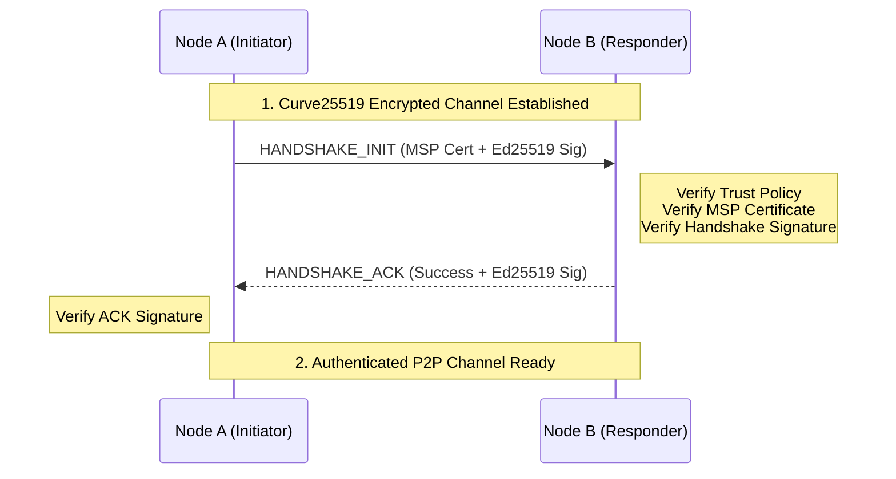

# Network Module (`hierachain/network/*`)

## Overview

The **Network** module handles communication between HieraChain nodes over **ZeroMQ**. `SecureConnectionManager` provides optional CurveZMQ transport encryption, an MSP handshake, and message-signature checks. The API server's `NetworkClient` creates `ZmqNode` directly, so that path does not automatically run the manager's handshake or signature checks.

---

## Layered Security Architecture

`SecureConnectionManager` provides these security components when an application uses it; they are not automatically active on every `NetworkClient` connection:

<div class="grid cards" markdown>

*   :material-lock-check:{ .lg .middle } __Layer 1: CurveZMQ (Transport)__

    ---

    __Technology__: Curve25519

    * Encrypts the transmission between ZeroMQ sockets when configured with local transport keys and peer public keys.
    * Ensures privacy and prevents eavesdropping on Web2 networks.
    * `SecureConnectionManager` generates a CurveZMQ keypair for its transport; the API server's separate `NetworkClient` uses the transport keys configured for its `ZmqNode`.

*   :material-account-check:{ .lg .middle } __Layer 2: MSP Handshake (Identity)__

    ---

    __Technology__: Ed25519 + Certificates

    * Authenticates node identity through MSP (Membership Service Provider) certificates when the handshake is run.
    * Only allows nodes from valid organizations to join the network.
    * 2-step Handshake process: `INIT` and `ACK`.
    * Binds the active certificate subject and signing key to the ZeroMQ routing ID
      and registered organization identity.

*   :material-shield-sync:{ .lg .middle } __Layer 3: Integrity & Replay Protection__

    ---

    __Technology__: Ed25519 + Nonce + Timestamp

    * Data-message signature checks are controlled by `require_signatures`; they default to `False` in base, development, and test settings, and `True` in `ProductionSettings`.
    * Prevents replay attacks by checking unique Nonce and Timestamp within the allowed window (60s).
    * Handshake messages have separate signature checks and carry signed `timestamp` and `nonce` fields accepted by the transport replay gate.

</div>

---

## Core Components

### 1. ZMQ Transport (`zmq_transport.py`)
Implements the asynchronous P2P model using **ROUTER** (for receiving) and **DEALER** (for sending) sockets.

*   **Transport**: Uses asynchronous sockets; broadcasts send to registered peers sequentially.
*   **Identity Management**: Manages node identities at the socket level for accurate routing.
*   **Replay buffer**: Retains at most 1,000 timestamp/nonce pairs with nonce strings of at most 128 characters. When all entries are still within the 60-second window, new messages are rejected until an entry expires.

`NetworkClient` tracks seed and manually registered peers in the same registry. Removing a peer also closes its outbound DEALER socket. A peer is initially healthy for 60 seconds after registration; each accepted inbound message from its registered socket identity renews that period. An idle peer becomes unhealthy when status or peers are read. This health indicator does not authenticate the peer or confirm delivery of outbound messages.

### 2. Secure Connection Manager (`secure_connection.py`)
Orchestrates the secure connection establishment process:

1.  Establish a Curve25519 encrypted channel.
2.  Perform Handshake to exchange and verify MSP certificates.
3.  Manage the list of authenticated peers (`authenticated_peers`).

The API server's `NetworkClient` does not currently wire this manager into its `ZmqNode` transport.

### 3. Peer Trust Manager (`peer_trust_manager.py`)
Manages the trust level of neighboring nodes:

*   **Policy Enforcement**: Supports `open` and `strict`. `open` trusts peers unless they are blocklisted; `strict` requires an allowlisted peer.
*   **Peer lists**: Allowlist and blocklist entries are managed explicitly; the manager does not assign reputation scores or automatically disconnect peers for spam.
*   **Signed messages**: Invalid data-message signatures are dropped by `SecureConnectionManager` when signature checks are enabled.

---

## Secure Handshake Process



The responder echoes the `HANDSHAKE_INIT` nonce in the signed ACK. The initiator
accepts an ACK only while a matching outbound handshake is pending, the peer
passes the configured trust policy, and the ACK certificate is active and bound
to that peer's routing ID and signing key. A missing or mismatched CA
certificate, identity record, organization, or key is rejected.

---

## Usage Examples

### 1. Initialize a Secure Node
```python
from hierachain.network.secure_connection import SecureConnectionManager

# Initialize manager with MSP integration
secure_node = SecureConnectionManager(
    node_id="node_001",
    port=5001,
    msp=msp_instance,
    identity_mgr=identity_instance
)

async def start_configured_node() -> None:
    await secure_node.start()
```

### 2. Send a Signed Message
```python
# Automatically signs and sends over the encrypted channel
async def send_proposal() -> bool:
    payload = {"event": "block_proposal", "data": {"block_index": 1}}
    return await secure_node.send_secure("peer_002", payload)
```

---

## P2P Configuration (Environment Variables)

| Environment Variable | Function | Recommended Value (Prod) |
| :--- | :--- | :--- |
| `HRC_P2P_TRUST_POLICY` | Trust policy | `strict` |
| `HRC_P2P_REQUIRE_SIGNATURES` | Require Ed25519 signatures | `true` |
| `HRC_P2P_PEER_ALLOWLIST` | Trusted Peer ID list | (Specific ID list) |

---

## Related

*   [Security and MSP](./security.md)
*   [BFT Consensus](../consensus/bft_consensus.md)
*   [Network Monitoring](./monitoring.md)

ZeroMQ accepts frames up to 1 MiB and exactly two application frames (sender identity and body); excess frames are drained without accumulating a Python multipart list. Secure connections validate identities and signatures before retaining replay entries, with a separate 1,000-entry cache per verified peer. Plain transport requires configured peer IDs and isolates their caches; it provides no cryptographic identity guarantee. These limits do not replace upstream connection and bandwidth controls.
