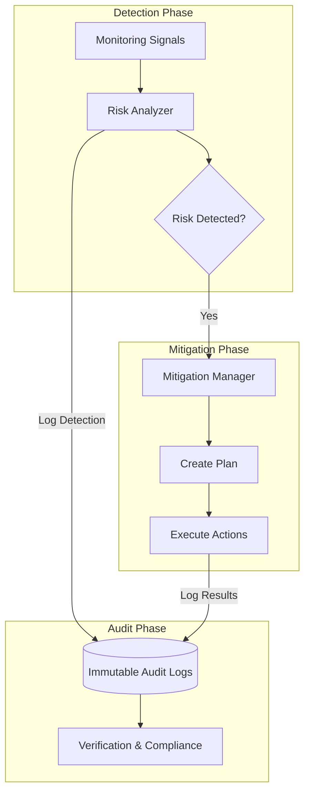

# Risk Management Module (`hierachain/risk_management/*`)

## Overview

The **Risk Management** module is HieraChain's security and operations control center. It not only monitors abnormal signs but also proactively proposes mitigation strategies and records immutable audit logs to ensure maximum transparency and compliance for the enterprise.

---

## Centralized Risk Governance Architecture

The system operates through the close coordination of three core components:

<div class="grid cards" markdown>

*   :material-magnify-scan:{ .lg .middle } __Risk Analyzer__

    ---

    __File__: `risk_analyzer.py`

    * Multi-domain risk analysis: Consensus, Security, Performance, and Storage.
    * Risk assessment based on **Severity** and **Likelihood**.
    * Automatically proposes mitigation recommendations.

*   :material-shield-airplane:{ .lg .middle } __Mitigation Manager__

    ---

    __File__: `mitigation_strategies.py`

    * Creates mitigation plans based on detected risks.
    * Executes automatic remediation actions (Scale-out, Renew Certs, Backup, etc.).
    * Manages priority and dependencies between actions.

*   :material-file-lock:{ .lg .middle } __Audit Logger__

    ---

    __File__: `audit_logger.py`

    * Records the entire risk lifecycle in **JSONL** format.
    * Ensures data integrity using **SHA-256** hashing.
    * Supports querying and creating reports for compliance auditing.

</div>

---

## Risk Lifecycle



---

## Risk Classification and Alert Thresholds

HieraChain defines strict thresholds to trigger analysis:

| Domain | Check Indicator | Risk Threshold |
| :--- | :--- | :--- |
| **Consensus** | BFT Node Count | `< 3f + 1` (Critical) |
| **Security** | Certificate (MSP) Expiry | `< 30 days` (High) |
| **Performance** | CPU/RAM Usage | `> 85%` (High) |
| **Storage** | Last Backup Time | `> 24 hours` (High) |

---

## Deployment Example

### 1. Perform Comprehensive Risk Analysis
```python
from hierachain.risk_management import RiskAnalyzer

analyzer = RiskAnalyzer()
# Collect system data
system_snapshot = get_system_snapshot() 
risks = analyzer.perform_comprehensive_analysis(system_snapshot)

if risks['security']:
    print(f"Detected {len(risks['security'])} security risks!")
```

### 2. Activate Automatic Mitigation Plan
```python
from hierachain.risk_management.mitigation_strategies import MitigationManager

mitigation_mgr = MitigationManager()
# Create plan based on risk list
plan = mitigation_mgr.create_mitigation_plan(risks['performance'])

# Execute asynchronously to not affect main flow
results = mitigation_mgr.execute_mitigation_plan(plan, async_execution=True)
```

---

## Audit Logging and Integrity

Every event in the module is stored with a unique Correlation ID and protected against tampering:

*   **Hashing**: Each audit record contains a SHA-256 hash of its content, enabling detection of log tampering.
*   **Rotation**: Automatic log rotation (100MB) and compression of old data for storage optimization.
*   **Retention**: Logs are stored by default for 90 days (configurable).

---

## Related

*   [Performance Monitoring](./monitoring.md)
*   [Security and Identity](./security.md)
*   [System Error Mitigation](./error-mitigation.md)
