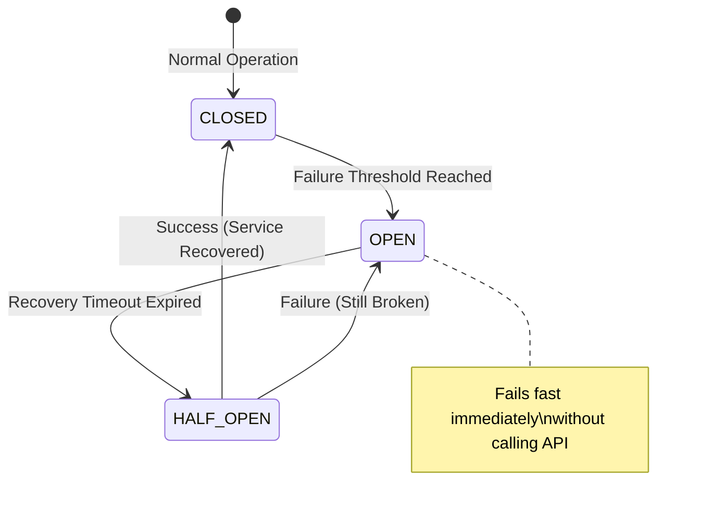

# SDK Module (`hierachain/sdk/*`)

## Overview

The **SDK** module provides a Python Software Development Kit that enables external applications to interact with HieraChain safely and reliably. Unlike calling REST APIs directly, the SDK includes built-in resiliency patterns to ensure applications do not hang when the network encounters issues or a node is in maintenance/lockdown mode.

---

## Key Features

<div class="grid cards" markdown>

*   :material-sync:{ .lg .middle } __Dual Interface (Sync/Async)__

    ---

    * **Sync Client**: Uses `requests`, suitable for simple scripts, sequential processing workers.
    * **Async Client**: Uses `aiohttp`, optimized for high-concurrency web applications (like FastAPI).

*   :material-refresh-circle:{ .lg .middle } __Smart & Flexible__

    ---

    * **Exponential Backoff**: Automatically retries with increasing intervals on temporary network errors.
    * **Circuit Breaker**: Automatically "breaks the circuit" to avoid overloading the system when the service is failing.

*   :material-shield-lock:{ .lg .middle } __System State Awareness__

    ---

    * **Lockdown Awareness**: Automatically detects and handles errors when the Node is in lockdown mode (`X-Lockdown-Mode`).
    * **Connection Pooling**: Optimizes HTTP connection reuse to reduce latency.

*   :material-magnify-expand:{ .lg .middle } __Advanced Queries__

    ---

    * **Entity Tracing**: Trace entity lifecycle across Sub-Chains.
    * **CID Resolution**: Automatically decrypts data from IPFS when querying blocks.

</div>

---

## Resiliency Architecture

The SDK uses a State Machine model to manage connections:



---

## Usage Guide

### 1. Configure Client
```python
from hierachain.sdk import HieraChainClientConfig, HieraChainClient

config = HieraChainClientConfig(
    base_url="https://api.hierachain.com",
    api_key="your_secret_key",
    max_retries=3,
    circuit_failure_threshold=5
)
```

### 2. Use Synchronous Client (For Scripts/CLI)
```python
with HieraChainClient(config) as client:
    # Write event to supply chain
    result = client.submit_event(
        chain_name="supply_chain",
        event_data={
            "entity_id": "PRODUCT-123",
            "event": "quality_check",
            "details": {"status": "passed", "inspector": "QA-01"}
        }
    )
    print(f"Event ID: {result.event_id}")
```

### 3. Use Asynchronous Client (For Web/High-load)
```python
from hierachain.sdk import HieraChainAsyncClient

async def track_product():
    async with HieraChainAsyncClient(config) as client:
        # Trace entity across chains
        trace = await client.trace_entity("PRODUCT-123")
        for event in trace.events:
            print(f"Timestamp: {event['timestamp']} - Action: {event['event']}")
```

---

## Exception Handling

The SDK defines specific exception classes for applications to handle with distinct logic:

| Exception | Cause | Handling Suggestion |
| :--- | :--- | :--- |
| `CircuitOpenError` | System is continuously failing, SDK paused sending requests. | Wait some time before retrying. |
| `LockdownError` | Target node is in security lockdown mode. | Check administrator notifications. |
| `ServiceUnavailableError` | Server overloaded (503). | SDK will automatically retry with backoff. |
| `HieraChainAPIError` | Logic error from the API or invalid data. | Review payload and access permissions. |

---

## Related

*   [API v1/v3 Documentation](../reference/api-v1.md)
*   [Security System](./security.md)
*   [Risk Management](./risk-management.md)
