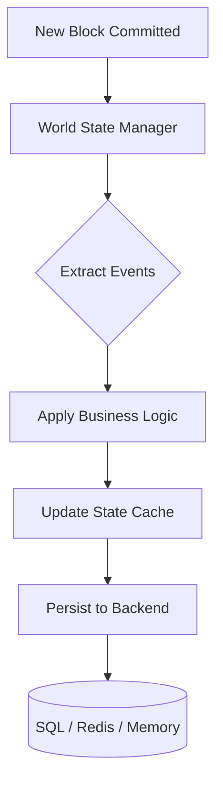

# Storage Module (`hierachain/storage/*`)

## Overview

The **Storage** module is responsible for managing all HieraChain data, from block and event history to the current state of business entities (**World State**). The system is designed with a pluggable architecture, allowing flexible switching of storage backends based on enterprise performance and scale requirements.

---

## Multi-tier Storage Architecture

HieraChain divides storage into two main layers to optimize between persistence and query speed:

*   :material-state-machine:{ .lg .middle } __World State Layer__

    ---

    __File__: `world_state.py`

    * Stores the current value of entities (e.g., the status of a shipment).
    * Updates in real time from new blocks through event processing mechanisms (`creation`, `update`, `status_change`).
    * Supports **Caching** and **Indexing** for instant query responses.

*   :material-database-sync:{ .lg .middle } __Persistence Layer (Adapters)__

    ---

    __File__: `storage/sql_backend.py`, `adapters/database/*`, `adapters/storage/*`

    * **SQL Backend**: Durable storage for blocks and events (SQLite via `sqlite_adapter.py`).
    * **Redis Adapter**: Optimized for entity indexing.
    * **File Adapter**: Parquet file storage for large data.

*   :material-cloud-sync:{ .lg .middle } __Off-chain Storage (IPFS)__

    ---

    __File__: `api/storage/ipfs_client.py`

    * Stores large data (such as attached documents, complex event details).
    * Only stores the hash (CID) on the blockchain to save space and optimize performance.
    * Integrates **AES-256-GCM** encryption before upload.

---

## State Update Processing Flow

---

## Core Data Models (`models.py`)

HieraChain uses SQLAlchemy to define durable data structures:

*   **BlockModel**: Stores block index, hash, previous_hash, and metadata.
*   **EventModel**: Stores event details, linked to block hash and entity ID.
*   **ChainStateModel**: Stores Key-Value pairs representing chain state.

---

## Backend Configuration (Environment Variables)

| Environment Variable | Meaning | Available Values |
| :--- | :--- | :--- |
| `HRC_STORAGE_BACKEND` | Storage backend type | `sqlite`, `redis`, `memory`, `file` |
| `DATABASE_URL` | DB connection string | `sqlite:///hierachain.db`, `postgresql://...` |
| `LOG_SQL_DETAIL` | Log detailed SQL | `true`, `false` (Recommended `false` for Prod) |

---

## Advanced Features

### 1. Integrity and Idempotency
`SqlStorageBackend` is designed to safely handle duplicate requests (Idempotency) through unique constraint checking, ensuring the system remains stable even when network issues cause block re-submission.

### 2. Indexing Queries
Every entity in World State is automatically indexed by `entity_id` and `timestamp`. When using the Redis Adapter, these indexes are stored as **Sorted Sets**, enabling extremely fast queries of an entity's change history.

---

## Related

*   [Core Module (Block & Blockchain)](./core.md)
*   [ERP Integration](./integration.md)
*   [Performance Monitoring](./monitoring.md)
