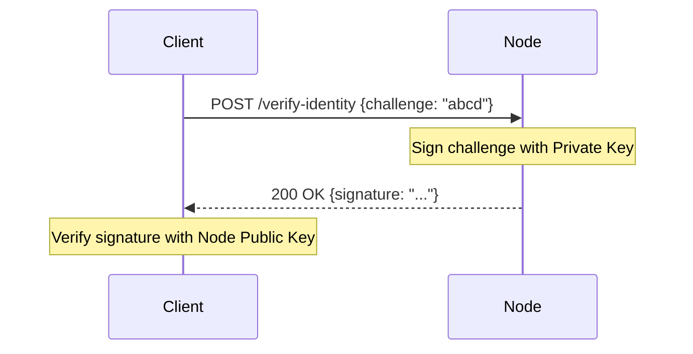

# API Admin

## Purpose

Describes the REST endpoints in API Admin (System & Admin) used for system administration tasks: node identity verification, health status checks (uptime, version, active chains).

## Endpoint Overview

* POST `/api/admin/verify-identity` — Verify node identity by signing a challenge string. (Requires authentication)
* GET `/api/admin/status` — Get a detailed report on node status. (Requires API Key if `AUTH_ENABLED=true`)

## Main Schemas (from `hierachain/api/admin/schemas.py`)

* `VerifyIdentityRequest`

    * `challenge: str` (Challenge string to sign, hex encoded)

* `VerifyIdentityResponse`

    * `status: str` ("success")
    * `node_id: str` (Node identifier)
    * `signature: str` (Digital signature of the challenge)
    * `challenge: str` (Original challenge received)

* `NodeStatusResponse`

    * `status: str` ("active")
    * `version: str` (Ledger version)
    * `chains_active: int` (Number of active sub-chains)
    * `license_active: bool` (License status)
    * `uptime: str` (System uptime)

## Usage Examples

Assuming the server is running at `http://localhost:2661`:

### Verify Identity

This endpoint is typically used by management tools to confirm that a node is a valid member of the network.



**Request:**

```bash
curl -X POST http://localhost:2661/api/admin/verify-identity \
  -H "Content-Type: application/json" \
  -d '{
        "challenge": "abcd1234"
      }'
```

**Response (200 OK):**

```json
{
  "status": "success",
  "node_id": "node_1",
  "signature": "3045022100...", 
  "challenge": "abcd1234"
}
```

*(Note: `signature` will be the actual hex string signed by the node's private key)*

### Node Status

Get an overview of node health and status.

**Request:**

```bash
curl -s http://localhost:2661/api/admin/status
```

**Response (200 OK):**

```json
{
  "status": "active",
  "version": "0.1.0",
  "chains_active": 5,
  "license_active": true,
  "uptime": "1d 2h 30m"
}
```

## Status Codes & Common Errors

* 200 OK — Success.
* 500 Internal Server Error — Identity verification error (e.g., crypto error during signing) or internal error when computing status.

## Implementation Notes (abbreviated from `endpoints.py`)

* **Identity Provider**: Uses `LocalKeyProvider` to load identity from file (path in settings) or generate temporary keys if file does not exist.
* **Hierarchy Manager**: Injected into `get_status` to count active chains and compute uptime.

## Related

* Config: [Config](config.md) (See `VALIDATOR_IDENTITY_PATH` configuration)
* Security: [Security](../modules/security.md) (About Key Provider and Identity)
