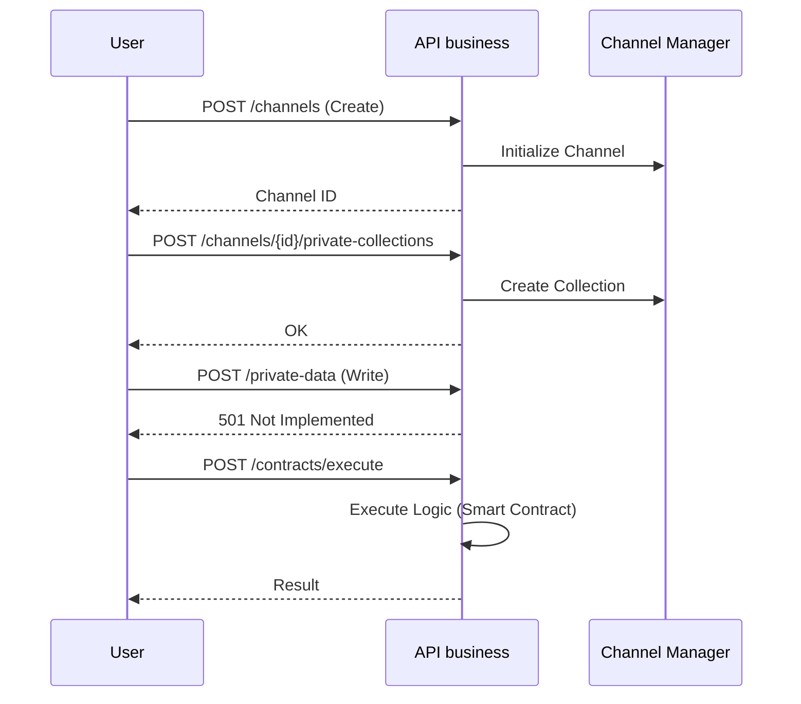

# API Business

API Business extends capabilities for working with channels, private data collections, domain contracts, and organizations. The private-data write route is currently unsupported because no private-data store is connected.

## Source Code Components

* Router/Endpoints: `hierachain/api/business/router.py`
* (Optional) Schemas: `hierachain/api/business/schemas.py`
* Server integration: `hierachain/api/server.py` (registers Business router)

## Main Endpoints (from code and tests)



* `GET  /api/business/health`: service health check.
* `POST /api/business/channels`: create a channel. Requires `chains` and `channels:manage` API key permissions.
* `GET  /api/business/channels/{channel_id}`: get channel info.
* `POST /api/business/channels/{channel_id}/private-collections`: create a private data collection.
* `POST /api/business/private-data`: currently returns HTTP 501 for an existing collection. It does not persist inline `value` or `value_cid` data.

* `ContractCreateRequest`

    * `contract_id: str` (Unique identifier)
    * `version: str` (Semantic version, e.g., "1.0.0")
    * `implementation: str | None` (Raw Python code)
    * `implementation_cid: str | None` (IPFS reference)
    * `implementation_nonce: str | None`
    * `metadata: dict[str, Any]` (Domain, Owner, Endorsement Policy)
    
* `POST /api/business/contracts`: Register a contract (Supports raw `implementation` or `implementation_cid` IPFS reference).
* `POST /api/business/contracts/execute`: execute a contract.
* `POST /api/business/organizations`: register an organization. Requires `chains` and `organizations:manage`; the verified API key user becomes its first administrator.
* `POST /api/business/organizations/{org_id}/members`: an organization administrator registers a member with role `admin` or `member`. The member ID must match that member's API key user ID.

Additional note: some test/instrumentation scenarios in `tests/integration/api_business/test_api_business.py` and `scripts/security/*` use the above endpoints for security testing and behavior verification.

## Provisioning and permissions

Provisioning requires API key authentication to be enabled. A trusted operator assigns `organizations:manage` and `channels:manage` scopes when provisioning API keys; these routes do not issue keys. Organization creation also requires `chains`, and the key's verified user ID becomes the first organization administrator. Member registration requires `chains` and an existing organization administrator. Channel creation requires `chains` and `channels:manage`. Event submission uses the authenticated API key user ID and channel role policy.

The organization, member, and channel registry is saved and restored through configured SQLite or PostgreSQL storage. `HierarchyManager` rejects Redis ledger storage at startup because the Redis adapter lacks durable signed-block persistence. The in-memory backend is process-local. Private-data values are not stored: the write route returns HTTP 501 before processing an inline value or IPFS reference. `ca_config` is retained as API-process metadata and is not used to verify member certificates. Direct Python channel and private-collection methods accept organization IDs as endorsements and require a trusted caller; they do not verify endorsement signatures.

```bash
ORG_PROVISIONER_KEY=replace-me
ORG_ADMIN_KEY=replace-me
CHANNEL_PROVISIONER_KEY=replace-me

curl -s -X POST http://localhost:2661/api/business/organizations \\
  -H 'X-API-Key: '"$ORG_PROVISIONER_KEY" \\
  -H 'Content-Type: application/json' \\
  -d '{"org_id": "orgA", "ca_config": {}}'

curl -s -X POST http://localhost:2661/api/business/organizations/orgA/members \\
  -H 'X-API-Key: '"$ORG_ADMIN_KEY" \\
  -H 'Content-Type: application/json' \\
  -d '{"member_id": "userB", "role": "member"}'

curl -s -X POST http://localhost:2661/api/business/channels \\
  -H 'X-API-Key: '"$CHANNEL_PROVISIONER_KEY" \\
  -H 'Content-Type: application/json' \\
  -d '{"channel_id": "test_channel", "organizations": ["orgA"], "policy": {"read": "MEMBER", "write": "ADMIN", "endorsement": "MAJORITY"}}'
```

Event submissions also require the `events` API key permission.

## Curl Examples

```bash
# Health
curl -s http://localhost:2661/api/business/health

# Create channel
curl -s -X POST http://localhost:2661/api/business/channels \
  -H 'Content-Type: application/json' \
  -d '{"channel_id": "test_channel", "organizations": ["orgA"], "policy": {"read": "MEMBER", "write": "ADMIN", "endorsement": "MAJORITY"}}'

# Create private collection for channel
curl -s -X POST \
  http://localhost:2661/api/business/channels/test_channel/private-collections \
  -H 'Content-Type: application/json' \
  -d '{"name": "sensitive_docs", "members": ["orgA"], "config": {"block_to_purge": 1000, "endorsement_policy": "MAJORITY"}}'

# Private-data writes currently return HTTP 501 Not Implemented.

# Register & execute domain contract
curl -s -X POST http://localhost:2661/api/business/contracts \
  -H 'Content-Type: application/json' \
  -d '{
        "contract_id": "quality_control", 
        "version": "1.0.0",
        "implementation": "def logic()...",
        "metadata": {"domain": "mfg"}
      }'

curl -s -X POST http://localhost:2661/api/business/contracts/execute \
  -H 'Content-Type: application/json' \
  -d '{
        "contract_id": "quality_control", 
        "event": {"entity_id": "PROD-001", "event": "check", "details": {}},
        "context": {"chain": "sub_chain_1"}
      }'

# Organization
curl -s -X POST http://localhost:2661/api/business/organizations -H 'Content-Type: application/json' -d '{"org_id": "orgA", "ca_config": {}}'
```

If API key authentication is enabled (production), add the header per `settings.API_KEY_NAME` (default `X-API-Key`).

## Security & Configuration

* API key authentication via `security/verify/api_key_verifier.py` (when `AUTH_ENABLED=true`).
* Policy/Identity/Key/Cert: see Security and Modules/Security pages.
* Host/port configuration and security in `hierachain/config/settings.py`.

## Related

* API Ledger: [API Ledger](api-ledger.md)
* Security Architecture: [Security (in-depth)](../architecture/security.md)
* Modules: [API](../modules/api.md)

Registered contracts return HTTP 501 from `/api/business/contracts/execute` because an execution engine is not implemented; unknown contracts return HTTP 404. Registration stores implementation metadata and does not imply execution support.
