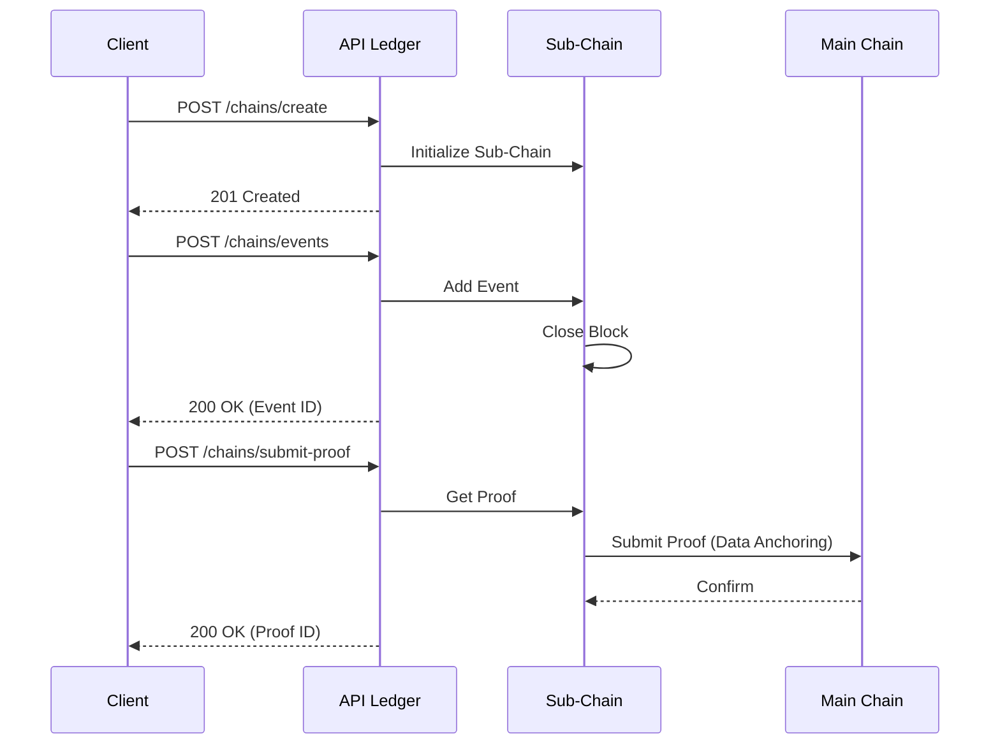

# API Ledger

## Purpose

Describes the REST endpoints in API Ledger used to interact with HieraChain: chain management, event recording, proof submission, entity tracing, statistics, and block retrieval.

#### Appendix: Event Submission with IPFS Example

When enterprises need to store large files (PDF contracts, product images) without bloating the blockchain:

1. **Step 1**: Upload the file to IPFS and get a `CID`.
2. **Step 2**: Submit the event to HieraChain with `details_cid`.

```bash
curl -X POST "http://localhost:2661/api/ledger/chains/supply_chain/events" \
     -H "Content-Type: application/json" \
     -H "X-API-Key: your_api_key" \
     -d '{
       "entity_id": "CONTRACT-2024-001",
       "event": "contract_signed",
       "details_cid": "QmXoypizjW3WknFiJnKLwHCnL72vedxjQkDDP1mXWo6uco",
       "details_nonce": "98765"
     }'
```

This data will be integrity-guaranteed by HieraChain through hash chaining, while the actual content is securely stored on the IPFS network.

## Endpoint Overview



* GET `/api/ledger/health` — Health check.
* GET `/api/ledger/chains` — List Main Chain and all Sub-Chains.
* POST `/api/ledger/chains/{chain_name}/create` — Create a new Sub-Chain (auto-creates Main Chain if not exists).
* POST `/api/ledger/chains/{chain_name}/events` — Add an event to a Sub-Chain.
* POST `/api/ledger/chains/{chain_name}/submit-proof` — Submit proof from Sub-Chain to Main Chain.
* GET `/api/ledger/chains/{chain_name}/stats` — Get chain statistics.
* GET `/api/ledger/chains/{chain_name}/blocks?limit=10&offset=0&resolve_cid=false` — Get block list (paginated). If `resolve_cid=true`, automatically load detailed data from IPFS.
* GET `/api/ledger/chains/{chain_name}/blocks/{index_or_hash}` — Get details of a specific block.
* GET `/api/ledger/entities/{entity_id}/trace[?chain_name=...&resolve_cid=false]` — Trace events. If `resolve_cid=true`, decrypt event details from IPFS.

## Main Schemas (from `hierachain/api/ledger/schemas.py`)

* `EventRequest`

    * `entity_id: str`
    * `event_type: str`
    * `details: dict[str, Any] | None` (On-chain data)
    * `details_cid: str | None` (Off-chain CID reference)
    * `details_nonce: str | None` (Encryption nonce)
    * `details_metadata: dict[str, Any] | None`

* `EventResponse`

    * `success: bool`
    * `message: str`
    * `event_id: str | None`

* `ChainInfoResponse`

    * `name: str`
    * `type: str` ("main" | "sub")
    * `block_count: int`
    * `latest_block_hash: str | None`

* `ProofSubmissionResponse`

    * `success: bool`
    * `message: str`
    * `proof_id: str | None`

* `EntityTraceResponse`

    * `entity_id: str`
    * `chains: list[str]`
    * `events: list[dict[str, Any]]`

* `ChainStatsResponse`

    * `chain_name: str`
    * `total_blocks: int`
    * `total_events: int`
    * `proof_count: int | None`
    * `registered_sub_chains: int | None`

## Usage Examples

Assuming the server is running at `http://localhost:2661`:

### 1. Health check

```bash
curl -s http://localhost:2661/api/ledger/health
```

### 2. Create Sub-Chain

```bash
curl -X POST http://localhost:2661/api/ledger/chains/supply_chain/create
```

Response (201):

```json
{
  "success": true,
  "message": "Sub-chain 'supply_chain' created successfully",
  "chain_name": "supply_chain"
}
```

### 3. Add event to Sub-Chain

```bash
curl -X POST http://localhost:2661/api/ledger/chains/supply_chain/events \
  -H "Content-Type: application/json" \
  -d '{
        "entity_id": "PROD-001",
        "event_type": "production_complete",
        "details": {"quantity": 100}
      }'
```

Response:

```json
{
  "success": true,
  "message": "Event added to chain 'supply_chain'",
  "event_id": "supply_chain_1_1"
}
```

### 4. Submit proof to Main Chain

```bash
curl -X POST http://localhost:2661/api/ledger/chains/supply_chain/submit-proof
```

Response:

```json
{
  "success": true,
  "message": "Proof submitted from 'supply_chain' to main chain",
  "proof_id": "supply_chain_1"
}
```

### 5. Get block details

**Endpoint**: `GET /api/ledger/chains/{chain_name}/blocks/{index_or_hash}`

Get detailed data of a specific block by Index (number) or Hash (string).

**Query Parameters**:

* `resolve_cid` (boolean): If `True`, the server will decrypt `details_cid` from IPFS and return the original data in `details` field.

**Example**:
```bash
curl -X GET "http://localhost:2661/api/ledger/chains/supply_chain/blocks/10?resolve_cid=true" \
     -H "X-API-Key: your_api_key"
```

### 6. Trace entity across all chains

```bash
curl -s "http://localhost:2661/api/ledger/entities/PROD-001/trace"
```

Or limited to a single chain:

```bash
curl -s "http://localhost:2661/api/ledger/entities/PROD-001/trace?chain_name=supply_chain"
```

### 6. Get chain statistics

```bash
curl -s http://localhost:2661/api/ledger/chains/supply_chain/stats
```

### 7. Get paginated blocks

```bash
curl -s "http://localhost:2661/api/ledger/chains/supply_chain/blocks?limit=5&offset=0"
```

## Status Codes & Common Errors

* 200 OK — Success for most GET/POST cases.
* 201 Created — Sub-Chain created successfully.
* 400 Bad Request — Invalid `chain_name` when creating (only allows `[a-zA-Z0-9_\-]`).
* 404 Not Found — Chain or sub-chain not found.
* 500 Internal Server Error — Internal processing error (e.g., error when listing chains, adding events, submitting proofs, statistics, or retrieving blocks).

## Implementation Notes (abbreviated from `endpoints.py`)

* Lazy DI: uses lightweight singletons `get_hierarchy_manager()` and `get_entity_tracer()` for request lifecycle.
* `POST /chains/{chain_name}/events`: server sets `timestamp = time.time()`; missing `details` defaults to `{}`.
* `POST /chains/{chain_name}/submit-proof`: if `SubChain` has no `submit_proof_to_main`, the endpoint falls back to a mock branch to avoid crash.
* `GET /chains/{chain_name}/blocks`: when `Block` has no `to_event_list`, there is a fallback conversion from Arrow Table (`to_pylist`) for safety.

## Related

* Overall architecture: [Overview](../architecture/overview.md)
* Hierarchical module: [Hierarchical](../modules/hierarchical.md)
* Core module: [Core](../modules/core.md)
