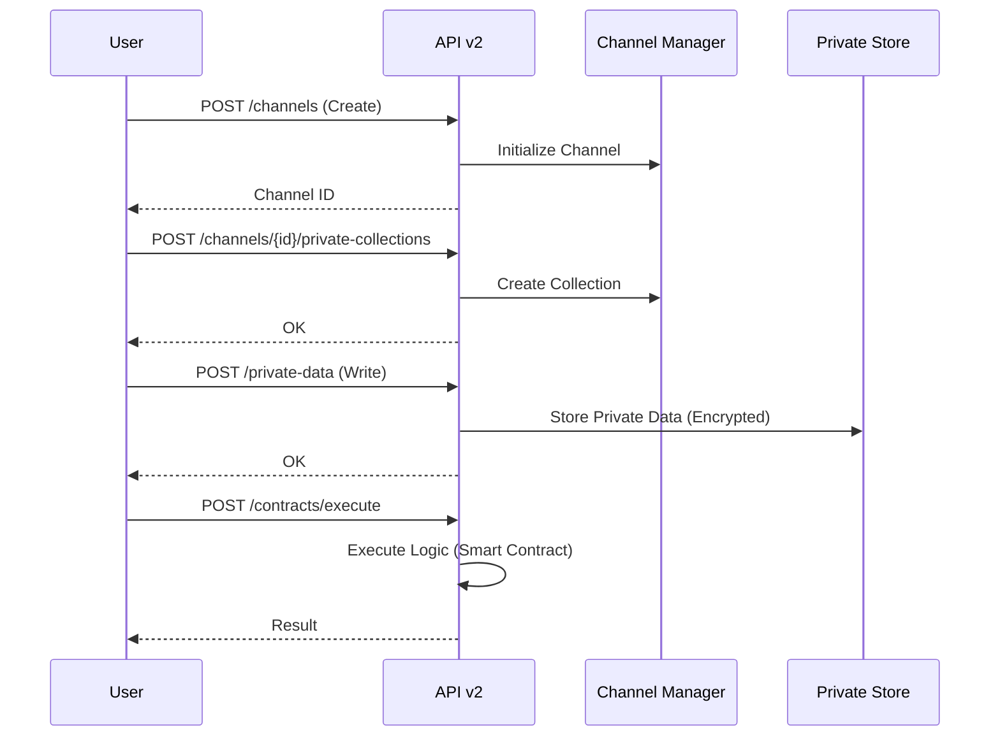

# API v2

API v2 extends capabilities for working with channels, private data, domain contracts, and organizations.

## Source Code Components

* Router/Endpoints: `hierachain/api/v2/endpoints.py`
* (Optional) Schemas: `hierachain/api/v2/schemas.py`
* Server integration: `hierachain/api/server.py` (registers v2 router)

## Main Endpoints (from code and tests)



* `GET  /api/v2/health` — service health check.
* `POST /api/v2/channels` — create a channel.
* `GET  /api/v2/channels/{channel_id}` — get channel info.
* `POST /api/v2/channels/{channel_id}/private-collections` — create a private data collection.
* `POST /api/v2/private-data` — Write private data (Supports raw `value` or `value_cid` IPFS reference).

    * `value_nonce: str | None`
    * `event_metadata: dict[str, Any]` (Entity ID, Event Type, Timestamp)

* `ContractCreateRequest`

    * `contract_id: str` (Unique identifier)
    * `version: str` (Semantic version, e.g., "1.0.0")
    * `implementation: str | None` (Raw Python code)
    * `implementation_cid: str | None` (IPFS reference)
    * `implementation_nonce: str | None`
    * `metadata: dict[str, Any]` (Domain, Owner, Endorsement Policy)
    
* `POST /api/v2/contracts` — Register a contract (Supports raw `implementation` or `implementation_cid` IPFS reference).
* `POST /api/v2/contracts/execute` — execute a contract.
* `POST /api/v2/organizations` — register an organization.

Additional note: some test/instrumentation scenarios in `tests/integration/api_v2/test_api_v2.py` and `scripts/security/*` use the above endpoints for security testing and behavior verification.

## Curl Examples

```bash
# Health
curl -s http://localhost:2661/api/v2/health

# Create channel
curl -s -X POST http://localhost:2661/api/v2/channels \
  -H 'Content-Type: application/json' \
  -d '{"name": "test_channel"}'

# Create private collection for channel
curl -s -X POST \
  http://localhost:2661/api/v2/channels/test_channel/private-collections \
  -H 'Content-Type: application/json' \
  -d '{"collection": "sensitive_docs"}'

# Write private data
curl -s -X POST http://localhost:2661/api/v2/private-data \
  -H 'Content-Type: application/json' \
  -d '{"channel": "test_channel", "collection": "sensitive_docs", "key": "doc-001", "value": "..."}'

# Register & execute domain contract
curl -s -X POST http://localhost:2661/api/v2/contracts \
  -H 'Content-Type: application/json' \
  -d '{
        "contract_id": "quality_control", 
        "version": "1.0.0",
        "implementation": "def logic()...",
        "metadata": {"domain": "mfg"}
      }'

curl -s -X POST http://localhost:2661/api/v2/contracts/execute \
  -H 'Content-Type: application/json' \
  -d '{
        "contract_id": "quality_control", 
        "event": {"entity_id": "PROD-001", "event": "check", "details": {}},
        "context": {"chain": "sub_chain_1"}
      }'

# Organization
curl -s -X POST http://localhost:2661/api/v2/organizations -H 'Content-Type: application/json' -d '{"org_id": "orgA", "name": "Org A"}'
```

If API key authentication is enabled (production), add the header per `settings.API_KEY_NAME` (default `X-API-Key`).

## Security & Configuration

* API key authentication via `security/verify/api_key_verifier.py` (when `AUTH_ENABLED=true`).
* Policy/Identity/Key/Cert — see Security and Modules/Security pages.
* Host/port configuration and security in `hierachain/config/settings.py`.

## Related

* API v1: [API v1](api-v1.md)
* Security Architecture: [Security (in-depth)](../architecture/security.md)
* Modules: [API](../modules/api.md)
