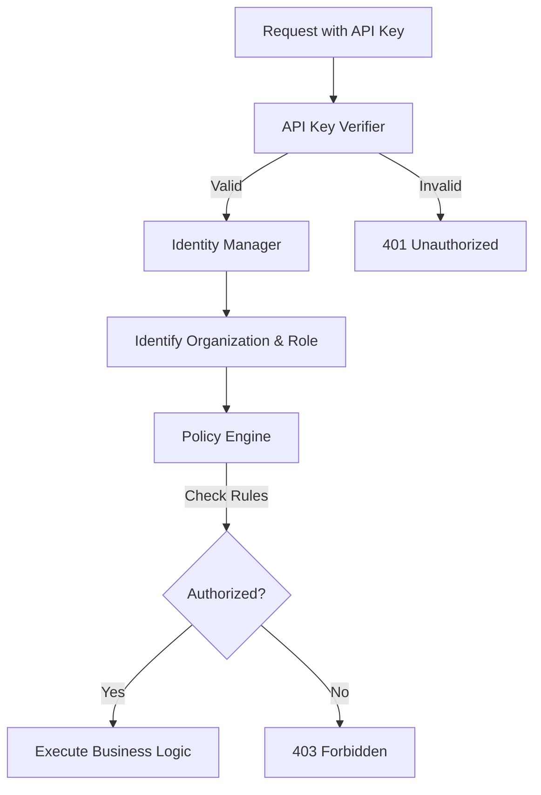

# Authorization & Access Control

This security layer is responsible for determining "Who are you?" (Authentication) and "What are you allowed to do?" (Authorization) within the HieraChain system.

## 1. Membership Service Provider (MSP)

**File**: `hierachain/security/msp.py`

MSP is the core component managing identity across the entire hierarchy.

*   **Entity Management**: Manages `Entity`, `Role`, and `Policy`.
*   **Internal PKI**: Issues and revokes certificates for nodes and users.
*   **Hierarchy**: Supports a hierarchical MSP model aligned with enterprise organizational structures.

## 2. Identity Manager

**File**: `hierachain/security/identity.py`

Manages detailed information about users and organizations:

*   **Organization Management**: Defines member organizations.
*   **User Profiles**: Stores identity information, roles, and Ed25519 digital signatures of users.
*   **Signature Verification**: Verifies user signatures on requests and events.

## 3. Policy Engine (ABAC)

**File**: `hierachain/security/policy_engine.py`

Attribute-Based Access Control system:

*   **Flexible Rules**: Defines `Allow`/`Deny` rules based on rich context (User, Resource, Action, Time).
*   **Logic Evaluation**: Processes complex logic to reach the final access decision.

## 4. API Key Verification

**File**: `hierachain/security/verify/api_key_verifier.py`

Fast authentication layer for API requests:

*   **API Key Management**: Creates, revokes, and validates API Keys.
*   **Integrated Middleware**: Automatically authenticates API Keys for every HTTP request to the server.
*   **Permission Mapping**: Maps API Keys to specific permissions within the system.

---

## Authentication & Authorization Flow

---

## Related

*   [Encryption & Keys](./encryption-keys.md)
*   [Security architecture](../architecture/security.md)
