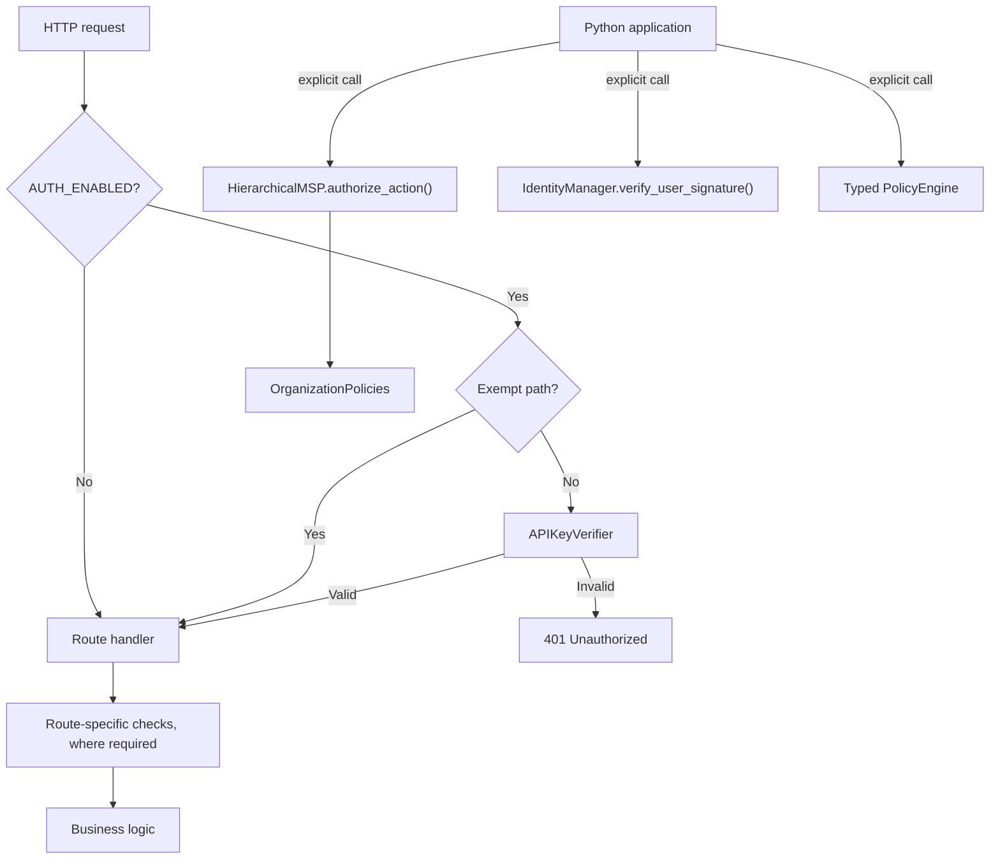

# Authorization & Access Control

This security layer is responsible for determining "Who are you?" (Authentication) and "What are you allowed to do?" (Authorization) within the HieraChain system.

## 1. Membership Service Provider (MSP)

**File**: `hierachain/security/msp.py`

MSP is the core component managing identity across the entire hierarchy.

*   **Entity Management**: Manages `Entity`, `Role`, and `Policy`.
*   **Internal PKI**: Issues and revokes certificates for nodes and users.
*   **Hierarchy**: Supports a hierarchical MSP model aligned with enterprise organizational structures.

## 2. Identity Manager

**File**: `hierachain/security/identity.py`

Manages detailed information about users and organizations:

*   **Organization Management**: Defines member organizations.
*   **User Profiles**: Stores identity information, roles, and an optional Ed25519 public key.
*   **Signature Verification**: `verify_user_signature()` checks a supplied message and signature against the registered public key when a caller invokes it. Request and event handlers do not call it automatically.

## 3. Policy Engine (ABAC)

**File**: `hierachain/security/policy_engine.py`

Attribute-Based Access Control system:

*   **Flexible Rules**: Defines `Allow`/`Deny` rules based on rich context (User, Resource, Action, Time).
*   **Logic Evaluation**: Processes complex logic to reach the final access decision.

## 4. API Key Verification

**File**: `hierachain/security/verify/api_key_verifier.py`

Fast authentication layer for API requests:

*   **API Key Lifecycle**: `KeyManager` in `hierachain/security/key_manager.py` creates and revokes keys. `APIKeyVerifier` validates them at request time.
*   **Global HTTP Authentication**: The server installs the API-key dependency only when `AUTH_ENABLED` is true. Paths in `EXEMPT_PATHS`, including health, status, and docs routes, bypass this global key check; route-specific authentication or permission checks can still apply. Production startup refuses to run with authentication disabled.
*   **Permission Mapping**: Maps API Keys to specific permissions within the system.

## Authorization checks

* MSP actions are allowed only while the entity is active and its certificate is currently valid and not revoked. Certificate validity is checked on each verification so an earlier successful check cannot outlive the certificate.
* API key permissions must be a list of strings. The wildcard is the exact permission `all`; malformed permission data denies access.
* Policy decision cache entries include the registered policy version. `Policy.add_rule()` and `Policy.remove_rule()` changes take effect on the next evaluation.

---

## Authentication & Authorization Flow

```mermaid
graph TD
    Request[HTTP request] --> Auth{AUTH_ENABLED?}
    Auth -- No --> Route[Route handler]
    Auth -- Yes --> Exempt{Exempt path?}
    Exempt -- Yes --> Route
    Exempt -- No --> Verify[APIKeyVerifier]
    Verify -- Invalid --> Error401[401 Unauthorized]
    Verify -- Valid --> Route
    Route --> Permission[Route-specific checks, where required]
    Permission --> Business[Business logic]
    PythonApp[Python application] -->|explicit call| MSP["HierarchicalMSP.authorize_action()"]
    MSP --> OrgPolicies[OrganizationPolicies]
    PythonApp -->|explicit call| Signature["IdentityManager.verify_user_signature()"]
    PythonApp -->|explicit call| Policy[Typed PolicyEngine]
```

---

## Related

*   [Encryption & Keys](./encryption-keys.md)
*   [Security architecture](../architecture/security.md)
