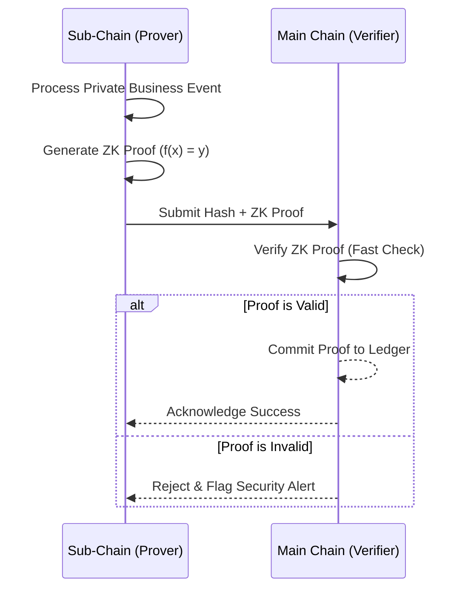

# Decentralized Zero-Knowledge Proofs

HieraChain's most advanced security layer, enabling evidence sharing about data between sub-chains and the main chain without exposing sensitive business content.

## 1. ZK Prover

**File**: `hierachain/security/zk_prover.py`

The component that generates proofs at Sub-Chains:

*   **Proof Generation**: Creates mathematical proofs asserting that an event or state is valid.
*   **Data Hiding**: Detailed event content is replaced by a unique identifier (Hash).
*   **Privacy Preservation**: Ensures the Main Chain never sees raw Sub-Chain data.

## 2. ZK Verifier

**File**: `hierachain/security/verify/zk_verifier.py`

The verification component at the Main Chain:

*   **Efficient Verification**: Validates ZK proof correctness with low computational cost.
*   **Trustless Validation**: Allows the Main Chain to trust Sub-Chain data without needing access to that data.
*   **Cross-chain Integrity**: Ensures data integrity when moving between tiers in the hierarchical architecture.

---

## ZK Operation Flow

---

## Real-world Applications

*   **Financial Reporting**: Proving total revenue meets a certain threshold without revealing individual invoice details.
*   **Supply Chain Management**: Confirming a shipment has passed quality inspection without disclosing proprietary production formulas.
*   **Authorization Validation**: Proving a user has sufficient rights to perform an action without revealing their specific identity on the main chain.

---

## Related

*   [Hierarchical architecture](../modules/hierarchical.md)
*   [Authorization & Access Control](./authorization-access-control.md)
