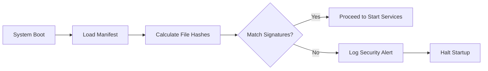

# Fault-tolerance & Integrity

This security layer ensures the system always operates within safe thresholds and that executed code has not been tampered with.

## 1. Resource Guard (DoS Protection)

**File**: `hierachain/security/resource_guard.py`

The steel shield protecting system resources (CPU, RAM):

*   **Load Shedding**: Automatically rejects new requests when system resources exceed the threshold (e.g., CPU > 90%) to prevent node-wide failure.
*   **Fast Response**: Immediately returns `503 Service Unavailable` errors to reduce worker processing load.
*   **Monitoring Integration**: Uses real-time data from `PerformanceMonitor` to make protection decisions.

## 2. Integrity Manager

**File**: `hierachain/security/integrity.py`

Verifies system integrity at startup:

*   **Executable Signing**: Checks digital signatures or checksums of critical executable and configuration files.
*   **Startup Verification**: Prevents the system from starting if code has been detected as tampered.
*   **Runtime Checks**: Performs periodic scans to ensure in-memory components have not been modified.

---

## Resource Protection Mechanism (Resource Guard)

The system uses a 3-stage protection mechanism:

| State | Threshold (CPU/RAM) | Action |
| :--- | :--- | :--- |
| **Normal** | < 70% | Accept all requests. |
| **Warning** | 70% - 90% | Begin rate limiting non-priority requests. |
| **Critical** | > 90% | Reject all new requests (Load shedding) until resources cool down. |

---

## Integrity Flow

---

## Related

*   [Performance monitoring](../modules/monitoring.md)
*   [System error handling](../modules/error-mitigation.md)
