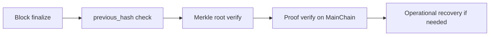

# Fault tolerance and integrity

Resource limits and ledger integrity checks run in the API middleware, ordering service and block verifier.

## Resource protection

* Rate and payload limits live in `hierachain/api/middleware.py` (`add_rate_limit`, `add_payload_limit` with `HRC_RATE_LIMIT`, `HRC_RATE_LIMIT_RPM`, `HRC_RATE_LIMIT_BACKEND`, `HRC_TRUSTED_PROXIES`). For POST, PUT, and PATCH requests, a parseable `Content-Length` is checked against 1 MiB; `request.stream()` byte counting runs only when the header is absent.
* `HRC_EVENT_POOL_MAX_SIZE` defaults to 10,000 and bounds the ordering queue. `HRC_RAM_CRITICAL_THRESHOLD` is declared with a 95% default but has no runtime consumer under `hierachain/`. `ResourceValidator` reports its separately configured CPU, memory, and disk thresholds when called; it does not enforce this RAM setting in ordering or storage.
* Use app middleware together with reverse proxy limits. `PerformanceMonitor` reports metrics; it does not install a per-request CPU/RAM guard.

## Integrity checks

Ledger loading and verification use the following mechanisms:

* Merkle and chain links in `hierachain/core/block.py` and `core/merkle_tree.py` (domain-separated `0x01` prefix) and `consensus/ordering/storage.py:_verify_chain_links()` (`previous_hash` chain).
* Proof verification in `hierachain/hierarchical/main_chain/proofs.py:_verify_proof_in_main_chain` (fallback chain scan) and `security/verify/block_verifier.py`.
* Runtime integrity checks use chain links, Merkle roots, proof verification, and consensus validation. State snapshots and rollback are deployment responsibilities.
* `BlockVerifier.verify_chain()` checks the sequence supplied. For a nonempty sequence, the first block must be genesis at index `0` with `previous_hash` equal to `"0"`, and links among supplied blocks are checked. An empty sequence returns `VALID`. The API has no expected tip height or hash, so a valid prefix that omits later blocks can pass.

```mermaid
graph LR
    A[Block finalize] --> B[previous_hash check]
    B --> C[Merkle root verify]
    C --> D[Proof verify on MainChain]
    D --> E[Operational recovery if needed]
```

## Related

*   [Error Mitigation](../modules/error-mitigation.md)
*   [Monitoring](../modules/monitoring.md)
*   [Secure Logging](./lockdown-logging.md)
