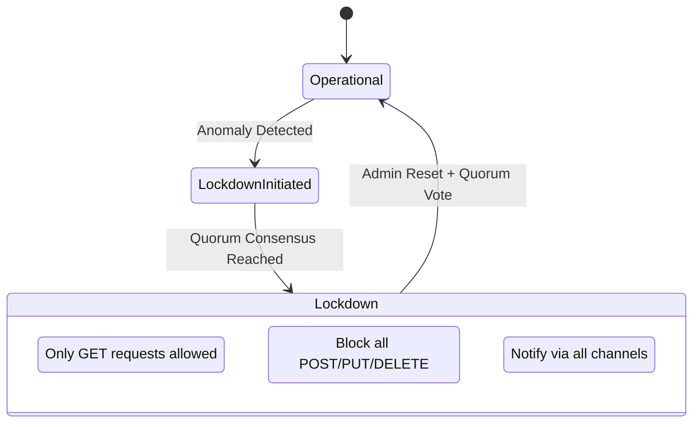

# Lockdown & Logging

This security layer focuses on rapid response when the system is compromised through a lockdown mechanism and a tamper-proof secure logging system.

## 1. Lockdown Protocol

**File**: `hierachain/cluster/lockdown_protocol.py`

Emergency "circuit breaker" mechanism for the entire cluster:

*   **Quorum Activation**: Lockdown mode can only be activated or removed with sufficient node quorum consensus.
*   **Read-only State**: In Lockdown mode, the system rejects all data modification requests (Write) to protect integrity.
*   **HMAC Lockdown**: Uses the `HRC_CLUSTER_SECRET` secret to authenticate lockdown commands between nodes.

## 2. Secure Logging

**File**: `hierachain/security/secure_logging.py`

A logging system specifically designed for security:

*   **Tamper-evident**: Each log record has a strict structure, supporting detection of log deletion or modification.
*   **Structured Logs**: Logs are recorded in JSON format for easy integration with centralized monitoring systems (SIEM).
*   **Log Segmentation**: Sensitive modules (such as `security`, `consensus`) use separate `SecureLogger` instances with higher protection levels.

---

## Lockdown Response Mechanism

---

## Related

*   [Risk analysis](./risk-analyzer.md)
*   [Cluster management](../modules/cluster.md)
